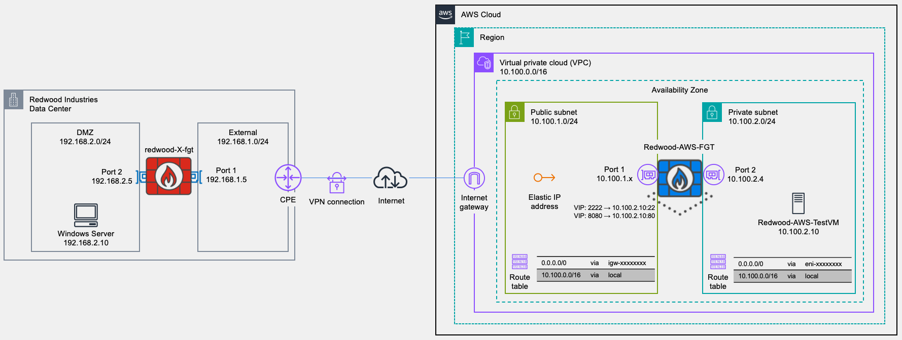

# AWS-101: FortiGate as AWS Cloud Firewall

## Fortinet Security Hands On Workshop | AWS Series

Deploy FortiGate in AWS to protect cloud workloads. You will build the AWS network, deploy and license a FortiGate-VM, steer traffic through it with route tables, configure inbound and outbound policies, and connect to on-premises with a site-to-site IPsec VPN.

### Scenario: Redwood Industries

Redwood Industries is a 200-employee manufacturer. FortiGate already protects its headquarters (HQ) network (`192.168.0.0/22`), and Redwood is moving its first business applications to AWS. The security team has one rule: **no traffic reaches or leaves an AWS workload unless FortiGate inspects it**, with the same policies and logs as at HQ.

You are the engineer building that environment. Each lab is one stage of the project.

<b>Why FortiGate on AWS?</b>

- **One security platform:** the same policies, logs, and operations on-premises and in AWS
- **Lower cost for this design:** a single-VPC design avoids separate charges for AWS Network Firewall and a managed Site-to-Site VPN
- **Full NGFW:** IPS, application control, web filtering, and FortiGuard services, with visibility through logs and FortiView

---

**Duration:** ~3 hours, including clean-up  
**Audience:** Network and security engineers with networking fundamentals and basic AWS knowledge.

## Reference Architecture

By the end of the workshop, you will have built the following:

## Labs

Complete the labs in order. Each one builds on the previous lab.

| Lab | Stage | Time |
| --- | --- | --- |
| 1. [AWS Infrastructure Foundation](/aws-101-lab1/README.md) | Build the AWS landing zone network | ~25 min |
| 2. [FortiGate VM Deployment & Traffic Steering](/aws-101-lab2/README.md) | Make FortiGate the only way in and out | ~60 min |
| 3. [Security Policies & Traffic Testing](/aws-101-lab3/README.md) | Launch the first application server, then prove it is reachable and inspected | ~40 min |
| 4. [Site-to-Site VPN Configuration](/aws-101-lab4/README.md) | Connect AWS to HQ | ~30 min |
| [Clean-Up](/aws-101-lab4/README.md#clean-up) | Delete every resource so nothing keeps billing | ~10 min |

## What You Need

- An isolated sandbox AWS account with `AdministratorAccess`, with access to `ca-central-1`
- An SSH client (OpenSSH, or PuTTY on Windows), an RDP client, and a modern browser
- **From your instructor:**
  - A FortiFlex token (Lab 2)
  - Your own **HQ (on-premises) FortiGate**: its public IP and admin credentials (Lab 4)
  - RDP credentials for the HQ Windows VM behind it (Lab 4)

---

> [!CAUTION]
> Use an isolated sandbox AWS account, not one connected to production. These examples are **not suitable for production**.

> [!WARNING]
> The workshop launches two EC2 instances in your account: the FortiGate-VM (`c5.large`) and a test VM (`t3.micro`). The HQ FortiGate is hosted by your instructor, not in your account. Stopped instances still incur EBS and Elastic IP charges. When you finish, follow the **Clean-Up** section at the end of [Lab 4](/aws-101-lab4/README.md).
