# AWS-101 Lab 1: AWS Infrastructure Foundation

## Overview

> **Scenario:** Before Redwood can deploy anything in AWS, it needs a network for FortiGate to protect. Your first job is to build the landing zone.

In this lab you build the AWS network that every later lab depends on:

- A **VPC**: Redwood's private network in AWS
- A **public subnet** for FortiGate's Internet-facing interface (`port1`)
- A **private subnet** for FortiGate's internal interface (`port2`) and the workloads it protects
- An **Internet Gateway** that connects the VPC to the Internet
- A **route table** that makes the public subnet reachable from the Internet

The private subnet's route table is created in Lab 2. Its default route must point at FortiGate, which doesn't exist yet.

**Prerequisites:** the AWS account described in [What You Need](/README.md#what-you-need). Sign in as an MFA-protected IAM identity, never the root user.

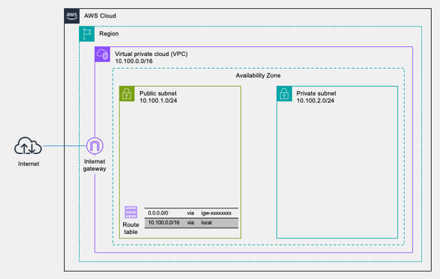

---

## Naming & Tagging

Every resource follows the naming pattern `redwood-aws101-lab-<resource>`. Resources that live in one Availability Zone end with the AZ, for example `-1a`. Consistent names make resources easy to find in the console and easy to recognize during clean-up.

Every resource also gets one tag, `Project` = `Redwood-AWS-101`. You don't need to memorize it: each step's parameter table includes it. The tag lets the Resource Group (Step 1) collect all workshop resources in one view. It also lets you confirm during clean-up that nothing is left. The console creates the `Name` tag automatically from the **Name** field.

Real deployments usually add more tags, such as `Environment` and `Owner`, for cost allocation and ownership.

---

## Step 1: Create an AWS Resource Group (Optional)

**Why:** AWS spreads resources across many consoles: VPC, EC2, Elastic IPs, and so on. A tag-based Resource Group shows every resource tagged `Project` = `Redwood-AWS-101` on one page. That makes it easy to see what you've built, and to make sure nothing is forgotten at clean-up. This step is optional, but recommended.

> [!NOTE]
> Do not block pop-ups for the AWS Management Console. Some console wizards open in new windows.

1. **Sign in and select the region:**
   - Go to <https://console.aws.amazon.com> and sign in with your IAM user.
   - In the top-right corner, open the region selector and choose **Canada (Central) ca-central-1**.
   - All work in this workshop happens in `ca-central-1`. Resources created in another region won't be visible to the later labs.

   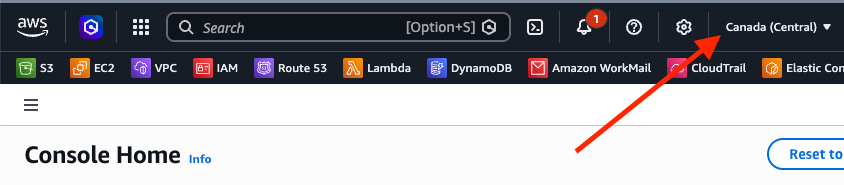

2. **Open Resource Groups:**
   - In the search bar at the top of the console, type `Resource Groups`.
   - Choose **Resource Groups & Tag Editor**.

   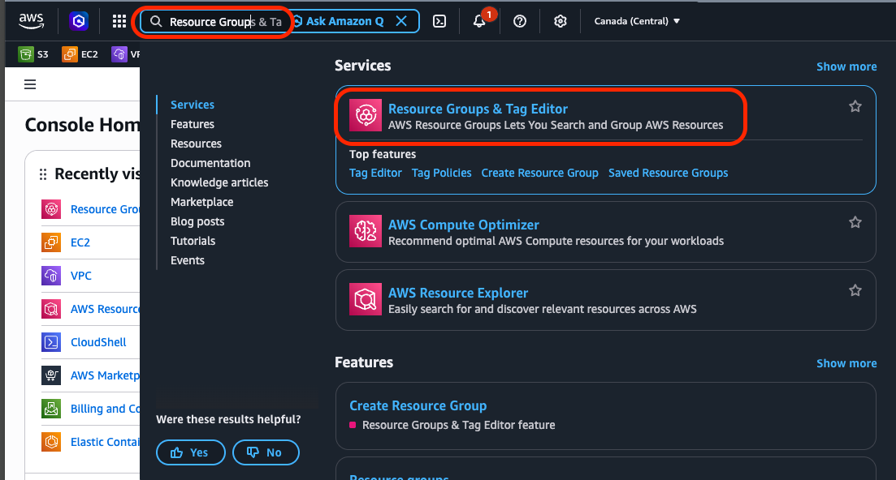

3. **Create the group:**
   - Choose **Create Resource Group**.

     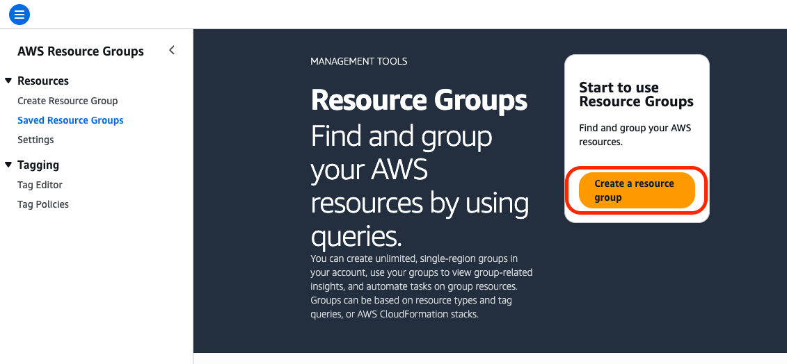

   - Fill in the form with the values below:

     | Parameter | Value |
     | --- | --- |
     | **Group type** | **Tag based** |
     | **Grouping criteria** | |
     | Resource types | **All supported resource types** |
     | Tag key | `Project` |
     | Tag value | `Redwood-AWS-101` |
     | **Group details** | |
     | Group name | `redwood-aws101-lab-rg` |
     | **Group tags** | |
     | Key | `Project` |
     | Value | `Redwood-AWS-101` |

     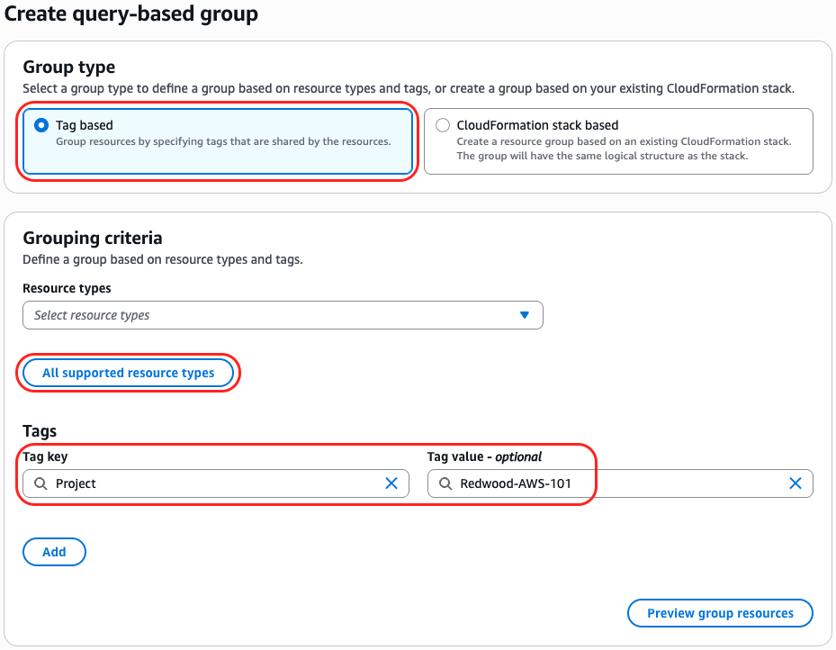
     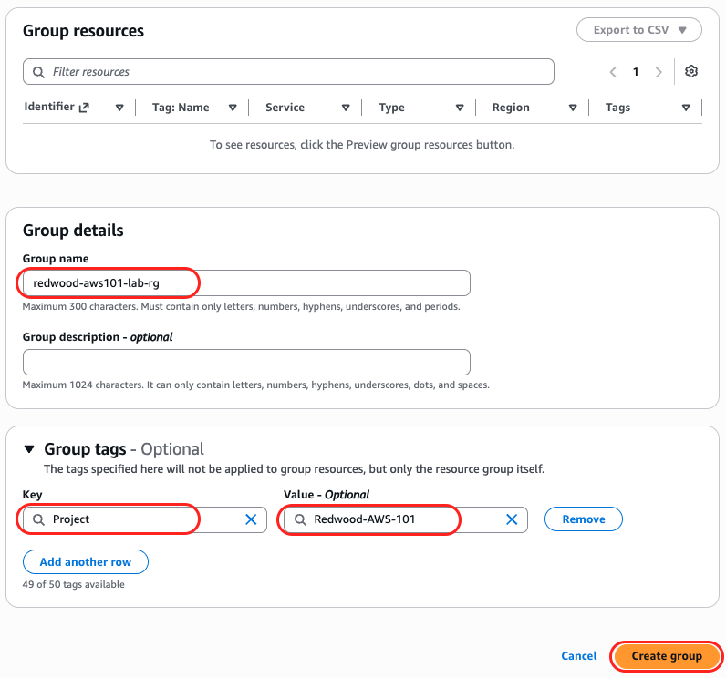

4. **Save and verify:**
   - Choose **Create group**.
   - In the left navigation pane, choose **Saved Resource Groups** and confirm that `redwood-aws101-lab-rg` is listed.

   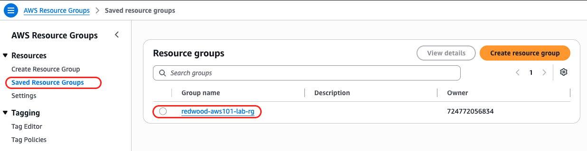

**Check:** `redwood-aws101-lab-rg` appears under **Saved Resource Groups**. It is empty for now. It fills up automatically as you create tagged resources.

---

## Step 2: Create the VPC

A Virtual Private Cloud (VPC) is Redwood's own isolated network inside AWS, the cloud equivalent of a data center network. Every subnet, interface, and instance in this workshop lives inside it. You choose its address range now, and that range must never overlap with HQ's network. Otherwise the VPN in Lab 4 can't route between them.

1. **Open the VPC console:**
   - In the search bar, type `VPC` and choose **VPC**.
   - Confirm that the region selector still shows **ca-central-1**.

   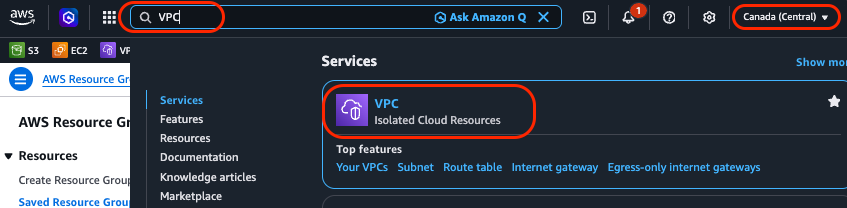

2. **Start creating the VPC:**
   - In the left navigation pane, choose **Your VPCs**.
   - Choose **Create VPC**.

   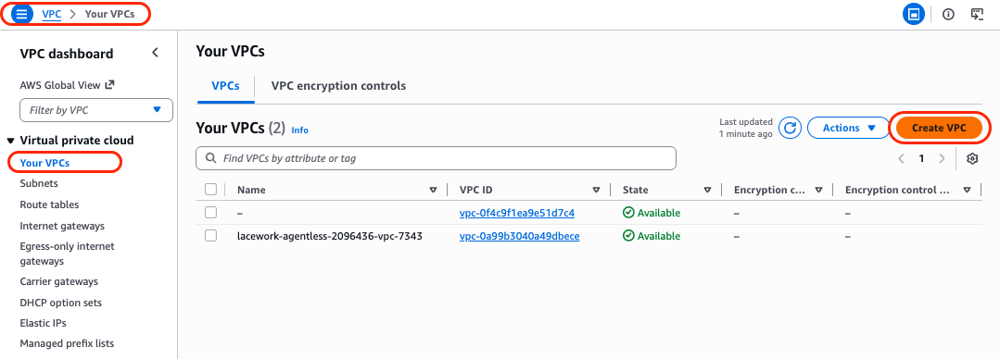

3. **Fill in the VPC settings:**

   | Parameter | Value |
   | --- | --- |
   | Resources to create | **VPC only** |
   | Name tag | `redwood-aws101-lab-vpc` |
   | IPv4 CIDR block | **IPv4 CIDR manual input** |
   | IPv4 CIDR | `10.100.0.0/16` |
   | IPv6 CIDR block | **No IPv6 CIDR block** |
   | Tenancy | **Default** |

   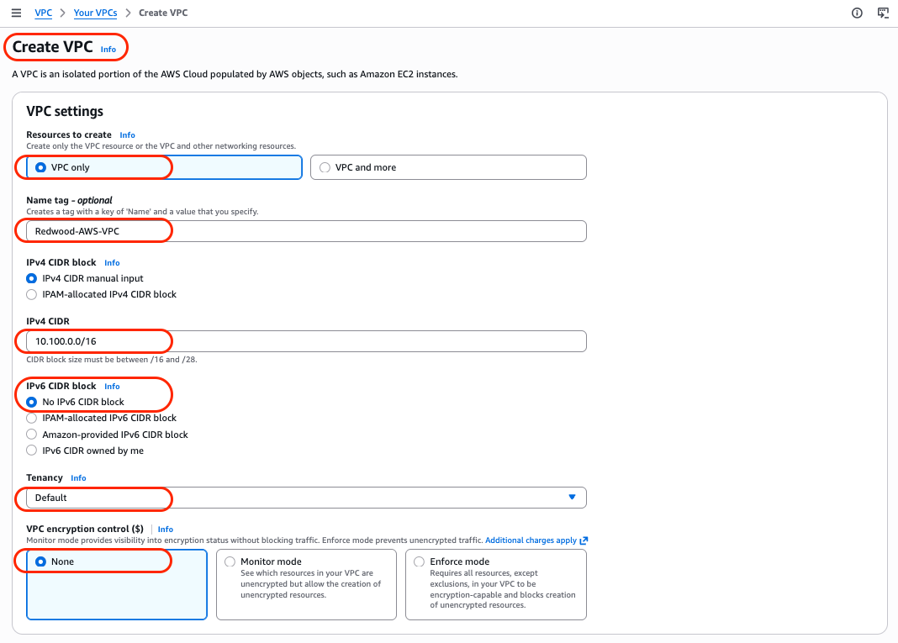

   > [!IMPORTANT]
   > Choose **VPC only**, not **VPC and more**. The "VPC and more" option creates subnets, route tables, and gateways automatically. You'll build each of them yourself in the next steps, so you understand exactly what each one does.

4. **Add the tag and create the VPC:**
   - Under **Tags**, the `Name` tag is already filled in. Choose **Add new tag** and enter.

     | **Tags** | |
     | --- | --- |
     | Key | `Project` |
     | Value - *optional* | `Redwood-AWS-101` |

   - Choose **Create VPC**.

   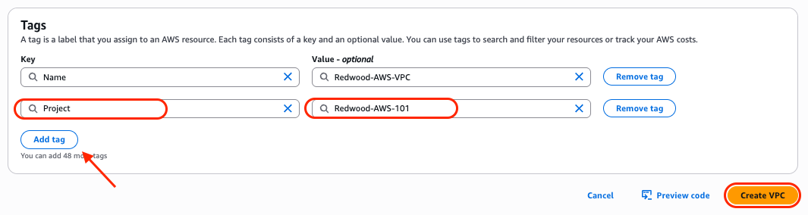

5. The VPC details page opens.

   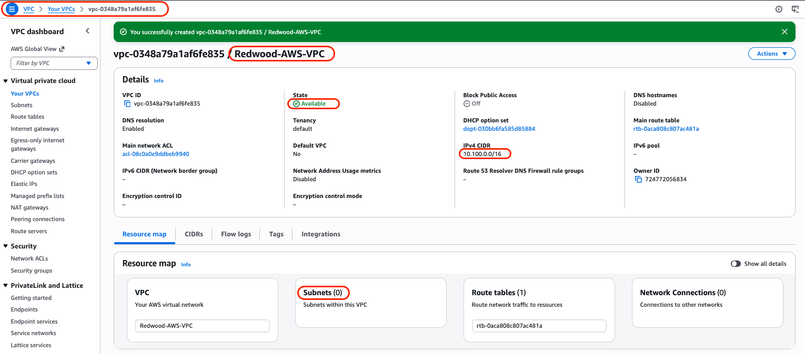

**Check:** the VPC `redwood-aws101-lab-vpc` shows **State: Available** and **IPv4 CIDR: `10.100.0.0/16`**.

<b>Why <code>10.100.0.0/16</code>?</b>

- It is an RFC 1918 private range, with 65,536 addresses.
- It doesn't overlap HQ's network (`192.168.0.0/22`). The VPN in Lab 4 requires that.
- It leaves room for more subnets now and more VPCs later (`10.101.0.0/16`, `10.102.0.0/16`, ...).

CIDR sizes you'll see in this workshop: `/16` = 65,536 addresses (the VPC), `/24` = 256 addresses (each subnet).

---

## Step 3: Create the Public Subnet

A subnet is a slice of the VPC's address range that lives in one Availability Zone. This first subnet is the **public** side of the design: it will hold FortiGate's `port1`, the interface that faces the Internet. It carries management access, licensing traffic, and all inspected traffic leaving for the Internet.

1. **Open Subnets:**
   - In the VPC console's left navigation pane, choose **Subnets**.
   - Choose **Create subnet**.

   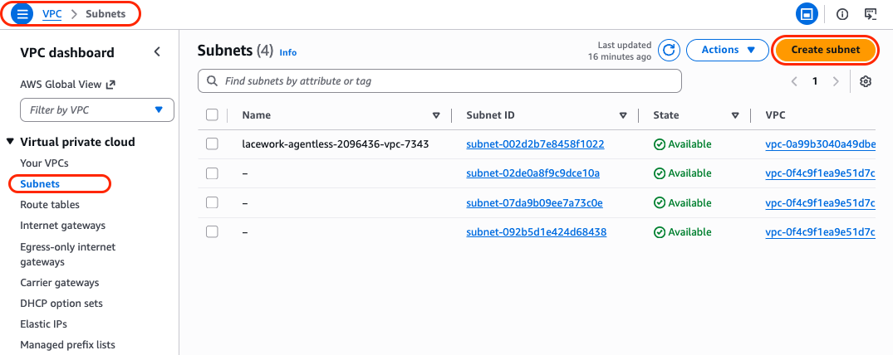

2. **Fill in the subnet settings:**

   | Parameter | Value |
   | --- | --- |
   | VPC ID | `redwood-aws101-lab-vpc` |
   | **Subnet settings** | |
   | Subnet name | `redwood-aws101-lab-subnet-public-1a` |
   | Availability Zone | `ca-central-1a` |
   | IPv4 VPC CIDR block | `10.100.0.0/16` (filled in automatically) |
   | IPv4 subnet CIDR block | `10.100.1.0/24` |
   | Tags - *optional* | |
   | Key | `Project` |
   | Value - *optional* | `Redwood-AWS-101` |

   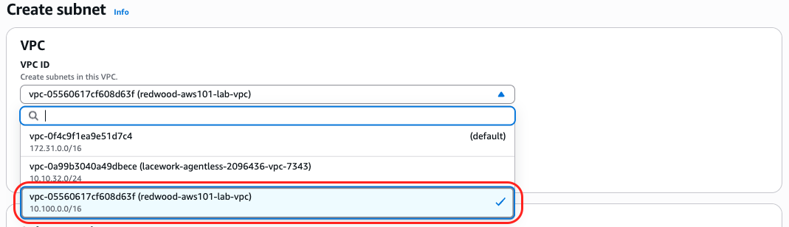
   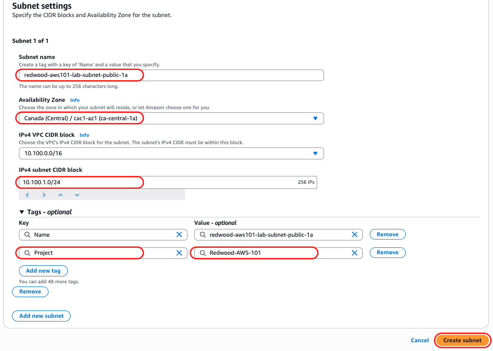

3. Choose **Create subnet**.

> [!IMPORTANT]
> Both subnets must be in the same Availability Zone, `ca-central-1a`. FortiGate has an interface in each subnet, and AWS only lets an instance use network interfaces in its own Availability Zone.

**Check:** `redwood-aws101-lab-subnet-public-1a` appears in the subnet list with CIDR `10.100.1.0/24`, AZ `ca-central-1a`, and **251** available IPv4 addresses.

<b>Why 251 available addresses and not 256?</b>

AWS reserves 5 addresses in every subnet:

| Address | Use |
| --- | --- |
| `10.100.1.0` | Network address |
| `10.100.1.1` | VPC router (the subnet's default gateway) |
| `10.100.1.2` | Reserved by AWS (the VPC DNS resolver is at `10.100.0.2`) |
| `10.100.1.3` | Reserved for future use |
| `10.100.1.255` | Broadcast (not supported in a VPC) |

Usable addresses: `10.100.1.4` to `10.100.1.254`.

---

## Step 4: Create the Private Subnet

This is the protected side of the design. It will hold FortiGate's `port2` and the workloads FortiGate protects, such as the application server you deploy in Lab 3. Nothing in this subnet gets a public IP. In Lab 2, you'll give it a route table that sends all outbound traffic to FortiGate, so every packet leaving the subnet is inspected.

1. **Create the second subnet:**
   - Still in **Subnets**, choose **Create subnet** again.
   - Fill in the settings:

     | Parameter | Value |
     | --- | --- |
     | VPC ID | `redwood-aws101-lab-vpc` |
     | **Subnet settings** | |
     | Subnet name | `redwood-aws101-lab-subnet-private-1a` |
     | Availability Zone | `ca-central-1a` (the same AZ as the public subnet) |
     | IPv4 subnet CIDR block | `10.100.2.0/24` |
     | Tags - *optional* | |
     | Key | `Project` |
     | Value - *optional* | `Redwood-AWS-101` |

2. Choose **Create subnet**.

   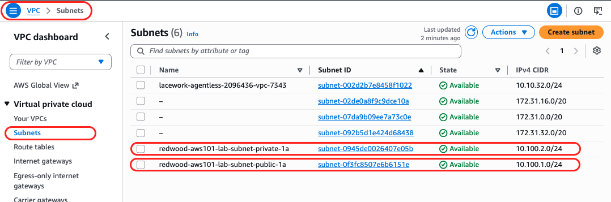

**Check:** two subnets now appear in `redwood-aws101-lab-vpc`: the public one (`10.100.1.0/24`) and the private one (`10.100.2.0/24`), both in `ca-central-1a`.

Here is how traffic will flow once FortiGate is in place (Lab 2):

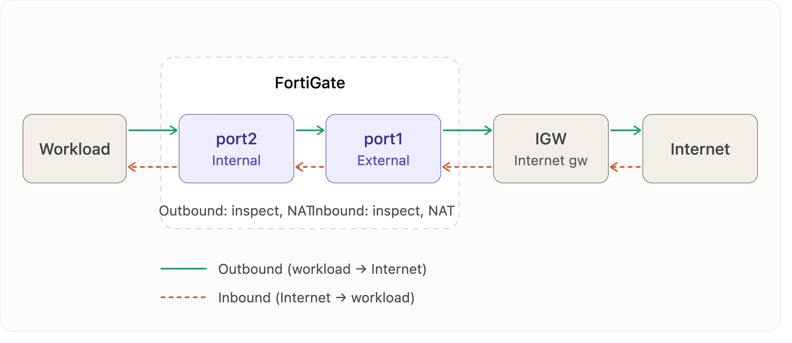

<b>Why only two subnets?</b>

This is Fortinet's reference design for a single FortiGate-VM on AWS: a **Public** subnet for `port1`, and a **Private** subnet shared by `port2` and the workloads. A separate transit subnet just for `port2` wouldn't add security here, because subnet route tables only affect traffic that leaves the subnet. Dedicated transit, HA-sync, and management subnets matter in HA, Gateway Load Balancer, and Transit Gateway designs (AWS-102).

---

<b>East-west traffic in the same subnet is NOT inspected</b>

Two instances in the same subnet talk directly through the VPC's implicit `local` route. AWS doesn't let any route table override that route within a subnet. If you add a second workload to the private subnet, traffic between it and the test VM bypasses FortiGate. This is an AWS limitation, not a FortiGate one.

To inspect east-west traffic, production designs use separate workload subnets with FortiGate as the next hop, a Gateway Load Balancer, or a Transit Gateway inspection VPC (covered in AWS-102).

---

## Step 5: Create and Attach an Internet Gateway

A new VPC is completely isolated: nothing inside it can reach the Internet, and nothing on the Internet can reach it. An Internet Gateway (IGW) is the VPC's door to the Internet. It also performs the 1:1 translation between public IPs (such as FortiGate's Elastic IP in Lab 2) and private VPC addresses. Without an IGW, FortiGate couldn't be managed, licensed, or used as the Internet exit.

1. **Create the Internet Gateway:**
   - In the VPC console's left navigation pane, choose **Internet gateways**.
   - Choose **Create internet gateway**.

   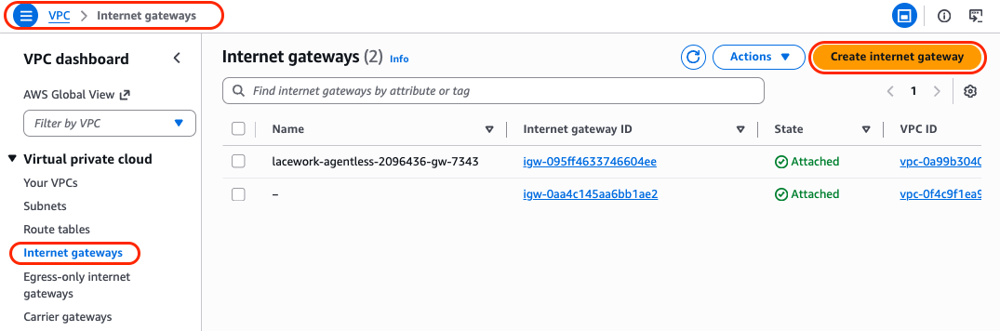

2. **Fill in the settings:**

   | Parameter | Value |
   | --- | --- |
   | **Internet gateway settings** | |
   | Name tag | `redwood-aws101-lab-igw` |
   | **Tags - *optional*** | |
   | Key | `Project` |
   | Value - *optional* | `Redwood-AWS-101` |

   - Choose **Create internet gateway**.

   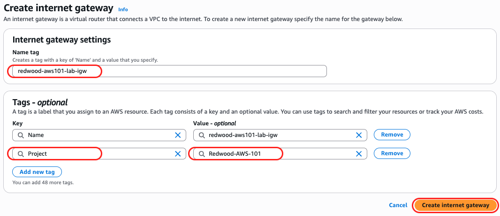

3. **Attach it to the VPC:**
   - A new gateway starts in the **Detached** state. On the gateway's details page, choose **Actions → Attach to VPC**.

     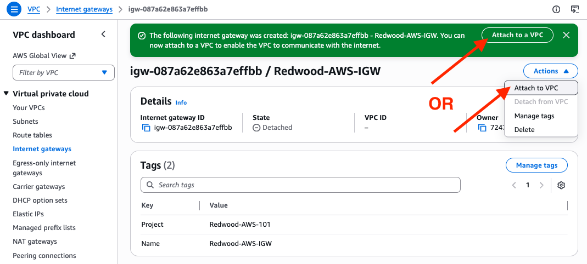

   - Under **Available VPCs**, select `redwood-aws101-lab-vpc`.
   - Choose **Attach internet gateway**.

     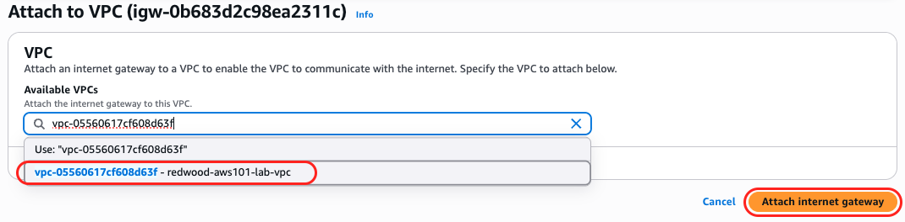

**Check:** `redwood-aws101-lab-igw` shows **State: Attached**, and its **VPC ID** column shows `redwood-aws101-lab-vpc`.

> [!NOTE]
> Attaching the IGW doesn't give any subnet Internet access yet. A subnet only uses the IGW when its route table has a route pointing to it. You create that route in the next step.

---

## Step 6: Create the Public Route Table

Every subnet uses a route table to decide where to send traffic. A subnet becomes "public" only when its route table sends Internet-bound traffic (`0.0.0.0/0`) to the Internet Gateway. FortiGate's `port1` will live in this subnet. It needs this route to activate its license, download FortiGuard updates, and send inspected traffic to the Internet.

> [!NOTE]
> Each subnet gets its own route table. The VPC's **Main** route table is left with only the `local` route. A subnet you forget to associate then can't reach anything, which is safer than accidentally inheriting a route to the Internet.

1. **Create the route table:**
   - In the VPC console's left navigation pane, choose **Route tables**.
   - Choose **Create route table**.

     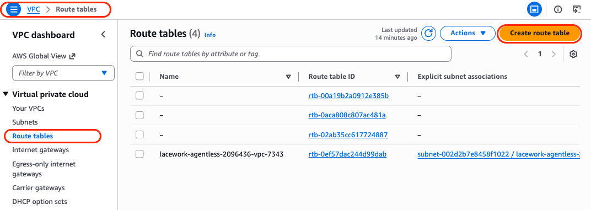

   - Fill in the settings:

     | Parameter | Value |
     | --- | --- |
     | **Route table settings** | |
     | Name | `redwood-aws101-lab-rt-public` |
     | VPC | `redwood-aws101-lab-vpc` |
     | **Tags** | |
     | Key | `Project` |
     | Value - *optional* | `Redwood-AWS-101` |

   - Choose **Create route table**.

     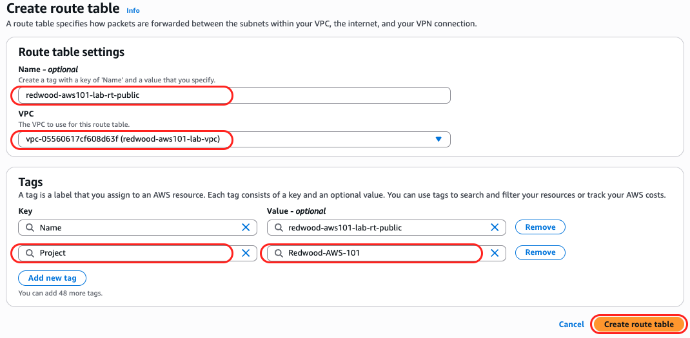

2. **Add the default route to the Internet Gateway:**
   - On the route table's details page, select the **Routes** tab. It already contains one route, `10.100.0.0/16 → local`. That route lets everything inside the VPC talk to each other, and it can't be removed.

     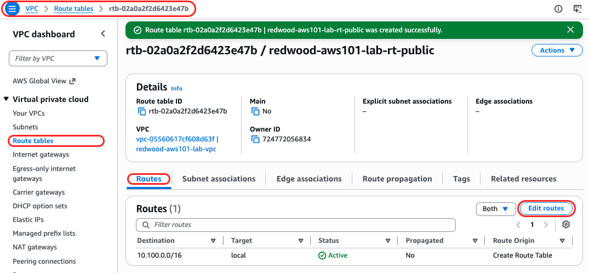

   - Choose **Edit routes**, then **Add route**, and enter:

     | Destination | Target |
     | --- | --- |
     | `0.0.0.0/0` | **Internet Gateway** → `redwood-aws101-lab-igw` |

   - Choose **Save changes**.

     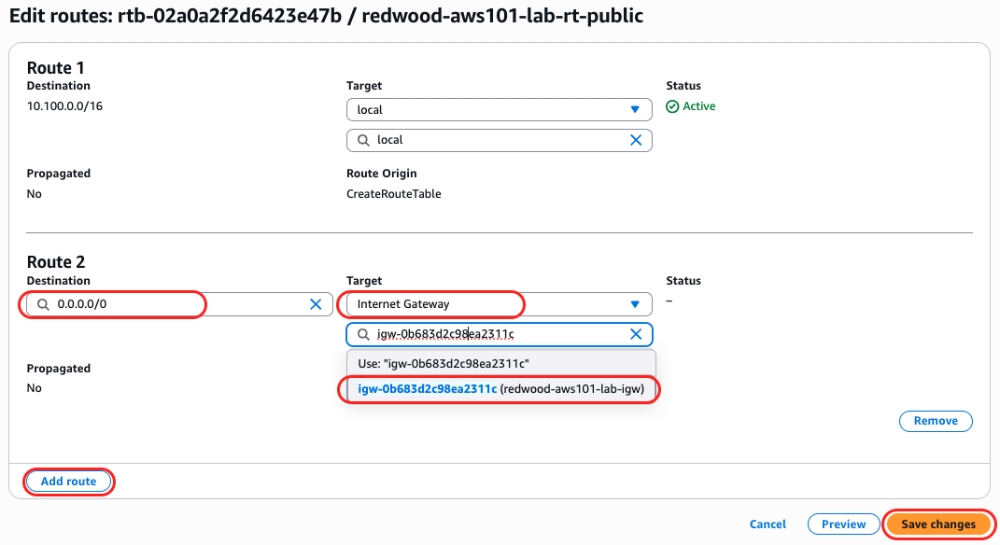

3. **Associate the route table with the public subnet:**
   - Select the **Subnet associations** tab and choose **Edit subnet associations**.

     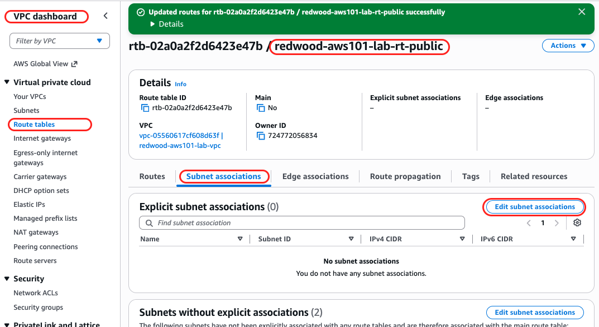

   - Select `redwood-aws101-lab-subnet-public-1a` (`10.100.1.0/24`). Leave the private subnet unselected.
   - Choose **Save associations**.

     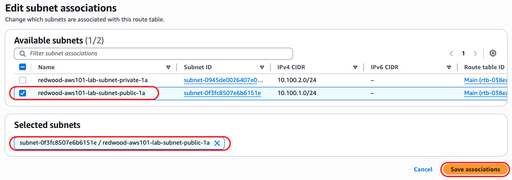

**Check:** `redwood-aws101-lab-rt-public` has two routes (`10.100.0.0/16 → local` and `0.0.0.0/0 → redwood-aws101-lab-igw`), and `redwood-aws101-lab-subnet-public-1a` is listed under **Subnet associations**.

---

## Checklist

Before moving to Lab 2, confirm:

- [x] VPC `redwood-aws101-lab-vpc` (`10.100.0.0/16`) exists in `ca-central-1`
- [x] Public subnet `10.100.1.0/24` and private subnet `10.100.2.0/24` both exist in `ca-central-1a`
- [x] Internet Gateway `redwood-aws101-lab-igw` is **Attached** to the VPC
- [x] `redwood-aws101-lab-rt-public` has `0.0.0.0/0 → redwood-aws101-lab-igw` and is associated with the public subnet
- [x] The private subnet is **not** associated with the public route table

## Troubleshooting

| Issue | Solution |
| --- | --- |
| "CIDR block overlaps" error | Another VPC or subnet already uses that range. Check the CIDR values against the tables above. |
| Resources are in the wrong region | Delete them and recreate them in `ca-central-1`. Later labs only look in that region. |
| The Internet Gateway won't attach | An IGW can be attached to only one VPC. Detach it from the other VPC, or create a new one. |
| The subnet AZ is wrong | A subnet's AZ can't be changed. Delete the subnet and recreate it in `ca-central-1a`. |

---

The landing zone is ready, but the private subnet has no way out yet. In Lab 2, FortiGate becomes that way out.

*Next:* [**Lab 2: FortiGate VM Deployment & Traffic Steering**](/aws-101-lab2/README.md)
