# AWS-101 Lab 2: FortiGate VM Deployment & Traffic Steering

## Overview

> **Scenario:** Redwood's security team requires FortiGate to be the only path in and out of AWS workloads, just as at HQ. You deploy it now, before any workload exists.

In this lab you turn the empty network from Lab 1 into an inspected network:

- **Part 1:** deploy a FortiGate-VM with two network interfaces. `port1` sits in the public subnet and faces the Internet. `port2` sits in the private subnet and faces the workloads. You give `port1` a permanent public IP and license FortiGate with FortiFlex.
- **Part 2:** create the private subnet's route table, which sends all outbound traffic to FortiGate's `port2`. From then on, FortiGate is the only way out of the private subnet.

**Prerequisites:** Lab 1 completed, plus the FortiFlex token and SSH client from [What You Need](/README.md#what-you-need).

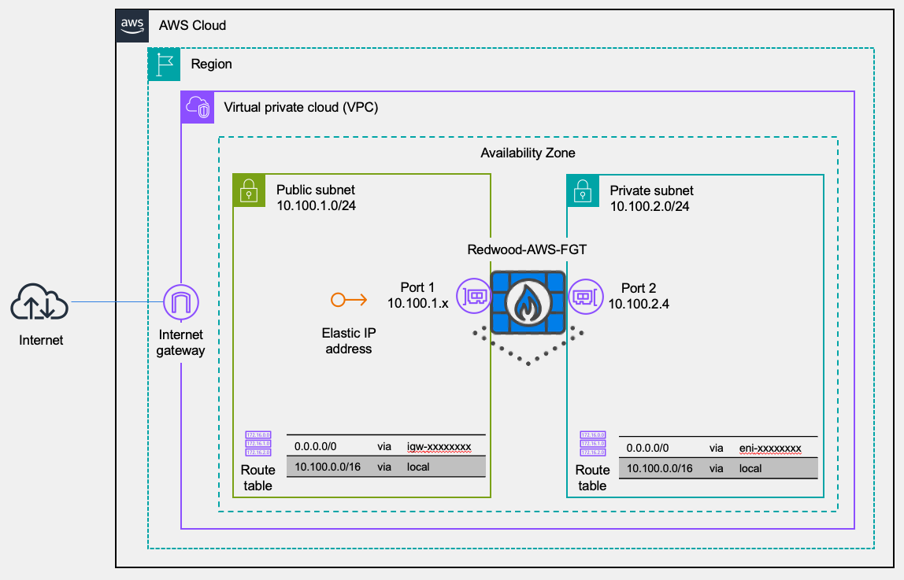

---

## PART 1: FortiGate VM Deployment

## Step 1: Subscribe to the FortiGate-VM AMI

FortiGate-VM is sold through AWS Marketplace. Before your account can launch it, you must subscribe to the listing and accept Fortinet's license agreement (EULA). This is a one-time action per AWS account. You subscribe to the **BYOL** (Bring Your Own License) listing because you'll license FortiGate with your own FortiFlex token. The PAYG listing would bill the license hourly through AWS instead.

1. **Open AWS Marketplace:**
   - In the search bar, type `Marketplace` and choose **AWS Marketplace**.
   - Confirm that the region selector shows **ca-central-1**.

   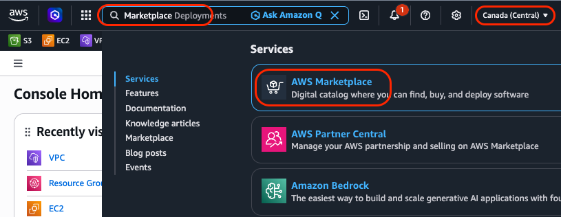

2. **Find the FortiGate listing:**
   - In the left navigation pane, choose **Discover products**.
   - In the search box, type `Fortinet FortiGate Next-Generation Firewall` and press **Enter**.

3. **Select the BYOL listing:**
   - Choose the listing published by **Fortinet, Inc.** that does **not** have "(PAYG)" in its title. That is the BYOL listing.
   - If the listing offers more than one architecture, use **x86_64**. It matches the `c5.large` instance type you launch in Step 3.

   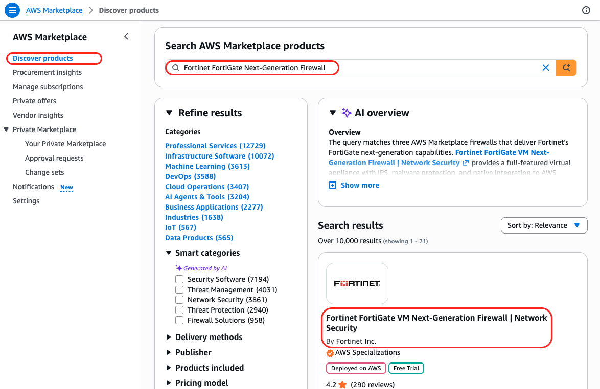

4. **Subscribe:**
   - Choose **View purchase options**.
   - Choose **Subscribe** and accept the EULA. The subscription is active within a few seconds. BYOL listings have no software charge.

   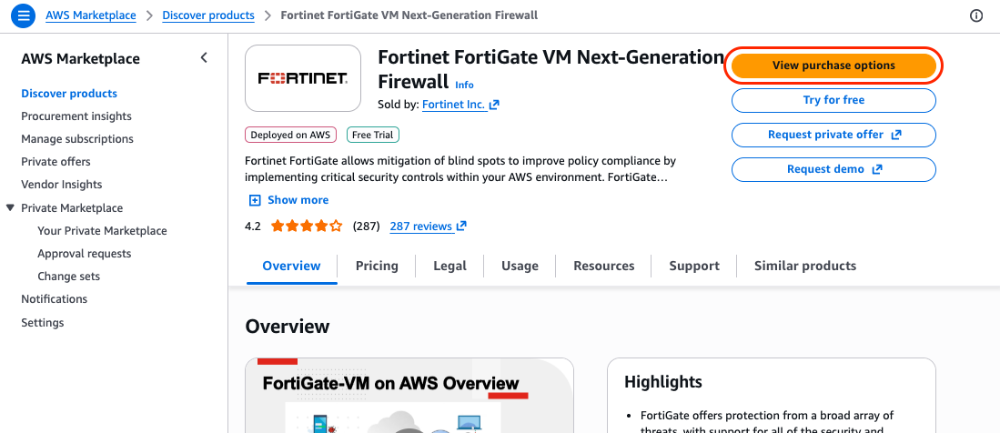

5. **Don't launch from Marketplace.** The next page offers to continue to configuration and launch. Close it instead. You'll launch FortiGate from the EC2 console in Step 3, which gives you full control over the network settings.

   **Check:**

   - [x] In **AWS Marketplace → Manage subscriptions**, the FortiGate listing appears under **Active subscriptions**.

   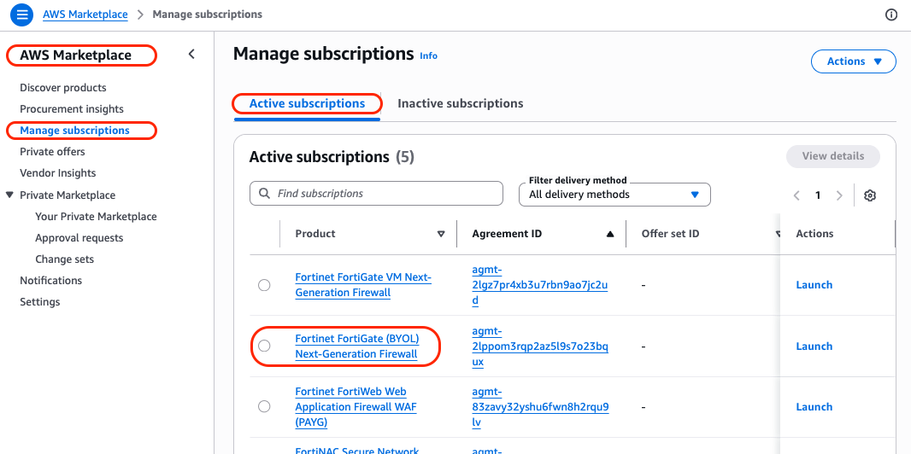

---

## Step 2: Create the EC2 Key Pair

AWS requires a key pair to launch an instance. In this workshop you use it to SSH into the test VM in Lab 3. AWS keeps the public half and gives you the private half as a file. The private key can be downloaded **only once**, at creation time. If you lose it, you must create a new key pair.

1. **Open Key Pairs:**
   - In the search bar, type `EC2` and choose **EC2**.
   - In the left navigation pane, under **Network & Security**, choose **Key Pairs**.
   - Choose **Create key pair**.

   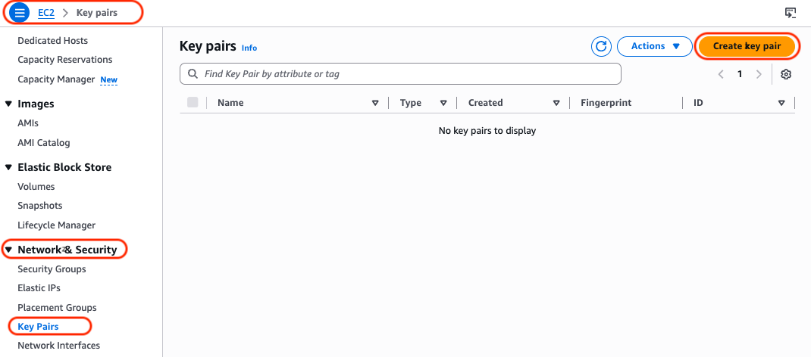

2. **Fill in the settings:**

   | Parameter | Value |
   | --- | --- |
   | **Key pair** | |
   | Name | `redwood-aws101-lab-kp` |
   | Key pair type | **RSA** |
   | Private key file format | **.pem** (macOS, Linux, WSL, or Windows OpenSSH) or **.ppk** (PuTTY) |
   | **Tags - *optional*** | |
   | Key | `Project` |
   | Value - *optional* | `Redwood-AWS-101` |

   - Choose **Create key pair**. Your browser downloads `redwood-aws101-lab-kp.pem` (or `.ppk`) immediately.

   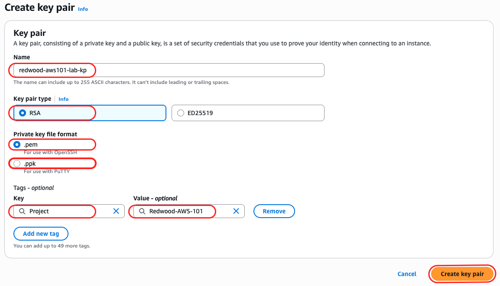

3. **Store the private key safely:**
   - On **macOS, Linux, or WSL**, move the file into your SSH folder and restrict its permissions. SSH refuses to use a private key that other users can read.

     ```bash
     mkdir -p ~/.ssh/aws-101
     mv ~/Downloads/redwood-aws101-lab-kp.pem ~/.ssh/aws-101/
     chmod 400 ~/.ssh/aws-101/redwood-aws101-lab-kp.pem
     ```

   - On **Windows with PuTTY**, save the `.ppk` file in a folder you'll remember, for example `C:\Users\<you>\Documents\AWS-101\`.
   
**Check:**

- [x] `redwood-aws101-lab-kp` appears in **EC2 → Key Pairs**.
- [x] The private key file is saved on your computer.

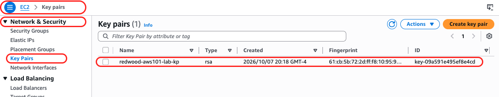

---

## Step 3: Launch the FortiGate EC2 Instance

This creates the FortiGate itself. The instance launches with one network interface, which becomes `port1` in the public subnet. You add `port2` later, in Steps 5 and 6. In this step you also create the security group, the AWS-level "firewall" in front of FortiGate's interfaces. It decides which traffic AWS lets reach FortiGate at all.

1. **Start the launch wizard:**
   - In the EC2 console's left navigation pane, choose **Instances**.
   - Choose **Launch instances**.

   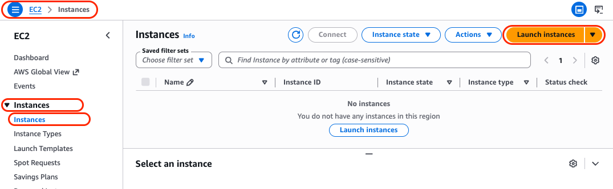

2. **Name and tags:**
   - Choose **Add additional tags** and fill in:

     | Parameter | Value |
     | --- | --- |
     | **Name and tags** | |
     | Name | `redwood-aws101-lab-fgt` |
     | **Additional tags** | |
     | Key | `Project` |
     | Value | `Redwood-AWS-101` |
     | Resource types | **Instances, Volumes, Network interfaces** |

   - Applying the tag to volumes and network interfaces means the disks and `port1` are tagged too.

   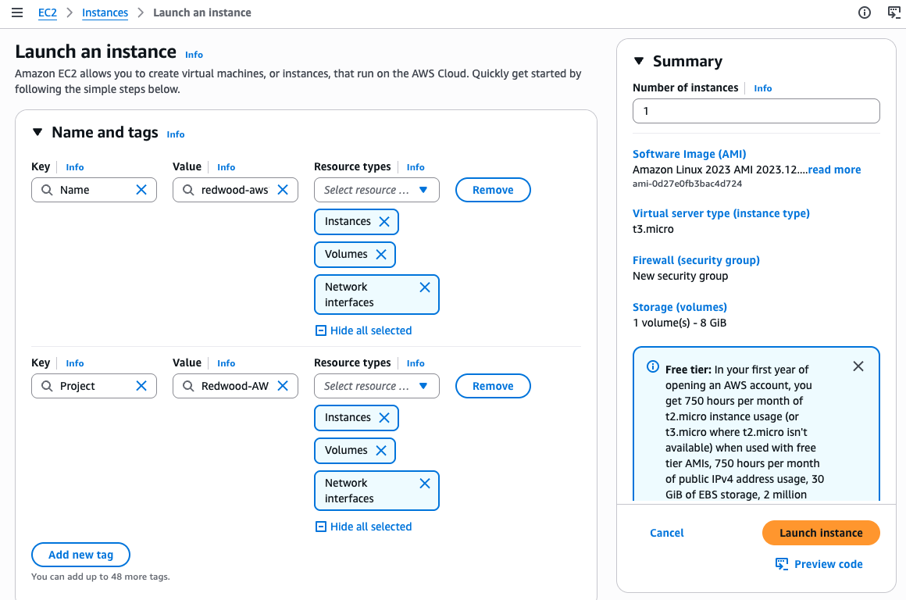

3. **Choose the FortiGate image (AMI):**
   - Under **Application and OS Images**, choose **Browse more AMIs**.
   - Select the **AWS Marketplace AMIs** tab and search for `FortiGate BYOL`.
   - Next to the **Fortinet FortiGate (BYOL) Next-Generation Firewall** listing, choose **Select**, then confirm.

   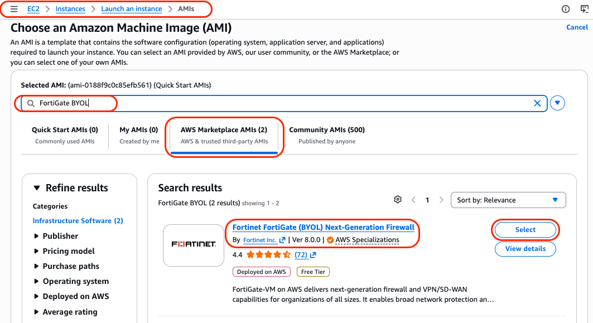

4. **Instance type:**
   - Select `c5.large` (2 vCPU, 4 GiB memory). It is a supported FortiGate-VM type and is enough for this workshop.

   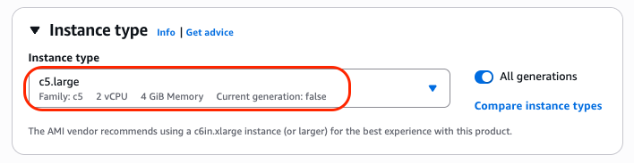
<!-- TODO: verify against the current FortiGate-VM on AWS supported instance types list -->

1. **Key pair:**
   - In **Key pair name**, select `redwood-aws101-lab-kp`.

2. **Network settings:**
   - Choose **Edit** in the **Network settings** panel and fill in:

     | Parameter | Value |
     | --- | --- |
     | **Network settings** | |
     | VPC | `redwood-aws101-lab-vpc` |
     | Subnet | `redwood-aws101-lab-subnet-public-1a` |
     | Auto-assign public IP | **Disable** |
     | **Firewall (security groups)** | |
     | Security group | **Create security group** |
     | Security group name | `redwood-aws101-lab-fgt-sg` |
     | Description | `Management and inspection access for redwood-aws101-lab-fgt` |

     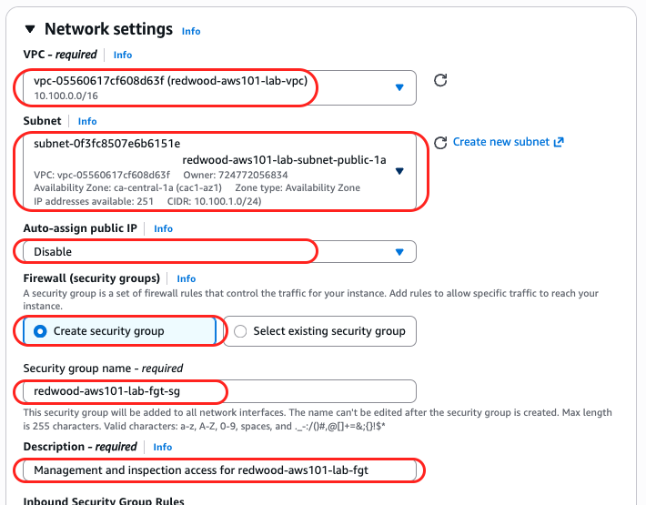

   - Under **Inbound security group rules**, replace the default rule with the five rules below. Use **Add security group rule** to add each new row.

     | Type | Port range | Source type | Source | Description |
     | --- | --- | --- | --- | --- |
     | SSH | 22 | My IP | (filled in automatically) | FortiGate CLI |
     | HTTPS | 443 | My IP | (filled in automatically) | FortiGate GUI |
     | Custom TCP | 2222 | Anywhere | `0.0.0.0/0` | Inbound SSH to the test VM |
     | Custom TCP | 8080 | Anywhere | `0.0.0.0/0` | Inbound HTTP to the test VM |
     | All traffic | All | Custom | `10.100.0.0/16` | Traffic from VPC |

     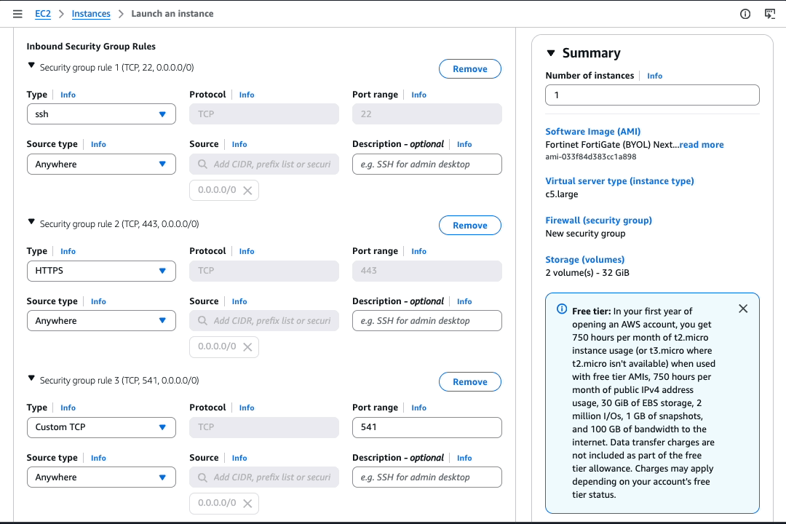
     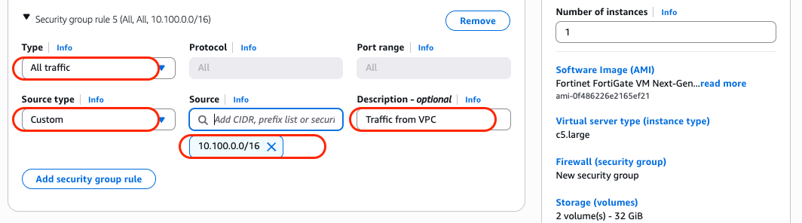

   > [!IMPORTANT]
   > Keep **Auto-assign public IP** set to **Disable**. In Step 4 you attach an Elastic IP, a public address that never changes. An auto-assigned public IP is released every time the instance stops, which you'll do in Step 6. That would break GUI access, the Lab 3 VIPs, and the Lab 4 VPN.

   <details>
   <summary><b>What each security group rule is for</b></summary>

   - **22 and 443 from My IP:** FortiGate CLI and GUI management. Only your workstation can reach them.
   - **2222 and 8080 from anywhere:** the inbound SSH and HTTP VIPs you build in Lab 3. They forward Internet traffic to the test VM through FortiGate.
   - **All traffic from `10.100.0.0/16`:** traffic from the workloads in the VPC. It arrives on `port2` to be inspected and forwarded.

   In production, use a separate security group for each interface role (Internet-facing and internal), and limit management access to a trusted admin network.
   </details>

3. **Storage:**
   - The FortiGate AMI provides two volumes: a 2 GiB root volume and a 30 GiB log volume (`/dev/sdb`). Confirm both are listed. Add the log volume only if it's missing.
     <!-- TODO: verify the default block-device mapping of the current FortiGate BYOL AMI -->

4. **Instance metadata:**
   - Expand **Advanced details** and set **Metadata version** to **V2 only (token required)**.
   - This enforces IMDSv2, which protects the instance's AWS credentials from SSRF-style attacks.
     <!-- TODO: verify IMDSv2-only support for the FortiOS version in use -->

5. **Launch:**
   - In the **Summary** panel on the right, confirm **Number of instances** is `1`.
   - Choose **Launch instance**.

   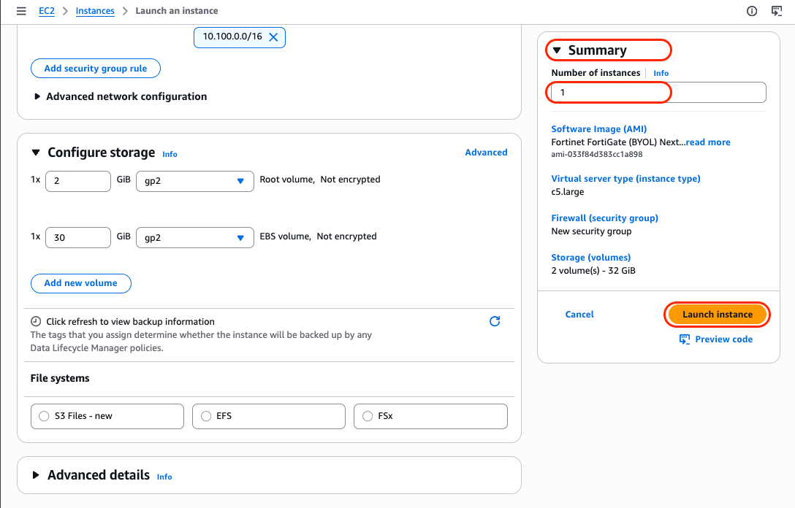

6. **Wait for the instance to start:**
    - Choose **View all instances**.
    - Wait until **Instance state** shows **Running** and **Status check** shows **3/3 checks passed**. This takes 2–4 minutes. Use the refresh button to update the view.

    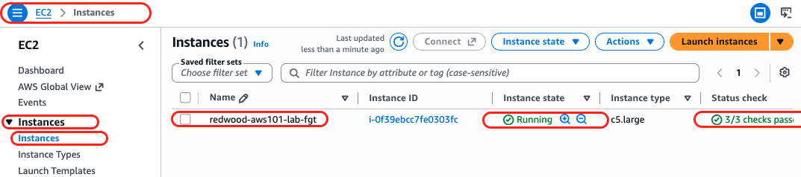

**Check:**

- [x] `redwood-aws101-lab-fgt` is **Running** with **3/3 checks passed**.
- [x] On its **Networking** tab, the interface is in `redwood-aws101-lab-subnet-public-1a`.
- [x] There is no public IPv4 address yet.

---

## Step 4: Allocate an Elastic IP for `port1`

FortiGate needs a public address that never changes. Your browser uses it to reach the GUI, Internet users use it to reach the Lab 3 VIPs, and the HQ FortiGate uses it as the VPN peer in Lab 4. An **Elastic IP** is a public IPv4 address that belongs to your account until you release it. It stays the same across stops, starts, and reboots.

1. **Allocate the Elastic IP:**
   - In the EC2 console's left navigation pane, under **Network & Security**, choose **Elastic IPs**.
   - Choose **Allocate Elastic IP address**.

     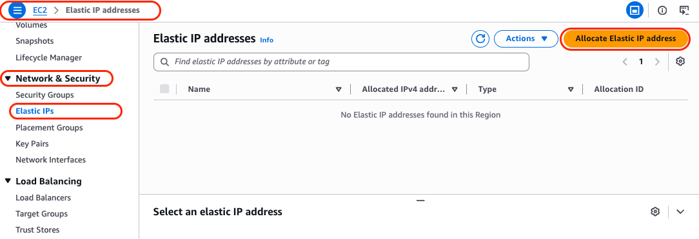

   - Fill in the settings:

     | Parameter | Value |
     | --- | --- |
     | **Elastic IP address settings** | |
     | Network border group | `ca-central-1` |
     | Public IPv4 address pool | **Amazon's pool of IPv4 addresses** |
     | **Tags - *optional*** | |
     | Key | `Name` |
     | Value - *optional* | `redwood-aws101-lab-fgt-eip` |
     | Key | `Project` |
     | Value - *optional* | `Redwood-AWS-101` |

   - Choose **Add new tag** to add the second tag.

   - Choose **Allocate**.

     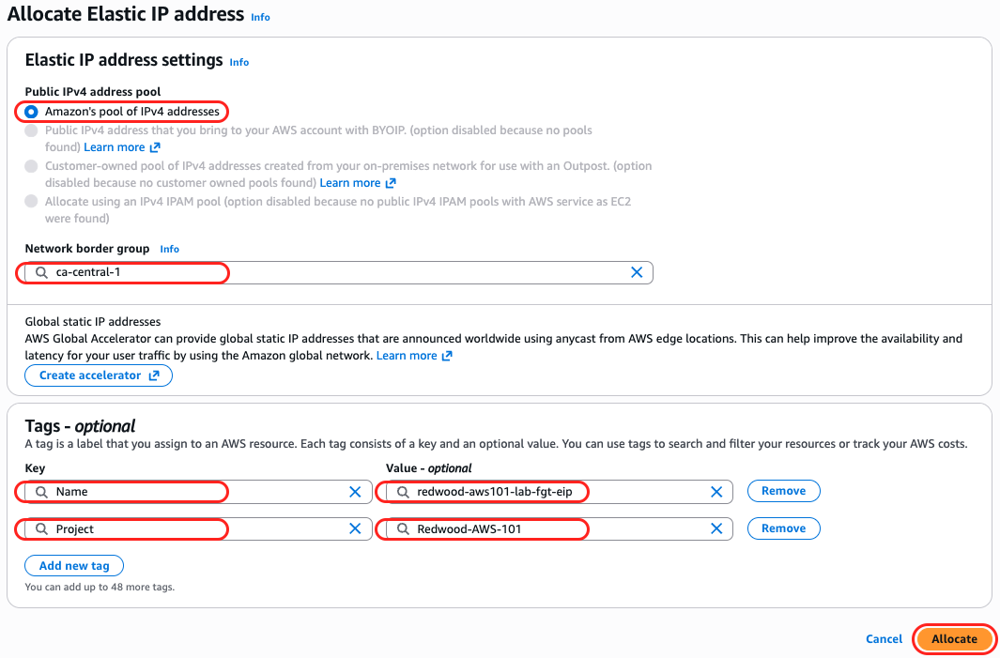

2. **Associate it with FortiGate's `port1`:**
   - In the **Elastic IPs** list, select the new address.
   - Choose **Actions → Associate Elastic IP address**.

     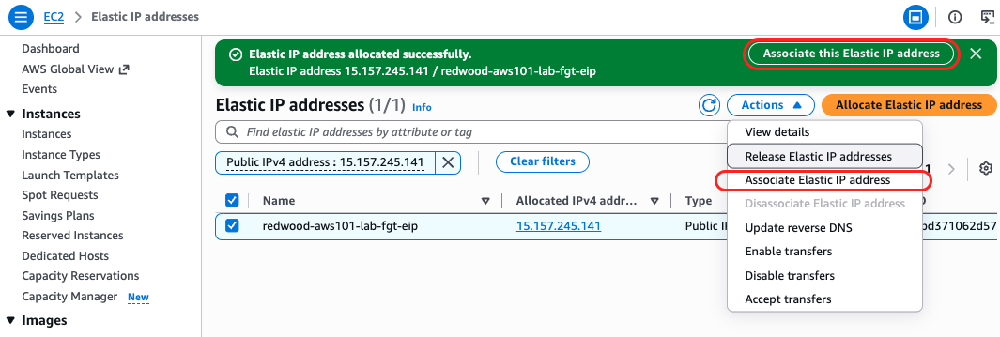

   - Fill in the settings:

     | Parameter | Value |
     | --- | --- |
     | **Resource type** | |
     | Resource type | **Network interface** |
     | Network interface | The primary interface of `redwood-aws101-lab-fgt` (its description starts with "Primary network interface") |
     | Private IP address | The only address listed (a `10.100.1.x` address) |
     | **Reassociation** | |
     | Allow this Elastic IP address to be reassociated | Leave unchecked |

   - Choose **Associate**.

     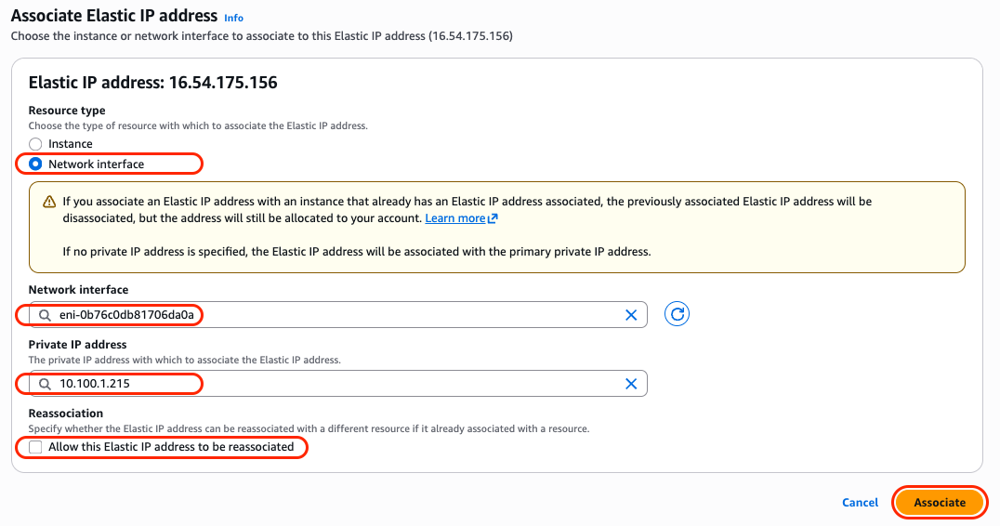

   > [!NOTE]
   > You associate the Elastic IP with the **network interface**, not the instance. The address then stays with `port1` even if the interface is moved to a replacement instance.

3. **Write down the Elastic IP.** You'll use it in every remaining lab, where it appears as `<FGT-EIP>`.

**Check:**

- [x] The Elastic IP shows as associated with FortiGate's primary interface.
- [x] The instance's **Public IPv4 address** field shows `<FGT-EIP>`.

---

## Step 5: Create the `port2` Network Interface

FortiGate needs a second interface in the private subnet. That's `port2`, the side that faces the workloads and receives their traffic for inspection. You create it as a standalone Elastic Network Interface (ENI) with a **fixed** private IP, `10.100.2.4`. The private route table (Step 9) and FortiGate's configuration both depend on this exact address, so it must never change.

1. **Start creating the interface:**
   - In the EC2 console's left navigation pane, under **Network & Security**, choose **Network Interfaces**.
   - Choose **Create network interface**.

   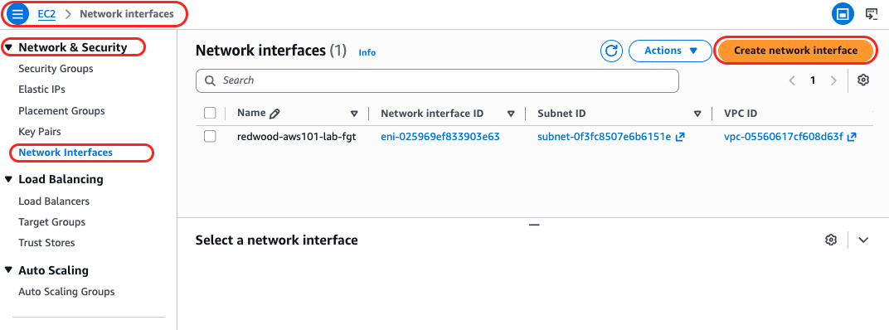

2. **Fill in the settings:**

   | Parameter | Value |
   | --- | --- |
   | **Details** | |
   | Description - *optional* | `redwood-aws101-lab-fgt port2 (internal inspection interface)` |
   | Subnet | `redwood-aws101-lab-subnet-private-1a` |
   | Interface type | **ENA** |
   | Private IPv4 address | **Custom** |
   | IPv4 address | `10.100.2.4` |
   | **Security groups** | |
   | Security groups | `redwood-aws101-lab-fgt-sg` |
   | **Tags - *optional*** | |
   | Key | `Name` |
   | Value - *optional* | `redwood-aws101-lab-fgt-eni-port2` |
   | Key | `Project` |
   | Value - *optional* | `Redwood-AWS-101` |

3. Choose **Create network interface**.

   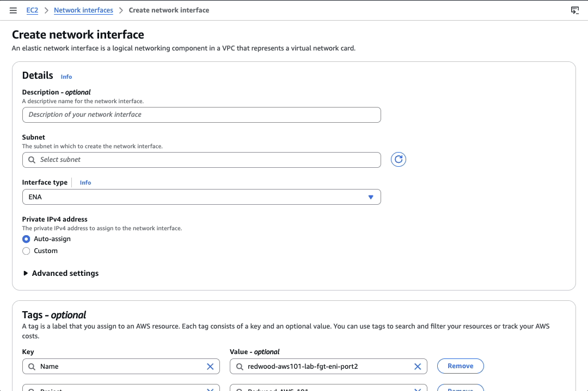

> [!IMPORTANT]
> Make sure **Private IPv4 address** is set to **Custom** with `10.100.2.4`. If you leave it on **Auto-assign**, AWS picks a random address and the rest of the lab won't match.

**Check:**

- [x] `redwood-aws101-lab-fgt-eni-port2` appears in **Network Interfaces** with **Status: Available** (not yet attached).
- [x] Its private IP is `10.100.2.4`.

---

## Step 6: Attach `port2` to FortiGate

The new interface exists, but no instance uses it yet. Attaching it gives FortiGate its second network port. You stop the instance first because FortiOS reliably detects new interfaces at boot. An interface attached while it's running may not appear until the next reboot.

1. **Stop FortiGate:**
   - In the EC2 console's left navigation pane, choose **Instances**.
   - Select `redwood-aws101-lab-fgt`.
   - Choose **Instance state → Stop instance**, then confirm.
   - Wait until **Instance state** shows **Stopped**.

     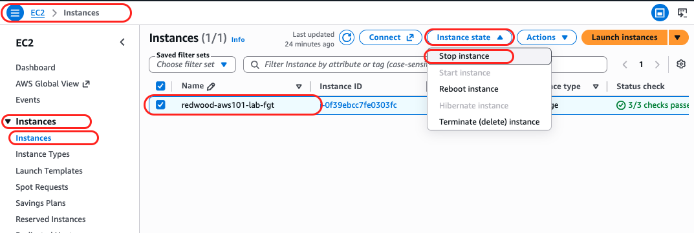

2. **Attach the interface:**
   - With `redwood-aws101-lab-fgt` still selected, choose **Actions → Networking → Attach network interface**.

     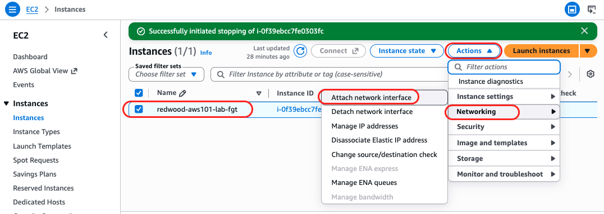

   - Fill in the settings:

     | Parameter | Value |
     | --- | --- |
     | VPC | `redwood-aws101-lab-vpc` |
     | Network interface | `redwood-aws101-lab-fgt-eni-port2` (description "redwood-aws101-lab-fgt port2 ...") |

   - Choose **Attach**.

     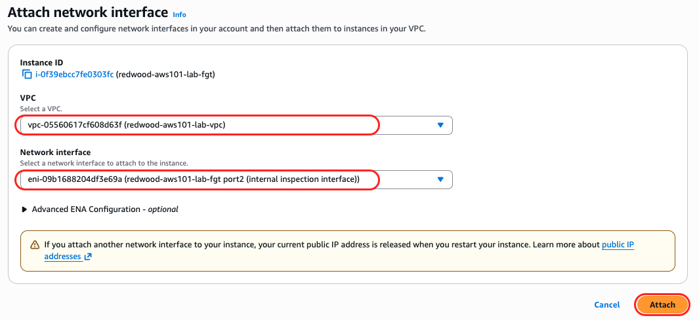

3. **Verify both interfaces:**
   - Select the instance and open the **Networking** tab at the bottom of the page.
   - Under **Network interfaces**, confirm there are two: the primary interface in the public subnet, and `port2` in the private subnet at `10.100.2.4`.

     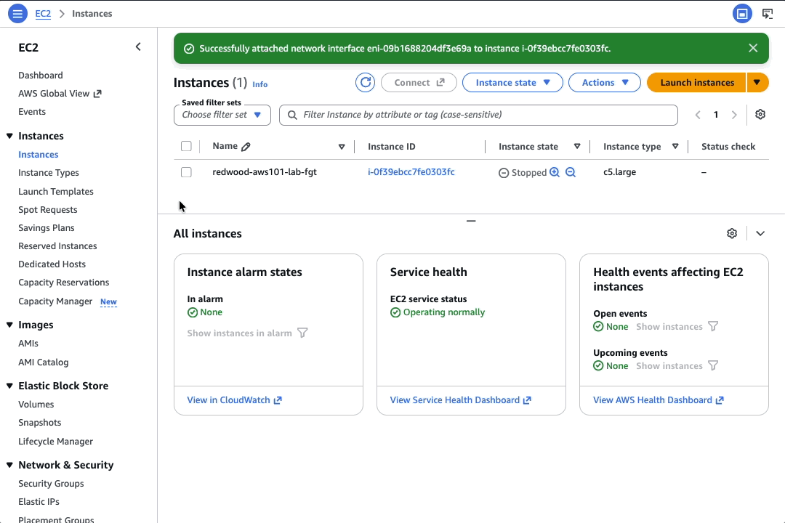

Leave the instance stopped. You start it again at the end of Step 7.

**Check:**

- [x] `redwood-aws101-lab-fgt` has two network interfaces.
- [x] The Elastic IP is still associated with the primary interface.

---

## Step 7: Disable Source/Destination Check

By default, AWS drops any packet that arrives at an interface unless that interface's own IP is the packet's source or destination. That protects normal servers, but it breaks a firewall. FortiGate forwards traffic **on behalf of other hosts**: for example, a packet from the test VM (`10.100.2.10`) to the Internet passes through `port2` and `port1`, and neither address is FortiGate's. You must turn this check off on both interfaces, or FortiGate looks healthy but passes no traffic.

<details>
<summary><b>More about the source/destination check</b></summary>

The check is an AWS anti-spoofing feature applied to every network interface. Any instance that routes, NATs, or firewalls traffic must have it disabled: FortiGate, NAT instances, VPN appliances, and so on. Forgetting this is the most common reason a firewall deployment on AWS "doesn't work." AWS drops the packets silently, so neither FortiGate's logs nor the instance show an error.
</details>

---

1. **Disable the check on `port1`:**
   - In the EC2 console's left navigation pane, under **Network & Security**, choose **Network Interfaces**.
   - Select FortiGate's primary interface (in `redwood-aws101-lab-subnet-public-1a`, with the name "redwood-aws101-lab-fgt").
   - Choose **Actions → Change source/dest. check**.
   - Clear the **Enable** checkbox for **Source/destination checking**, and choose **Save**.

   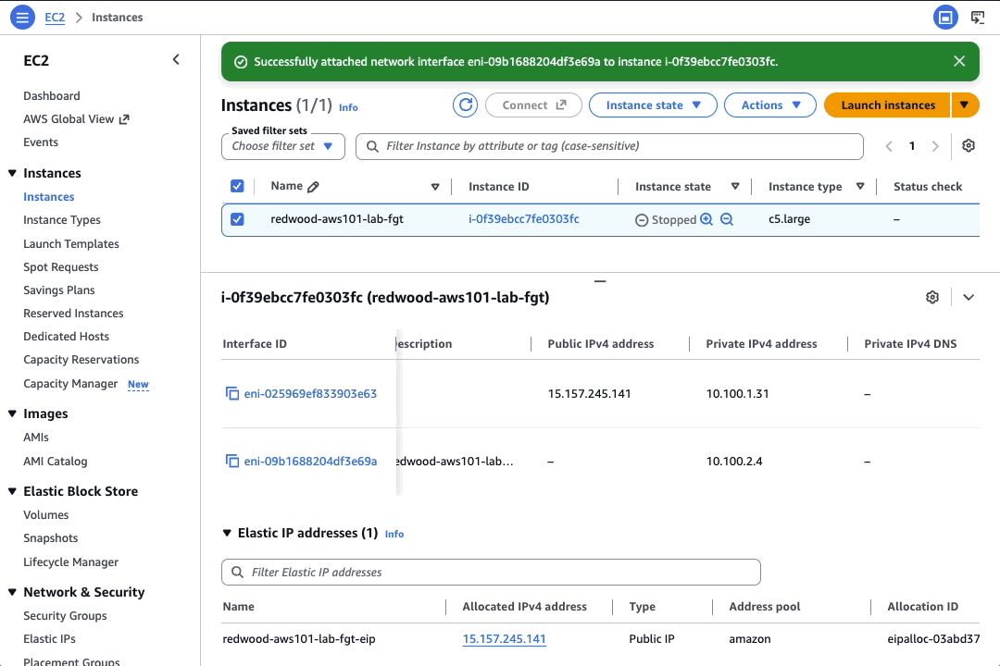

2. **Disable the check on `port2`:**
   - Select `redwood-aws101-lab-fgt-eni-port2`.
   - Choose **Actions → Change source/dest. check**, clear **Enable**, and choose **Save**.

3. **Start FortiGate again:**
   - In the left navigation pane, choose **Instances** and select `redwood-aws101-lab-fgt`.
   - Choose **Instance state → Start instance**.
   - Wait until **Status check** shows **3/3 checks passed**.

   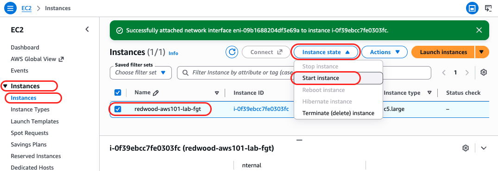

**Check:**

- [x] Both interfaces show **Source/dest. check: false** in their **Details** tab.
- [x] FortiGate is **Running** with **3/3 checks passed**.

---

## Step 8: License FortiGate and Access the GUI

A new FortiGate-VM runs on a limited evaluation license (1 vCPU, 2 GB RAM, no FortiGuard services). Activating your FortiFlex token unlocks the full VM and the FortiGuard security services (IPS, antivirus, web filtering, and more). It also proves that FortiGate can reach the Internet through `port1`, the Elastic IP, and the Internet Gateway, because activation must contact FortiCare online.

1. **Open the GUI:**
   - In your browser, go to `https://<FGT-EIP>` (note the `https://` not `http://`).
   - FortiGate uses a self-signed certificate, so the browser shows a security warning. This is expected:
     - **Chrome:** choose **Advanced → Proceed to `<FGT-EIP>` (unsafe)**.
     - **Firefox:** choose **Advanced → Accept the Risk and Continue**.

2. **Log in for the first time:**

   | Parameter | Value |
   | --- | --- |
   | Username | `admin` |
   | Password | The **EC2 instance ID**, for example `i-0abc123def4567890` |

   > [!NOTE]
   > On AWS, FortiGate's initial admin password is its instance ID. Find it in **EC2 → Instances → `redwood-aws101-lab-fgt` → Details → Instance ID**.

3. **Set a new admin password:**
   - When prompted, enter a strong password (at least 12 characters, with upper- and lowercase letters, digits, and a symbol), confirm it, and save it somewhere safe. It can't be recovered.

4. **Activate the FortiFlex license:**
   - In the **VM License** dialog, select **FortiFlex token**.
   - Paste the token from your instructor, with no spaces before or after it.
   - Choose **OK**, then confirm the reboot. Activation usually takes 30–60 seconds, plus the reboot.

   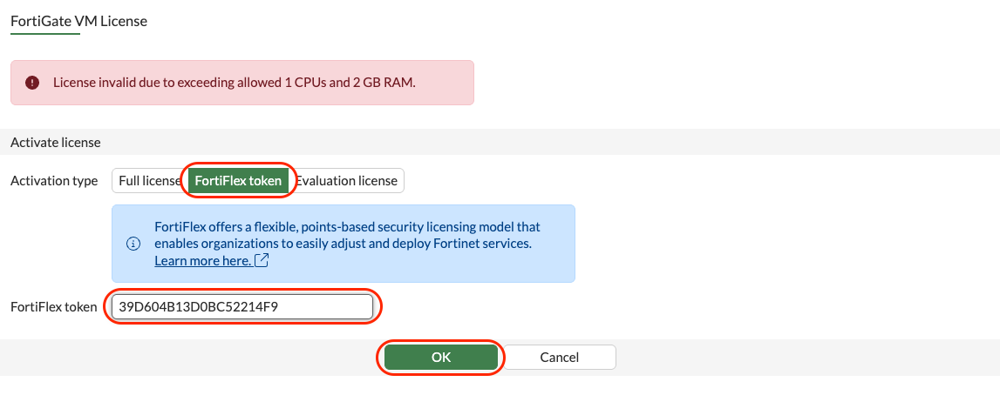

5. **Verify the license:**
   - After the reboot, log in again with your new password and complete the initial setup prompts.
   - Go to **System → FortiGuard** and confirm:
     - **VM License:** Valid
     - **Support contract:** Valid
     - **IPS, Advanced Malware Protection, Web Filtering:** Licensed

   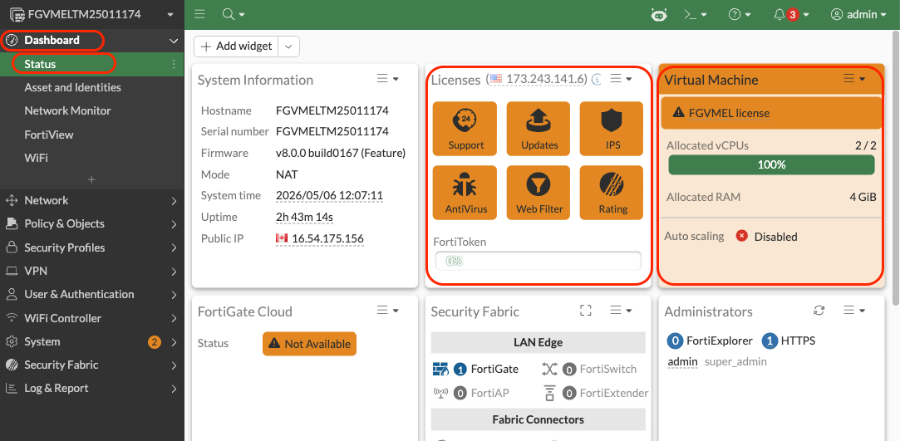

6. **Verify the interfaces:**
   - Go to **Network → Interfaces** and confirm:

     | Interface | Expected |
     | --- | --- |
     | `port1` | **Up**, IP `10.100.1.x/24` |
     | `port2` | **Up**, IP `10.100.2.4/24` |

     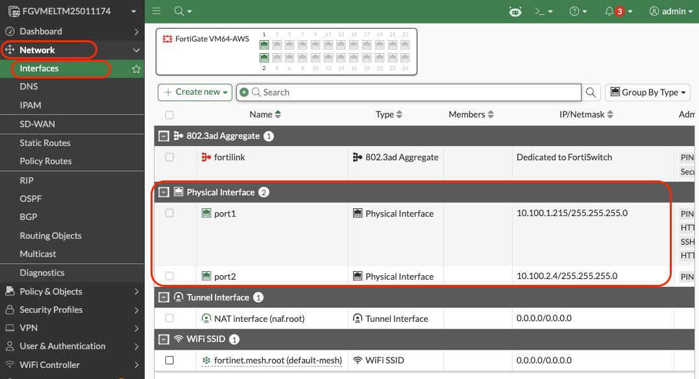

   - If `port2` has no IP address, edit it and set **Addressing mode: Manual** with IP `10.100.2.4/255.255.255.0`, enable the **Administrative Access** `PING` then choose **OK**.

     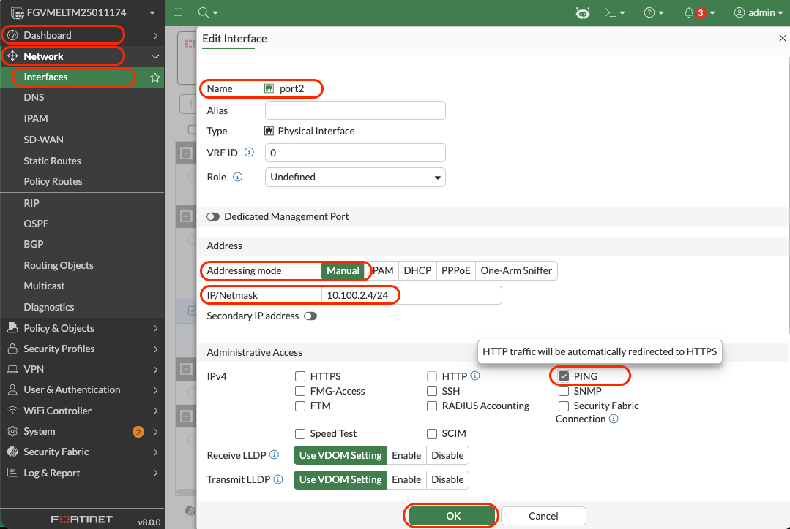

> [!TIP]
> `port1` shows its private address (`10.100.1.x`), not the Elastic IP. AWS translates between the Elastic IP and the private address at the Internet Gateway, so FortiOS never sees the Elastic IP. This matters in Lab 3 (VIPs) and Lab 4 (VPN).

**Check:**

- [x] You can log in at `https://<FGT-EIP>`.
- [x] The license shows **Valid**.
- [x] Both `port1` and `port2` are **Up**.

---

## PART 2: Traffic Steering

FortiGate is running, but nothing sends traffic to it yet. The private subnet still uses the VPC's Main route table, which only has the `local` route, so workloads there can't leave the VPC at all. In this part you give the private subnet a route table that sends everything to FortiGate.

## Step 9: Create the Private Route Table

This route table is what makes FortiGate the inspection point. Its default route sends all traffic leaving the private subnet (`0.0.0.0/0`) to FortiGate's `port2` interface. Any workload placed in the private subnet is then inspected automatically, with no configuration on the workload itself. FortiGate's own routing table then decides where the traffic goes next: the Internet (Lab 3) or the VPN tunnel to HQ (Lab 4).

1. **Create the route table:**
   - Open the VPC console. In the left navigation pane, choose **Route tables**.
   - Choose **Create route table**.

     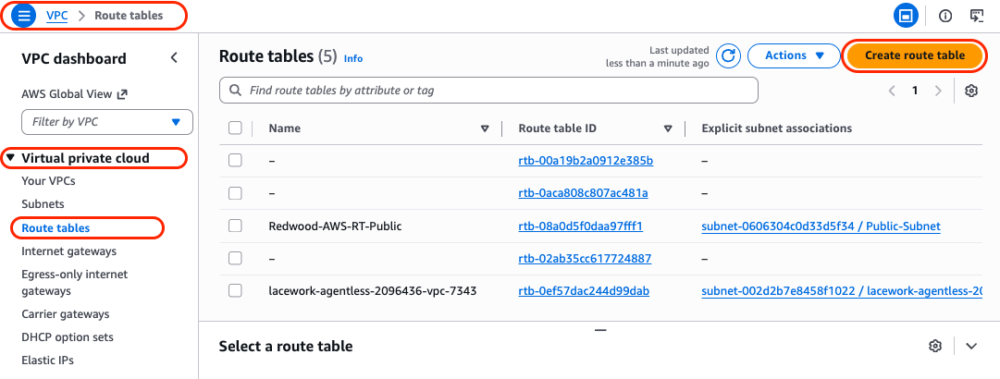

   - Fill in the settings:

     | Parameter | Value |
     | --- | --- |
     | **Route table settings** | |
     | Name - *optional* | `redwood-aws101-lab-rt-private` |
     | VPC | `redwood-aws101-lab-vpc` |
     | **Tags** | |
     | Key | `Project` |
     | Value - *optional* | `Redwood-AWS-101` |

   - Choose **Create route table**.

     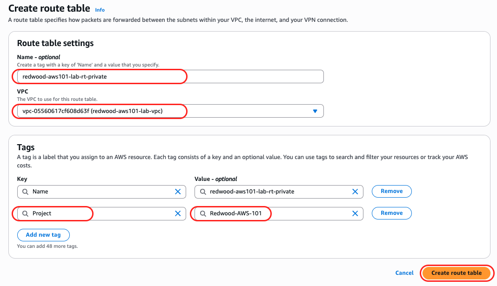

2. **Add the default route to FortiGate's `port2`:**
   - On the route table's details page, select the **Routes** tab.
   - Choose **Edit routes**, then **Add route**, and enter:

     | Destination | Target |
     | --- | --- |
     | `0.0.0.0/0` | **Network Interface** → `redwood-aws101-lab-fgt-eni-port2` (the interface with IP `10.100.2.4`) |

   - Choose **Save changes**.

     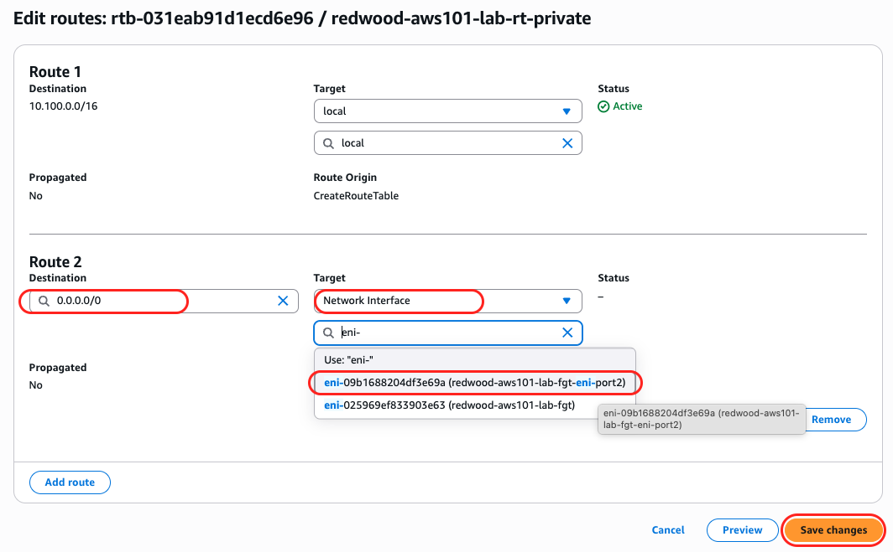

   > [!IMPORTANT]
   > In the **Target** list, choose **Network Interface**, not **Instance**. FortiGate has two interfaces, and the route must point specifically at `port2`.

   <details>
   <summary><b>Why point the route at the interface?</b></summary>

   VPC routes always point at AWS objects (interfaces, gateways, endpoints), never at a bare IP address. Targeting the `port2` interface makes the next hop explicit. The interface is a standalone object, so if FortiGate is ever replaced (for a resize or an upgrade), you move the interface to the new instance and the route keeps working unchanged.
   </details>

   ---

3. **Associate the route table with the private subnet:**
   - Select the **Subnet associations** tab and choose **Edit subnet associations**.
   - Select `redwood-aws101-lab-subnet-private-1a` (`10.100.2.0/24`).
   - Choose **Save associations**.

   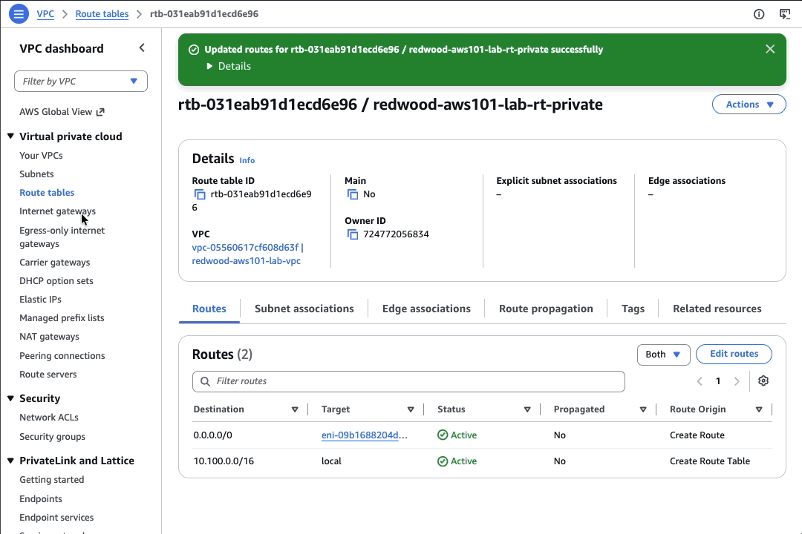

**Check:**

- [x] `redwood-aws101-lab-rt-private` has two routes: `10.100.0.0/16 → local` and `0.0.0.0/0 → eni-...`.
- [x] `redwood-aws101-lab-subnet-private-1a` is listed under **Subnet associations**.
- [x] Each subnet has its own route table, and neither uses the Main route table.

<details>
<summary><b>Production considerations</b></summary>

- **Availability:** a single FortiGate in one Availability Zone is a single point of failure for everything behind it. Production designs use FortiGate FGCP active-passive HA across two AZs (AWS-102), or a FortiGate fleet behind a Gateway Load Balancer.
- **Sizing:** choose the instance type based on the throughput you need to inspect with your security profiles enabled. Check Fortinet's list of supported instance types.
</details>

---

## Checklist

Before moving to Lab 3, confirm:

- [ ] `redwood-aws101-lab-fgt` is **Running** with **3/3 checks passed**
- [ ] `port1` is in the public subnet and has the Elastic IP; `port2` is in the private subnet at `10.100.2.4`
- [ ] Source/destination check is **disabled** on both interfaces
- [ ] The FortiGate GUI is reachable at `https://<FGT-EIP>`, and the FortiFlex license is **Valid**
- [ ] `redwood-aws101-lab-rt-private` has `0.0.0.0/0 → port2 interface` and is associated with the private subnet

## Troubleshooting

| Issue | Solution |
| --- | --- |
| The GUI times out | The security group allows HTTPS only from the IP you had at launch. If your IP changed (VPN, different network), update the **My IP** rules in `redwood-aws101-lab-fgt-sg`. |
| Login fails with `admin` | The initial password is the **EC2 instance ID**, not `admin` or blank. |
| `port2` IP is not `10.100.2.4` | The interface was created with an auto-assigned IP. Stop the instance, detach and delete the interface, and recreate it with a **Custom** IP (Step 5). |
| FortiFlex: "Failed to contact FortiCare" | FortiGate can't reach the Internet. Check the public route table and its subnet association (Lab 1, Step 6). From the FortiGate CLI, test with `execute ping fortiguard.com`. |
| FortiFlex: "Token already used" | Each token can be used once. Ask your instructor for a new one. |

---

FortiGate now controls every path in and out of the private subnet, and it blocks everything until you add policies. In Lab 3, Redwood's first application server arrives.

*Next:* [**Lab 3: Security Policies & Traffic Testing**](/aws-101-lab3/README.md)
