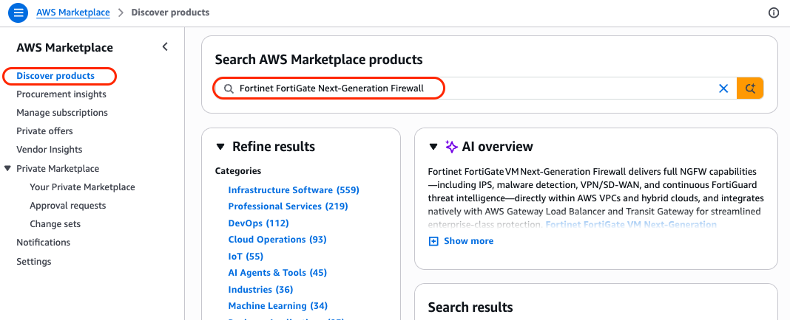

# AWS-101 Lab 2: FortiGate VM Deployment & Traffic Steering

## Lab Overview

### Objective

Deploy a FortiGate-VM from the AWS Marketplace into the VPC built in Lab 1, attach a second Elastic Network Interface (ENI) so the firewall has both an external (`port1`) and internal (`port2`) presence, license the appliance with FortiFlex, and configure VPC route tables to steer all subnet traffic through FortiGate for inspection.

This lab combines the appliance deployment with the routing configuration — by the end, every packet entering or leaving `redwood-aws101-lab-subnet-private-1a` will pass through FortiGate, and `redwood-aws101-lab-subnet-public-1a` will have a working path to the Internet via the IGW from Lab 1.

### What You'll Build

- A FortiGate-VM EC2 instance (`redwood-aws101-lab-fgt`) running FortiOS 8.0.x on a `c5.large` instance in `ca-central-1a`
- `port1` ENI in `redwood-aws101-lab-subnet-public-1a` with an Elastic IP for management and Internet egress
- `port2` ENI in `redwood-aws101-lab-subnet-private-1a` with a **static** private IP of `10.100.2.4` for traffic inspection
- **Source/Destination check** disabled on both ENIs (required for any AWS instance acting as a router/firewall)
- FortiFlex license activated, FortiGuard registered, FortiGate GUI reachable via HTTPS
- `redwood-aws101-lab-rt-private` route table — `0.0.0.0/0` → FortiGate `port2` ENI, associated with `redwood-aws101-lab-subnet-private-1a` (the Public Subnet's route table was built in Lab 1)

### Architecture After Lab 2


### Business Context

Redwood Industries' security policy requires every workload — on-premises **and** cloud — to be inspected by FortiGate before traffic reaches the Internet or another network segment. In Lab 1 you built the AWS networking foundation. In this lab, you deploy the security appliance that turns that foundation into an inspected enclave: a FortiGate-VM acting as the single point of egress and ingress for the `redwood-aws101-lab-subnet-private-1a`. Once the route tables are associated, every workload deployed in Lab 3 will have its traffic steered through FortiGate automatically — no per-VM configuration required.

---

## Prerequisites

- Lab 1 completed successfully (VPC, two subnets, IGW)
- IAM user/role with `AmazonEC2FullAccess` and `AmazonVPCFullAccess` (or equivalent policies granting `ec2:*` — VPC actions are part of the `ec2` IAM namespace — plus `aws-marketplace:Subscribe` and `aws-marketplace:ViewSubscriptions`)
- A **FortiFlex token** provided by your instructor (or your own active FortiFlex entitlement)
- A modern terminal capable of using an OpenSSH-format private key (`.pem`) on macOS / Linux / WSL, or PuTTY on Windows. You will create a workshop-dedicated EC2 **key pair** in Step 2 — there is no need to bring an existing one
- A modern browser (Chrome or Firefox) for the FortiGate GUI

> [!IMPORTANT]
> The FortiGate-VM AMI is a **paid Marketplace product**. Even with a BYOL listing (no software charge), you must accept the seller's End-User Licence Agreement once per AWS account before launch. Step 1 walks through this acceptance — it is a one-time action.

---

## PART 1: FortiGate VM Deployment

This part covers everything from accepting the AMI in AWS Marketplace through getting a licensed, reachable FortiGate GUI.

---

## Step 1: Subscribe to the FortiGate-VM AMI in AWS Marketplace

Before you can launch a FortiGate EC2 instance, you must subscribe to the BYOL Marketplace listing. This is a one-time per-account action that records the AWS Marketplace EULA acceptance.

1. **Open the AWS Marketplace:**
   - In the top search bar, type `Marketplace`
   - Click **AWS Marketplace**
   - Confirm you are still in **ca-central-1** (top-right region selector)

   

2. **Search for the FortiGate BYOL listing:**
   - Click **Discover products**
   - In the search bar, type `Fortinet FortiGate Next-Generation Firewall`
   - Press Enter

   

3. **Select the correct listing:**
   - Click the listing published by **Fortinet, Inc.** with NO **"(PAYG)"** in the title
   - Review the overview pane (optional)

   

> [!NOTE]
> Fortinet publishes several FortiGate listings. The one you want is the BYOL (Bring Your Own License) variant — the PAYG (Pay-As-You-Go) listing bills the licence by the hour and is **not** what FortiFlex uses. BYOL listings may also be offered for both x86_64 and Arm64 (Graviton) architectures; this workshop uses **x86_64** to match the `c5.large` instance type.
<!-- TODO: verify current Marketplace listing titles and architectures against the current AWS Marketplace -->

4. **Subscribe to the listing:**
   - Click **View purchase options**
   - Click **Subscribe**
   - Accept the EULA when prompted (subscription is granted immediately)

   

5. **Skip the in-Marketplace launch wizard:**
   - The next page offers a **Continue to Configuration → Launch** flow — **do not use it** (it provides limited control over networking)
   - Close this page and return to the EC2 console; you will launch the instance manually in Step 3 to retain full control over ENI placement and tagging

### Validation

- [x] **AWS Marketplace > Manage subscriptions** lists `Fortinet FortiGate VM Next-Generation Firewall` in the **Active subscriptions** tab
- [x] No EULA prompt remains outstanding
  


---

## Step 2: Create the EC2 Key Pair

EC2 key pairs provide SSH access to Linux instances and serve as the initial credential factor for many AMIs. For this workshop, you will create a dedicated key pair so that all attendees follow the same naming convention and the key can be cleanly deleted at the end of the lab — even if you already have other key pairs in your account.

> [!IMPORTANT]
> AWS only allows you to download the **private** half of the key pair **once**, at the moment of creation. If the download is lost or the file is misplaced, you must delete the key pair and create a new one. AWS never stores the private key.

1. **Open the Key Pairs console:**
   - In the top search bar, type `EC2` and click **EC2** (the service result)
   - In the left navigation menu under **Network & Security**, click **Key Pairs**
   - Confirm the region selector at the top right shows **Canada (Central) ca-central-1**

   

2. **Create the key pair:**
   - Click **Create key pair** and use the parameters below.

     | Parameter | Value |
     | --- | --- |
     | Name | `redwood-aws101-lab-kp` |
     | Key pair type | `RSA` |
     | Private key file format | `.pem` (macOS / Linux / WSL / OpenSSH) **or** `.ppk` (Windows / PuTTY) |
     | Tags | |
     | `Project` | `Redwood-AWS-101` |
     | `Environment` | `lab` |
     | `Owner` | `<your-name>` |

   - Click **Create key pair**. Your browser will immediately download `redwood-aws101-lab-kp.pem` (or `.ppk`).

   

3. **Move the file to a safe location and tighten permissions:**
   - On **macOS / Linux / WSL** (the `.pem` file must not be world-readable or SSH will refuse to use it):

     ```bash
     mkdir -p ~/.ssh/aws-101
     mv ~/Downloads/redwood-aws101-lab-kp.pem ~/.ssh/aws-101/
     chmod 400 ~/.ssh/aws-101/redwood-aws101-lab-kp.pem
     ```

   - On **Windows (PowerShell)** — keep the `.ppk` file with PuTTY's other keys (commonly `C:\Users\<you>\Documents\AWS-101\`). PuTTY does not enforce a permissions check.

4. **Verify the key pair exists in AWS:**
   - Return to the **Key Pairs** console
   - Confirm `redwood-aws101-lab-kp` is listed with **Type: rsa** and a **Fingerprint** value

   

### Validation

- [x] `redwood-aws101-lab-kp` appears in **EC2 → Key Pairs** with type **rsa**
- [x] You have the downloaded `.pem` (or `.ppk`) file saved in a known, secure location
- [x] On macOS / Linux / WSL, `ls -l redwood-aws101-lab-kp.pem` shows permissions `-r--------` (400)

---

## Step 3: Launch the FortiGate EC2 Instance

In this step you launch a new EC2 instance from the FortiGate AMI, placing its primary network interface (`port1`) in `redwood-aws101-lab-subnet-public-1a`. The secondary interface (`port2`) is added in Step 5.

1. **Open the EC2 console:**
   - In the top search bar, type `EC2` and click **EC2** (the service result)
   - In the left navigation menu, click **Instances**
   - Click **Launch instances**

   

2. **Name and tags:**
   - Click **Add additional tags** and enter the values below. The `Name` tag is set automatically from the **Name** field at the top.

     | Parameter | Value |
     | --- | --- |
     | Name | `redwood-aws101-lab-fgt` |
     | Tags | | 
     | `Project` | `Redwood-AWS-101` |
     | `Environment` | `lab` |
     | `Owner` | `<your-name>` |

   - Click **Add tag to resource types → Instances, Volumes, Network interfaces** so the tags propagate to the EBS volume and the primary ENI.

   

3. **Application and OS Images (Amazon Machine Image):**
   - Click **Browse more AMIs**
   - Click the **AWS Marketplace AMIs** tab
   - Search for `FortiGate BYOL`
   - Select the **Fortinet FortiGate (BYOL) Next-Generation Firewall** listing and click **Select**

   

4. **Instance type:**
   - Use the parameter below.

     | Parameter | Value |
     | --- | --- |
     | Instance type | `c5.large` (2 vCPU, 4 GB, dedicated CPU, ENA) |

   

> [!NOTE]
> `c5.large` is a supported FortiGate-VM instance type and is sufficient for this lab's traffic profile while keeping EC2 cost low.
<!-- TODO: verify against the current FortiGate-VM on AWS supported instance types list -->

> **Well-Architected – Performance Efficiency:** In production, size the instance from the throughput you need to inspect (with the security profiles you will enable), and check Fortinet's supported list for current-generation compute-optimized types before defaulting to an older family.

5. **Key pair (login):**
   - In the **Key pair name — required** dropdown, select `redwood-aws101-lab-kp` (created in Step 2)
   - Do **not** click **Create new key pair** — using the workshop key pair keeps tagging and clean-up consistent

6. **Network settings:**
   - Click **Edit** to expand the panel and use the parameters below. This is the most error-prone screen — match every value carefully.

     | Parameter | Value |
     | --- | --- |
     | VPC | `redwood-aws101-lab-vpc` |
     | Subnet | `redwood-aws101-lab-subnet-public-1a` |
     | Auto-assign public IP | **Disable** |
     | Firewall (security groups) | **Create security group** |
     | Security group name | `redwood-aws101-lab-fgt-sg` |
     | Description | `Management and inspection access for redwood-aws101-lab-fgt` |

     

   - In the **Inbound security group rules** section, replace the default rule with the five rules below.

     | Type | Protocol | Port range | Source type | Source | Description |
     | --- | --- | --- | --- | --- | --- |
     | SSH | TCP | 22 | My IP | (auto-filled) | FortiGate CLI |
     | HTTPS | TCP | 443 | My IP | (auto-filled) | FortiGate GUI |
     | Custom TCP | TCP | 2222 | Anywhere | `0.0.0.0/0` | Incoming access to server |
     | Custom TCP | TCP | 8080 | Anywhere | `0.0.0.0/0` | Incoming access to server |
     | All traffic | All | All | Custom | 10.100.0.0/16 | Traffic from VPC |

     
     

> [!IMPORTANT]
> The "Auto-assign public IP" must be **Disabled**. You will associate a dedicated **Elastic IP** with `port1` in Step 4. An auto-assigned public IP is released whenever the instance is stopped (which you will do in Step 6), so it would break GUI access, the VIPs in Lab 3, and the VPN peer address in Lab 4.

> **Well-Architected – Security:** This lab attaches one security group to both ENIs for simplicity. In production, use a separate security group per ENI role (Internet-facing vs. internal) and restrict management (HTTPS/SSH) to a trusted admin CIDR or a dedicated management interface.

7. **Configure storage:**
   - Confirm the AMI provides the two volumes below. Add the log volume only if it is **not** already listed — do not create a duplicate.
     <!-- TODO: verify the default block-device mapping of the current FortiGate BYOL AMI -->

     | Parameter | Value |
     | --- | --- |
     | Volume 1 (root) | `2 GiB`, `gp3` |
     | Volume 2 (log) | `30 GiB`, `gp3`, device name `/dev/sdb` |

> **Well-Architected – Security:** Under **Advanced details**, set **Metadata version** to **V2 only (token required)** to enforce IMDSv2, which protects the instance metadata service against SSRF-style credential theft.
<!-- TODO: verify IMDSv2-only support for the FortiOS version in use -->

8. **Review and launch:**
   - Go to the **Summary** panel on the right
   - Confirm **Number of instances** is `1`
   - Click **Launch instance**

   

9. **Wait for the instance to reach `Running` state:**
    - Click **View all instances**
    - Refresh the **Instances** page until the **Instance state** shows **Running**
    - Wait until the **Status check** column shows **3/3 checks passed** (typically 2–4 minutes for a `c5.large`)
    - Click on the reload button to update the **Status check**

   

### Validation

- [x] `redwood-aws101-lab-fgt` appears in the **Instances** list with state **Running**
- [x] Instance type shows `c5.large`
- [x] AMI ID begins with `ami-` and the AMI name contains `FortiGate` and `8.0`
- [x] **Networking** tab shows the primary ENI is in `redwood-aws101-lab-subnet-public-1a` with **no public IPv4 address yet**
- [x] Security group `redwood-aws101-lab-fgt-sg` is attached and contains the five inbound rules above

---

## Step 4: Allocate an Elastic IP and Associate It with `port1`

In AWS, public IPv4 addresses come in two flavours: **auto-assigned** (released when the instance stops) and **Elastic IP** (persistent, account-bound). FortiGate needs a stable public address for management, for the inbound VIPs in Lab 3, and as the IPsec peer address in Lab 4, so an Elastic IP is required.

1. **Allocate the Elastic IP:**
   - In the EC2 console left navigation menu under **Network & Security**, click **Elastic IPs**
   - Click **Allocate Elastic IP address**
  
     

   - Use the parameters below.

     | Parameter | Value |
     | --- | --- |
     | Public IPv4 address pool | **Amazon's pool of IPv4 addresses** |
     | Network Border Group | `ca-central-1` |
     | Tags | |
     | `Name` | `redwood-aws101-lab-fgt-eip` |
     | `Project` | `Redwood-AWS-101` |
     | `Environment` | `lab` |
     | `Owner` | `<your-name>` |

   - Click **Allocate**

     

2. **Associate the EIP with the FortiGate primary ENI:**
   - In the **Elastic IPs** list, select the row for the new EIP
   - Click **Actions → Associate Elastic IP address**

     

   - Use the parameters below.

     | Parameter | Value |
     | --- | --- |
     | Resource type | **Network interface** |
     | Network interface | (primary ENI of `redwood-aws101-lab-fgt` — its description begins `Primary network interface`) |
     | Private IP address | (the only IP listed; a `10.100.1.x` address) |
     | Allow this Elastic IP address to be reassociated | **Unchecked** |

   - Click **Associate**

     

3. **Note the Elastic IP value:**
   - Copy the **Allocated IPv4 address** value (e.g., `15.222.x.x`)
   - You will use it to access the FortiGate GUI in Step 8 — record it somewhere safe

### Validation

- [x] The Elastic IP shows **Associated** with the FortiGate primary ENI
- [x] In **EC2 → Instances → redwood-aws101-lab-fgt → Details**, the **Public IPv4 address** field now shows the Elastic IP value
- [x] You have written down the Elastic IP address (e.g., `15.222.x.x`)

---

## Step 5: Create the `port2` Elastic Network Interface

FortiGate's internal interface must live in `redwood-aws101-lab-subnet-private-1a` and must use the **static** private IP `10.100.2.4` so that the Lab 2 route table can use it as a deterministic next-hop. You will create this ENI as a separate object first, then attach it in Step 6.

1. **Open the Network Interfaces console:**
   - In the EC2 console left navigation menu under **Network & Security**, click **Network Interfaces**
   - Click **Create network interface**

     

2. **Configure the ENI:**
   - Use the parameters below.

     | Parameter | Value |
     | --- | --- |
     | Description | `redwood-aws101-lab-fgt port2 (internal inspection interface)` |
     | Subnet | `redwood-aws101-lab-subnet-private-1a` |
     | Interface type | **ENA** |
     | Private IPv4 address — assignment | **Custom** |
     | Private IPv4 address | `10.100.2.4` |
     | Security groups | `redwood-aws101-lab-fgt-sg` |
     | Tags |
     | `Name` | `redwood-aws101-lab-fgt-eni-port2` |
     | `Project` | `Redwood-AWS-101` |
     | `Environment` | `lab` |
     | `Owner` | `<your-name>` |

   - Click **Create network interface**

     

### Validation

- [x] `redwood-aws101-lab-fgt-eni-port2` appears in **Network Interfaces** with **Status: Available**
- [x] Subnet shows `redwood-aws101-lab-subnet-private-1a`, primary private IPv4 shows `10.100.2.4`
- [x] **Source/destination check** column shows **Enabled** (you will disable it in Step 7)

---

## Step 6: Attach the `port2` ENI to the FortiGate Instance

The new ENI exists but is unattached. Attaching it adds a second virtual NIC to the running FortiGate instance, which FortiOS will detect on its next boot or interface scan.

1. **Stop the FortiGate instance:**
   - In the EC2 console left navigation menu, click **Instances**
   - Select the row for `redwood-aws101-lab-fgt`
   - Click **Instance state → Stop instance** and confirm

     

   - Wait until the **Instance state** column shows **Stopped**

> [!NOTE]
> Attaching an additional ENI to a running instance is technically supported, but FortiOS sometimes does not detect the new interface until the next reboot. Stopping the instance first guarantees clean detection.

2. **Attach the ENI:**
   - With `redwood-aws101-lab-fgt` still selected, click **Actions → Networking → Attach network interface** and use the parameters below.

     

     | Parameter | Value |
     | --- | --- |
     | VPC | redwood-aws101-lab-vpc |
     | Network interface | (`redwood-aws101-lab-fgt port2` (`internal inspection interface`)) |

   - Click **Attach**

     

3. **Verify the attachment:**
   - With `redwood-aws101-lab-fgt` still selected, click the **Networking** tab in the lower details pane
   - Confirm two **Network interfaces** are listed
   - Confirm the primary (`port1`) is in `redwood-aws101-lab-subnet-public-1a` and the secondary (`port2`) is in `redwood-aws101-lab-subnet-private-1a` at `10.100.2.4`

   

### Validation

- [x] `redwood-aws101-lab-fgt` shows two attached network interfaces
- [x] `port1` ENI is in `redwood-aws101-lab-subnet-public-1a` with the Elastic IP from Step 4 associated
- [x] `port2` ENI is in `redwood-aws101-lab-subnet-private-1a` with private IP `10.100.2.4`

---

## Step 7: Disable Source/Destination Check on Both ENIs

By default, AWS drops any packet that arrives at an ENI whose source or destination IP does not match that ENI's IP. This is fine for normal application servers but **breaks** any instance that needs to forward traffic — including FortiGate. You must disable this check on both ENIs.

1. **Disable on `port1` (primary ENI):**
   - In the EC2 console left navigation menu under **Network & Security**, click **Network Interfaces**
   - Select the primary ENI of `redwood-aws101-lab-fgt` (the one in `redwood-aws101-lab-subnet-public-1a`)
   - Click **Actions → Change source/dest. check** and use the parameter below.

     | Parameter | Value |
     | --- | --- |
     | Source/destination checking | **Unchecked** |

   - Click **Save**

     

2. **Disable on `port2`:**
   - In the same **Network Interfaces** list, select `redwood-aws101-lab-fgt-eni-port2`
   - Click **Actions → Change source/dest. check**
   - Set **Source/destination checking** to **Unchecked** and click **Save**

3. **Start the FortiGate instance:**
   - In the EC2 console left navigation menu, click **Instances**
   - Select the row for `redwood-aws101-lab-fgt`
   - Click **Instance state → Start instance**
   - Wait until the **Status check** column shows **3/3 checks passed**

     

### Validation

- [x] Both ENIs show **Source/dest. check: Disabled** in their **Details** tab
- [x] `redwood-aws101-lab-fgt` is back to **Running** with **3/3 checks passed**
- [x] The Elastic IP is still associated with `port1` (verify in **EC2 → Elastic IPs**)

---

## Step 8: Activate the FortiFlex Licence and Access the FortiGate GUI

FortiGate-VM has a permanent **evaluation** VM license limited to 1 CPUs and 2 GB RAM. Before it can route traffic for Lab 3, you must register it against your FortiFlex entitlement.

1. **Open the FortiGate GUI:**
   - In your browser, navigate to `https://<Elastic-IP-from-Step-4>` (note the **HTTPS** prefix — port 443 is used)
   - You will see a "Your connection is not private" warning because FortiGate ships with a self-signed certificate — this is expected
   - **Chrome:** click **Advanced** → **Proceed to (IP) (unsafe)**
   - **Firefox:** click **Advanced** → **Accept the Risk and Continue**

2. **First-time login:**
   - Use the credentials below.

     | Parameter | Value |
     | --- | --- |
     | Username | `admin` |
     | Password | (the EC2 instance ID — e.g., `i-0abc123def4567890`) |

   > [!NOTE]
   > Unlike many appliances, the AWS FortiGate-VM uses the **EC2 instance ID** as the initial admin password. Find it in **EC2 → Instances → redwood-aws101-lab-fgt → Details → Instance ID**.

3. **Set a new admin password:**
   - When prompted, enter a strong password (12+ characters, mixed case, digits, symbol)
   - Confirm the password
   - Record it securely — it is not recoverable

4. **Activate FortiFlex:**
   - In the **VM Licence** dialog, select **Activation type: FortiFlex token** and use the parameter below.

     | Parameter | Value |
     | --- | --- |
     | FortiFlex token | (the FortiFlex token provided by your instructor) |

   - Click **OK** and then confirm the system reboot. FortiGate will contact the FortiCare service via its `port1` Internet path — activation typically completes in 30–60 seconds

   

5. **Verify the licence:**
   - After the reboot, login to FortiGate again.
   - Go through the FortiGate Setup process.
   - In the FortiGate GUI left navigation menu, click **System → FortiGuard** (or use the **Dashboard → Status → Licence widget**)
   - Confirm **VM licence**: `Valid`
   - Confirm **Support contract**: `Valid`
   - Confirm **IPS, Advanced Malware Protection, URL, DNS & Video Filtering**: all show `Licensed` and `Up to date`

   

6. **Confirm interface state:**
   - In the FortiGate GUI left navigation menu, click **Network → Interfaces**
   - Confirm the interfaces match the values below.

     | Interface | Expected state |
     | --- | --- |
     | `port1` | `Up`, IP `10.100.1.x/24` (DHCP from VPC) |
     | `port2` | `Up`, IP `10.100.2.4/24` (DHCP from VPC, resolves to the static reservation) |

     

   - `port2` may not be configured correctly. If this is the case, configure a static IP address of `10.100.2.4/24` on port2

     

> [!TIP]
> AWS does not surface the Elastic IP inside the FortiGate OS — `port1` will show the **private** `10.100.1.x` address. The public Elastic IP is provided by the IGW via 1:1 NAT, transparent to the appliance.

### Validation

- [x] You can log into the FortiGate GUI at `https://<Elastic-IP>`
- [x] Admin password has been changed from the default and recorded securely
- [x] FortiFlex licence shows **Valid** under **System → FortiGuard**
- [x] Both `port1` and `port2` interfaces show state **Up** in **Network → Interfaces**
- [x] `port2` IP is exactly `10.100.2.4`

---

## PART 2: Traffic Steering Configuration

`redwood-aws101-lab-subnet-public-1a` is already routed to the Internet — `redwood-aws101-lab-rt-public` was created in Lab 1 and is what allowed Step 8 to reach the FortiGate GUI and activate the FortiFlex licence. The remaining piece is the **Private Subnet route table**, which can only be built now that FortiGate's `port2` ENI exists to serve as the next-hop.

`redwood-aws101-lab-rt-private` will send `0.0.0.0/0` from `redwood-aws101-lab-subnet-private-1a` to FortiGate's `port2` ENI, so any workload deployed in Lab 3 has its egress automatically inspected by FortiGate. Without this route, an instance in `redwood-aws101-lab-subnet-private-1a` would have no path off the subnet at all (the VPC main route table only has the implicit `local` route).

---

## Step 9: Create and Configure the Private Subnet Route Table

This is the route table that turns FortiGate into the inspection point for `redwood-aws101-lab-subnet-private-1a`. The next-hop is FortiGate's `port2` ENI — VPC route tables target AWS objects (ENIs, gateways, endpoints), never a bare IP address.

1. **Create the route table:**
   - In the VPC console left navigation menu under **Virtual private cloud**, click **Route tables**

     

   - Click **Create route table** and use the parameters below.

     | Parameter | Value |
     | --- | --- |
     | Name | `redwood-aws101-lab-rt-private` |
     | VPC | `redwood-aws101-lab-vpc` |
     | Tags | |
     | `Project` | `Redwood-AWS-101` |
     | `Environment` | `lab` |
     | `Owner` | `<your-name>` |

   - Click **Create route table**

     

2. **Add the default route to FortiGate `port2`:**
   - Open the new `redwood-aws101-lab-rt-private` route table
   - Click the **Routes** tab
   - Click **Edit routes → Add route** and use the parameters below.

     | Parameter | Value |
     | --- | --- |
     | Destination | `0.0.0.0/0` |
     | Target | **Network Interface → `redwood-aws101-lab-fgt-eni-port2`** (the ENI created in Step 5 — its IP is `10.100.2.4`) |

   - Click **Save changes**

   

> [!IMPORTANT]
> Select the **Network Interface** target, not the **Instance** target. The console shows the ENI's interface ID (`eni-xxxxxxxxxxxxxxxxx`) and its private IP `10.100.2.4`. Because FortiGate has multiple ENIs, targeting the ENI makes the next-hop explicit, and the route keeps working if the instance is replaced and the same ENI is re-attached.

3. **Associate the route table with `redwood-aws101-lab-subnet-private-1a`:**
   - Click the **Subnet associations** tab
   - Click **Edit subnet associations** and use the parameter below.

     | Parameter | Value |
     | --- | --- |
     | Subnets to associate | `redwood-aws101-lab-subnet-private-1a` (`10.100.2.0/24`) |

   - Click **Save associations**

   

### Validation

- [x] `redwood-aws101-lab-rt-private` exists with two routes: `10.100.0.0/16 → local` and `0.0.0.0/0 → eni-xxxxxxxx (redwood-aws101-lab-fgt-eni-port2)`
- [x] `redwood-aws101-lab-subnet-private-1a` appears under **Subnet associations** for this route table
- [x] **VPC → Route tables** shows the **Main** route table is no longer associated with either subnet (both are now using their dedicated tables)

---

## Lab 2 Complete

You have now deployed and configured the security appliance for Redwood Industries' AWS environment.

### Architecture Review

Current state after Lab 2:


### Key Takeaways

1. **Two ENIs, two roles.** A FortiGate-VM on AWS always needs at least two ENIs in two subnets — one for the Internet-facing role and one for the inspection role. The primary ENI is bound to the instance at launch; secondary ENIs are created and attached as separate operations.

2. **Disabling source/destination check is what lets an instance forward traffic it did not originate.** Every ENI that forwards traffic on behalf of another instance must have this disabled. Forgetting to do so is the single most common reason FortiGate appears to be working but no inspected traffic flows through it.

3. **Routes target ENIs, not IPs.** The `0.0.0.0/0 → ENI` entry in `redwood-aws101-lab-rt-private` references the `port2` ENI's interface ID. Because the ENI is a standalone object, it can be detached from one instance and attached to a replacement (e.g., during a resize or AMI update) without touching the route table. The **static** `10.100.2.4` address keeps FortiOS interface configuration, policies, and documentation predictable.

4. **The Elastic IP is FortiGate's stable public identity.** Management access, the Lab 3 VIPs, and the Lab 4 VPN peer all depend on it. Treat `redwood-aws101-lab-fgt-eip` as a long-lived resource for the lifetime of the lab.

5. **Both subnets now have explicit route tables.** Neither uses the VPC's Main route table any more. This is good practice — the Main table should remain empty (only `local`) so any forgotten/unassociated subnet defaults to a non-routable state rather than accidentally inheriting a permissive route.

> **Well-Architected – Reliability:** A single FortiGate in a single Availability Zone is a single point of failure for everything behind it. Production designs use FortiGate FGCP active-passive HA across two Availability Zones, or a FortiGate fleet behind a Gateway Load Balancer (GWLB) spanning multiple Availability Zones.

### Quick Reference

**FortiGate access:**

| Property | Value |
| --- | --- |
| Management URL | `https://<Elastic-IP>` |
| Admin username | `admin` |
| Admin password | (the password you set during first login) |
| SSH | `ssh -i ~/.ssh/aws-101/redwood-aws101-lab-kp.pem admin@<Elastic-IP>` |

**Network configuration:**

| Interface | Subnet | Private IP | Notes |
| --- | --- | --- | --- |
| `port1` | `redwood-aws101-lab-subnet-public-1a` | DHCP `10.100.1.x` | Elastic IP `15.x.x.x` for management & egress |
| `port2` | `redwood-aws101-lab-subnet-private-1a` | `10.100.2.4` (static) | Next-hop for `redwood-aws101-lab-subnet-private-1a` default route |

**Route tables:**

| Route table | Default route target | Associated subnet |
| --- | --- | --- |
| `redwood-aws101-lab-rt-public` | `redwood-aws101-lab-igw` | `redwood-aws101-lab-subnet-public-1a` |
| `redwood-aws101-lab-rt-private` | `redwood-aws101-lab-fgt-eni-port2` ENI | `redwood-aws101-lab-subnet-private-1a` |

### Next Steps

Ready for [***Lab 3 — Security Policies & Traffic Testing***](/aws-101-lab3/README.md)

In Lab 3 you will:

- Deploy a test workload (Ubuntu Server 26.04 LTS) in `redwood-aws101-lab-subnet-private-1a`
- Create FortiGate firewall policies to allow inspected outbound Internet access (with NAT)
- Create a Virtual IP (VIP) and policy to expose SSH on the test workload through FortiGate's Elastic IP
- Generate test traffic and watch it appear in **FortiView → Sources** and **Log & Report → Forward Traffic**
- Validate that egress is now NAT'd to the FortiGate Elastic IP rather than the workload's private IP

---

## Configuration Checklist

Before moving to Lab 3, verify:

- [ ] `redwood-aws101-lab-kp` key pair exists in **EC2 → Key Pairs**, and the private key file is saved locally with permissions `400`
- [ ] `redwood-aws101-lab-fgt` is **Running** with **3/3 checks passed**
- [ ] Two ENIs attached: `port1` in `redwood-aws101-lab-subnet-public-1a`, `port2` in `redwood-aws101-lab-subnet-private-1a`
- [ ] `port2` private IP is exactly `10.100.2.4`
- [ ] **Source/destination check** is **Disabled** on **both** ENIs
- [ ] Elastic IP `redwood-aws101-lab-fgt-eip` is associated with the `port1` ENI
- [ ] FortiGate GUI reachable at `https://<Elastic-IP>`
- [ ] FortiFlex licence shows **Valid** in **System → FortiGuard**
- [ ] `redwood-aws101-lab-rt-public` exists with `0.0.0.0/0 → redwood-aws101-lab-igw`, associated with `redwood-aws101-lab-subnet-public-1a`
- [ ] `redwood-aws101-lab-rt-private` exists with `0.0.0.0/0 → redwood-aws101-lab-fgt-eni-port2` ENI, associated with `redwood-aws101-lab-subnet-private-1a`
- [ ] All resources tagged with `Project=Redwood-AWS-101`

### AWS CLI Verification (Optional)

For advanced users with the AWS CLI v2 configured for `ca-central-1`:

```bash
export AWS_DEFAULT_REGION=ca-central-1

# Verify FortiGate instance state and instance type
aws ec2 describe-instances \
  --filters "Name=tag:Name,Values=redwood-aws101-lab-fgt" \
  --query "Reservations[0].Instances[0].{InstanceId:InstanceId,State:State.Name,Type:InstanceType,PublicIp:PublicIpAddress}" \
  --output table

# Verify both ENIs and their source/dest check status
aws ec2 describe-network-interfaces \
  --filters "Name=tag:Project,Values=Redwood-AWS-101" \
  --query "NetworkInterfaces[].{ENI:NetworkInterfaceId,Subnet:SubnetId,PrivateIp:PrivateIpAddress,SrcDstCheck:SourceDestCheck,Status:Status}" \
  --output table

# Verify both route tables and their associations
aws ec2 describe-route-tables \
  --filters "Name=tag:Project,Values=Redwood-AWS-101" \
  --query "RouteTables[].{Name:Tags[?Key=='Name']|[0].Value,Routes:Routes[].{Dest:DestinationCidrBlock,Target:GatewayId||NetworkInterfaceId},AssocSubnets:Associations[].SubnetId}" \
  --output table
```

Expected: `SrcDstCheck` is `false` on both ENIs, both route tables list one subnet association each, and the `0.0.0.0/0` targets are the IGW (`igw-...`) and the `port2` ENI (`eni-...`) respectively.

---

## Troubleshooting Guide

### Cannot Reach the FortiGate GUI

| Symptom | Likely cause | Fix |
| --- | --- | --- |
| Browser hangs / times out | Security group missing HTTPS rule from your IP | **EC2 → Security Groups → redwood-aws101-lab-fgt-sg → Edit inbound rules** — add HTTPS (443) from **My IP** |
| `ERR_CERT_AUTHORITY_INVALID` | Self-signed FortiGate certificate | Expected — click **Advanced → Proceed** in the browser |
| Connection refused | Instance still booting, or `port1` not yet up | Wait 2–3 minutes after instance reaches **Running**; refresh the EC2 status check |
| Page loads but login fails | Wrong default password — you used `admin` / `password` instead of `admin` / `<instance-id>` | Default password on AWS is the **EC2 instance ID** |
| Page loads from one network but not another | Source IP changed (e.g., VPN on/off) and the SG rule is bound to your old IP | Update the SG rule **Source** to your current IP |

### `port2` IP Is Not `10.100.2.4`

- Symptom: ENI has a different `10.100.2.x` IP, or DHCP assigned a different address
- Cause: `port2` ENI was created without specifying a custom private IP, or the static IP was not selected
- Fix: Delete the ENI and recreate with **Private IPv4 address — Custom → 10.100.2.4** (Step 5)

### FortiFlex Licence Activation Fails

| Symptom | Likely cause | Fix |
| --- | --- | --- |
| "Failed to contact FortiCare" | FortiGate cannot reach Internet via `port1` | Confirm Lab 1 Step 6 is complete (`redwood-aws101-lab-rt-public` associated with `redwood-aws101-lab-subnet-public-1a`); test from FortiGate CLI: `execute ping fortiguard.com` |
| "Token already used" | Token previously consumed by another VM | Request a fresh token from your instructor |
| "License invalid, please contact FortiCare" | Token format wrong, or token region-restricted | Verify the token string was pasted without leading/trailing whitespace; verify with the instructor that the token is valid for FortiGate-VM (not FortiAnalyzer/Manager) |
| Licence stays in "Validating..." | Slow FortiCare response | Wait 5 minutes and refresh; if still stuck, navigate to **System → FortiGuard → Update FortiGuard servers** to retry |

### Test Traffic Doesn't Reach FortiGate

This becomes relevant in Lab 3, but check now:

- `redwood-aws101-lab-rt-private` shows the `0.0.0.0/0 → eni-xxx` route (not `0.0.0.0/0 → instance i-xxx`)
- Both ENIs have **Source/dest. check: Disabled** (Step 7)
- `redwood-aws101-lab-subnet-private-1a` is associated with `redwood-aws101-lab-rt-private` (not the VPC main route table)
- FortiGate firewall policies in Lab 3 are configured to allow `port2 → port1` with NAT enabled

### Instance Won't Start After ENI Attachment

- Symptom: After attaching `port2` and starting the instance, it stays in **Pending** for >5 minutes or fails the status check
- Cause: ENI attached to wrong device index (must be `1`, not `0`)
- Fix: Stop instance, detach the secondary ENI, re-attach with **Device index = 1**

---

## Additional Resources

**AWS Documentation:**

- Elastic Network Interfaces: <https://docs.aws.amazon.com/AWSEC2/latest/UserGuide/using-eni.html>
- Elastic IP Addresses: <https://docs.aws.amazon.com/AWSEC2/latest/UserGuide/elastic-ip-addresses-eip.html>
- VPC Route Tables: <https://docs.aws.amazon.com/vpc/latest/userguide/VPC_Route_Tables.html>
- Disable source/destination check: <https://docs.aws.amazon.com/vpc/latest/userguide/VPC_NAT_Instance.html#EIP_Disable_SrcDestCheck>

**Fortinet Documentation:**

- FortiGate-VM AWS Administration Guide: <https://docs.fortinet.com/document/fortigate-public-cloud/8.0.0/aws-administration-guide> <!-- TODO: verify FortiOS documentation version used across the workshop -->
- Deploying FortiGate-VM on AWS: <https://docs.fortinet.com/document/fortigate-public-cloud/8.0.0/aws-administration-guide/403036/deploying-fortigate-vm-on-aws>
- BYOL licensing on AWS: <https://docs.fortinet.com/document/fortigate-public-cloud/8.0.0/aws-administration-guide/421030/byol>
- FortiFlex token activation: <https://docs.fortinet.com/document/fortiflex/latest>

---

*Lab Guide Version 1.1 — September 2026*
*Questions? Ask your instructor or refer to the troubleshooting section.*
