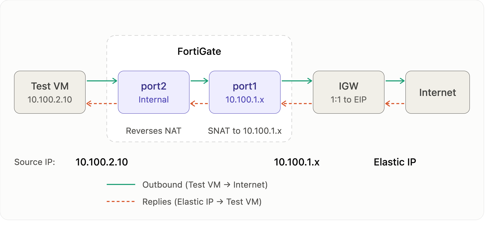

# AWS-101 Lab 3: Security Policies & Traffic Testing

## Overview

> **Scenario:** Redwood's first application server is ready to move to AWS. Before anyone signs off, the security team wants proof of three things: the server is reachable only through FortiGate, it reaches the Internet only through FortiGate, and every session is logged.

In this lab you deploy a test VM that stands in for the application server, and you configure FortiGate to control both directions of its traffic:

- **Part 1:** launch the test VM in the private subnet, with no public IP.
- **Part 2 (inbound):** publish the VM's SSH and HTTP services on FortiGate's Elastic IP, using Virtual IPs (VIPs) and an inbound firewall policy.
- **Part 3 (outbound):** let the VM reach the Internet through FortiGate, with source NAT.
- **Part 4 (proof):** find every session in FortiGate's logs and in FortiView.

Along the way you'll see FortiGate's default behavior in action: anything you haven't explicitly allowed is blocked.

**Prerequisites:** Labs 1 and 2 completed, `<FGT-EIP>`, and the `redwood-aws101-lab-kp` private key.


---

## PART 1: Deploy the Test Workload

## Step 1: Launch the Test EC2 Instance

You need a workload to protect. This small Ubuntu VM plays the role of Redwood's application server. You place it in the **private** subnet with **no public IP**, so it has no direct connection to the Internet. Its only path in or out is the private route table from Lab 2, which sends everything to FortiGate's `port2`. You also give it a fixed IP, `10.100.2.10`, because FortiGate's address object and VIPs will point at that address.

1. **Start the launch wizard:**
   - Open the EC2 console. In the left navigation pane, choose **Instances**.
   - Choose **Launch instances**.

2. **Name and tags:**
   - Choose **Add additional tags** and fill in:

     | Parameter | Value |
     | --- | --- |
     | **Name and tags** | |
     | Name | `redwood-aws101-lab-testvm` |
     | **Additional tags** | |
     | Key | `Project` |
     | Value | `Redwood-AWS-101` |
     | Resource types | **Instances, Volumes, Network interfaces** |

     

3. **Choose the image (AMI):**
   - Under **Application and OS Images**, select the **Quick Start** tab, then **Ubuntu**.
   - In **Amazon Machine Image (AMI)**, select **Ubuntu Server 26.04 LTS (HVM), SSD Volume Type**.
   - Set **Architecture** to **64-bit (x86)**.

     

4. **Instance type:**
   - Select `t3.micro` (2 vCPU, 1 GiB memory). A test server needs very little capacity.
     <!-- TODO: verify Free Tier eligibility of t3.micro in ca-central-1 for the account type in use -->

5. **Key pair:**
   - In **Key pair name**, select `redwood-aws101-lab-kp`, the same key you created in Lab 2.

6. **Network settings:**
   - Choose **Edit** in the **Network settings** panel and fill in:

     | Parameter | Value |
     | --- | --- |
     | **Network settings** | |
     | VPC | `redwood-aws101-lab-vpc` |
     | Subnet | `redwood-aws101-lab-subnet-private-1a` |
     | Auto-assign public IP | **Disable** |
     | **Firewall (security groups)** | |
     | Security group | **Create security group** |
     | Security group name | `redwood-aws101-lab-testvm-sg` |
     | Description | `Workload access - reachable only via FortiGate VIPs` |

     

   - Under **Inbound security group rules**, replace the default rule with these two rules:

     | Type | Port range | Source type | Source | Description |
     | --- | --- | --- | --- | --- |
     | SSH | 22 | Anywhere | `0.0.0.0/0` | SSH from the Internet to VM (via FortiGate) |
     | HTTP | 80 | Anywhere | `0.0.0.0/0` | HTTP from the Internet to VM (via FortiGate) |

     

   > [!NOTE]
   > `0.0.0.0/0` looks wide open, but the VM is not exposed. It has no public IP, and FortiGate is its only path to the Internet. The source must be "anywhere" because FortiGate's inbound VIPs keep the real client IP: the VM sees connections coming from Internet addresses, not from FortiGate. FortiGate's policies decide who actually gets in, and the security group adds a second layer.

7. **Set the fixed private IP:**
   - Still in **Network settings**, expand **Advanced network configuration**.
   - Under **Network interface 1**, set **Primary IP** to `10.100.2.10`.

     

8. **Storage:**
   - Keep the default 8 GiB `gp3` root volume.

9. **Instance metadata:**
   - Expand **Advanced details** and set **Metadata version** to **V2 only (token required)**, as you did for FortiGate.
     <!-- TODO: verify the current Ubuntu 26.04 AMI defaults to IMDSv2-only -->

10. **Launch:**
    - Choose **Launch instance**, then **View all instances**.
    - Wait until **Instance state** shows **Running** and **Status check** shows **3/3 checks passed**.

      

> [!IMPORTANT]
> The VM must have **no public IP**. If it has one, Internet traffic could reach it directly and bypass FortiGate, which defeats the purpose of this lab.

**Check:**

- [x] On the instance's **Networking** tab, the private IP is `10.100.2.10`.
- [x] The subnet is `redwood-aws101-lab-subnet-private-1a`.
- [x] There is no public IPv4 address.

---

## PART 2: Inbound Access (VIPs)

The test VM is running, but nobody can reach it: it has no public IP, and FortiGate blocks all traffic by default. In this part you publish two of its services, SSH and HTTP, on FortiGate's Elastic IP.

## Step 2: Create the Address Object

FortiGate policies and VIPs refer to hosts and networks through named **address objects** rather than raw IPs. Defining the test VM once as `TESTVM-INTERNAL` makes every policy that uses it easier to read ("allow to TESTVM-INTERNAL" instead of "allow to 10.100.2.10/32"). If the VM's address ever changes, you update one object instead of every policy.

1. **Log in to FortiGate:**
   - In your browser, go to `https://<FGT-EIP>` and log in as `admin` with the password you set in Lab 2.

2. **Create the address object:**
   - Go to **Policy & Objects → Addresses**.
   - Choose **Create new → Address** and fill in:

     | Parameter | Value |
     | --- | --- |
     | Name | `TESTVM-INTERNAL` |
     | Type | **Subnet** |
     | IP/Netmask | `10.100.2.10/32` |
     | Interface | `port2` |
     | Routing configuration | `disabled` |

     

   - Choose **OK**.

**Check:**

- [x] `TESTVM-INTERNAL` appears in the address list with the value `10.100.2.10/32`.

---

## Step 3: Create the Virtual IPs

A Virtual IP (VIP) is FortiGate's **destination NAT**. It tells FortiGate: "when traffic arrives on this public IP and port, send it to this private IP and port." You create two VIPs that share FortiGate's Elastic IP:

- Port `2222` → test VM port `22` (SSH)
- Port `8080` → test VM port `80` (HTTP)

Using different external ports lets one public IP publish several services. Port `22` on the Elastic IP is left for FortiGate's own SSH management.

<details>
<summary><b>Why the external IP is <code>0.0.0.0</code> and not the Elastic IP</b></summary>

On AWS, `port1` holds a private VPC address (`10.100.1.x`). The Internet Gateway translates the Elastic IP to that private address 1:1 before the packet reaches FortiGate, so FortiOS never sees the Elastic IP. Inbound packets arrive addressed to `port1`'s private IP. Setting the VIP's external IP to `0.0.0.0` tells FortiGate to match whatever address `port1` has.
</details>

---

1. **Create the SSH VIP:**
   - Go to **Policy & Objects → Virtual IPs**.
   - Choose **Virtual IP → +Create new** and fill in:

     | Parameter | Value |
     | --- | --- |
     | Name | `TESTVM-INTERNAL-VIP-SSH` |
     | **Network** | |
     | Interface | `port1` |
     | Type | **Static NAT** |
     | External IP address/range | `0.0.0.0` |
     | Map to IPv4 address/range | `TESTVM-INTERNAL` (start typing and select it) |
     | **Port Forwarding** | **Enabled** |
     | Protocol | **TCP** |
     | Port Mapping Type | **One to one** |
     | External service port | `2222` |
     | Map to IPv4 port | `22` |

     

   - Choose **OK**.

2. **Create the HTTP VIP:**
   - Choose **Virtual IP → +Create new** again and fill in the same values, except:

     | Parameter | Value |
     | --- | --- |
     | Name | `TESTVM-INTERNAL-VIP-HTTP` |
     | **Port Forwarding** | |
     | External service port | `8080` |
     | Map to IPv4 port | `80` |

   - Choose **OK**.

**Check:**

- [x] Both VIPs appear in the list on interface `port1`.
- [x] `TESTVM-INTERNAL-VIP-SSH` maps `0.0.0.0:2222 → 10.100.2.10:22`.
- [x] `TESTVM-INTERNAL-VIP-HTTP` maps `0.0.0.0:8080 → 10.100.2.10:80`.


---

## Step 4: Create the Virtual IP Group

A firewall policy's destination can be a single VIP or a group of VIPs. Grouping the SSH and HTTP VIPs means one inbound policy covers both services, instead of two nearly identical policies. When Redwood publishes another service on this server, you just add its VIP to the group.

1. **Create the group:**
   - Still in **Policy & Objects → Virtual IPs**, select the **Virtual IP Group** tab.
   - Choose **+Create new** and fill in:

     | Parameter | Value |
     | --- | --- |
     | Name | `TESTVM-INTERNAL-VIPGRP` |
     | Interface | `port1` |
     | Members | `TESTVM-INTERNAL-VIP-SSH`, `TESTVM-INTERNAL-VIP-HTTP` |

     

   - Choose **OK**.

**Check:**

- [x] `TESTVM-INTERNAL-VIPGRP` appears in the **Virtual IP Group** tab.
- [x] Both VIPs are listed as members.

---

## Step 5: Create the Inbound Policy (port1 → port2)

The VIPs translate addresses, but they don't allow anything by themselves. FortiGate **denies all traffic by default**: every flow needs an explicit policy that accepts it. This policy allows traffic arriving from the Internet on `port1` to reach the published VIPs through `port2`, for the SSH and HTTP services only. Logging all sessions gives the security team its audit trail.

1. **Create the policy:**
   - Go to **Policy & Objects → Firewall Policy**.
   - Choose **Create new** and fill in:

     | Parameter | Value |
     | --- | --- |
     | Name | `testvm_access_vip` |
     | Schedule | `always` |
     | Action | **ACCEPT** |
     | Incoming interface | `port1` |
     | Outgoing interface | `port2` |
     | Source | `all` |
     | Destination | `TESTVM-INTERNAL-VIPGRP` |
     | Service | `SSH`, `HTTP` |
     | **Firewall/Network Options** | |
     | NAT | **Disabled** |
     | **Logging Options** | |
     | Log allowed traffic | **All sessions** |

     

   - Choose **OK**.

<details>
<summary><b>Why NAT is disabled and the source is <code>all</code></b></summary>

- **NAT disabled:** the VIP already performs destination NAT. Leaving source NAT off means the test VM sees the real client IP, which keeps the VM's own logs accurate. It's also why the VM's security group allows `0.0.0.0/0`.
- **Source `all`:** lets attendees connect from any network. In production, narrow the source to an office IP range or a jump host.

</details>

---

**Check:**

- [x] `testvm_access_vip` appears in the policy list as enabled.
- [x] It goes from `port1` to `port2`.

---

## Step 6: Test SSH Through the VIP

This proves the inbound path works end to end: your laptop → Elastic IP → Internet Gateway → FortiGate `port1` → VIP translation → policy check → `port2` → test VM. Once you're on the VM, you also confirm the other half of the story: the VM can't reach the Internet yet, because no policy allows outbound traffic.

1. **SSH to the test VM through FortiGate:**
   - On **macOS, Linux, or WSL**, run:

     ```bash
     ssh -i ~/.ssh/aws-101/redwood-aws101-lab-kp.pem -p 2222 ubuntu@<FGT-EIP>
     ```

   - On **Windows with PuTTY**:
     - **Host Name:** `<FGT-EIP>`, **Port:** `2222`
     - **Connection → SSH → Auth → Credentials → Private key file:** `redwood-aws101-lab-kp.ppk`
     - **Login as:** `ubuntu`

   - The first time you connect, SSH asks whether to trust the host key. Type `yes` and press **Enter**.
   - You should land at the prompt `ubuntu@ip-10-100-2-10:~$`.

   

2. **Test reachability from the VM:**
   - Ping FortiGate's `port2`. This should **succeed**, because the traffic stays inside the VPC:

     ```bash
     ping -c 3 10.100.2.4
     ```

     If it fails, enable **PING** under **Administrative Access** on `port2` (**Network → Interfaces → port2**).
     <!-- TODO: verify whether PING is enabled on port2 by default in the AWS FortiGate image -->

   - Ping the Internet. This should **fail**:

     ```bash
     ping -c 3 8.8.8.8
     ```

   - Try to update the package list. This should **fail** too:

     ```bash
     sudo apt update
     ```

   Both failures are expected. The packets leave the VM and reach FortiGate's `port2`, but no policy allows traffic from `port2` to `port1`, so FortiGate drops them. The server can't even download software until FortiGate allows it.

Keep this SSH session open for the next steps.

**Check:**

- [x] SSH through `<FGT-EIP>:2222` works.
- [x] `ping 10.100.2.4` succeeds.
- [x] `ping 8.8.8.8` and `sudo apt update` both fail.

---

## PART 3: Outbound Access

## Step 7: Create the Outbound Policy (port2 → port1)

The application server needs Internet access for software updates, DNS, and API calls, but only through FortiGate. The folllowing policy allows traffic from the private side (`port2`) to the Internet (`port1`). It also enables **source NAT**, which is mandatory on AWS. The Internet Gateway only translates addresses that have a public IP associated with them. `port1`'s address has the Elastic IP, and the VM's `10.100.2.10` has none. FortiGate must therefore replace the VM's address with `port1`'s address before the packet leaves.

1. **Create the policy:**
   - Go to **Policy & Objects → Firewall Policy**.
   - Choose **Create new** and fill in:

     | Parameter | Value |
     | --- | --- |
     | Name | `internet_access` |
     | Schedule | `always` |
     | Action | **ACCEPT** |
     | Incoming interface | `port2` |
     | Outgoing interface | `port1` |
     | Source | `all` |
     | Destination | `all` |
     | Service | `ALL` |
     | **Firewall/Network Options** | |
     | NAT | **Enabled** |
     | IP Pool Configuration | **Use Outgoing Interface Address** |
     | **Logging Options** | |
     | Log allowed traffic | **All sessions** |

     

   - Choose **OK**.

> [!IMPORTANT]
> **NAT must be enabled.** Without it, packets leave FortiGate with the VM's private source address (`10.100.2.10`). The Internet Gateway can't translate that address, and drops the packets.

<details>
<summary><b>The full outbound NAT path</b></summary>



There are two NAT steps: FortiGate translates the VM's address to `port1`'s address, then the Internet Gateway translates `port1`'s address to the Elastic IP.
</details>

---

**Check:**

- [x] `internet_access` appears in the policy list as enabled.
- [x] It goes from `port2` to `port1`, with NAT enabled.

---

## Step 8: Test Outbound Access and Publish the Web Server

Now you repeat the tests that failed in Step 6, to prove the outbound policy works. You also confirm that the VM's traffic reaches the Internet from FortiGate's Elastic IP, not from any address of its own. With outbound access working, the server can finally install its web server. That lets you test the second inbound service, HTTP on port `8080`.

1. **Repeat the outbound tests** in your SSH session on the test VM:

   ```bash
   ping -c 3 8.8.8.8                 # ICMP to the Internet
   ping -c 3 www.google.com          # DNS resolution + ICMP
   curl -I https://www.fortinet.com  # HTTPS; expect an HTTP 200 response
   curl -s https://ifconfig.me       # Shows the public IP the Internet sees
   ```

   - All four commands should succeed.
   - `ifconfig.me` must return `<FGT-EIP>`. That proves the VM's traffic leaves through FortiGate.

2. **Install the web server:**

   ```bash
   sudo apt update && sudo apt install -y nginx
   ```

   - `apt update` now succeeds, because the outbound policy allows it. nginx starts automatically after installation.

3. **Test the HTTP VIP from your workstation** (not from the test VM):

   ```bash
   curl -I http://<FGT-EIP>:8080
   ```

   - Expected: `HTTP/1.1 200 OK` and `Server: nginx`.
   - You can also open `http://<FGT-EIP>:8080` in a browser to see the nginx welcome page.

The application server is now published and protected in both directions, and FortiGate inspected every step.

**Check:**

- [x] All outbound tests succeed.
- [x] `curl -s https://ifconfig.me` returns `<FGT-EIP>`.
- [x] `http://<FGT-EIP>:8080` returns the nginx page.

---

## PART 4: Verify Inspection

The traffic works. Now you show the security team the evidence: every session you generated went through FortiGate and was logged.

## Step 9: Review the Forward Traffic Logs

Working connectivity alone doesn't prove inspection. The Forward Traffic log records every session FortiGate forwarded: which policy allowed it, which interfaces it used, and how it was translated. This is the audit trail the security team asked for.

1. **Open the log:**
   - In the FortiGate GUI, go to **Log & Report → Forward Traffic**.
   - You'll see the sessions from Steps 6 and 8.

     

2. **Inspect an outbound session:**
   - Select a session with source `10.100.2.10` and open its details. Confirm:

     | Field | Expected value |
     | --- | --- |
     | Source | `10.100.2.10` (the test VM) |
     | Destination | The address you tested, for example `8.8.8.8` |
     | Source interface → Destination interface | `port2` → `port1` |
     | Policy | `internet_access` |
     | NAT / Source NAT IP | `10.100.1.x` (FortiGate's `port1`) |
     | Action | `accept` |

     

3. **Inspect an inbound session:**
   - Find a session for your SSH or HTTP connection. It shows policy `testvm_access_vip`, interfaces `port1` → `port2`, and your workstation's public IP as the source.

> [!NOTE]
> The logs show `port1`'s private address (`10.100.1.x`) as the NAT source, not the Elastic IP. The Internet Gateway applies the Elastic IP after the traffic leaves FortiGate. To see the real public source, use `curl -s https://ifconfig.me` from the VM.

> [!TIP]
> Local logs are lost if the FortiGate instance is replaced. In production, send logs off-box to FortiAnalyzer or a SIEM.

**Check:**

- [x] You can find an `internet_access` session (outbound) for the test VM.
- [x] You can find a `testvm_access_vip` session (inbound) for the test VM.

---

## Step 10: Explore FortiView

Logs show individual sessions, while FortiView shows the big picture: who is talking to whom, how much, and through which policies. It needs no configuration, because it reads the same log data. It's the dashboard a security team would use to spot unusual behavior from a workload.

1. **Open FortiView Sources:**
   - Go to **Dashboard → FortiView Sources**.

   

2. **Drill down on the test VM:**
   - Double-click the row for `10.100.2.10`.
   - Select the **Destinations** tab.
   - You should see the destinations you tested in Step 8: `8.8.8.8`, `www.google.com`, `www.fortinet.com`, `ifconfig.me`, and the Ubuntu package mirrors used by `apt`.

   

**Check:**

- [x] FortiView lists `10.100.2.10` as a source.
- [x] Its destinations include the hosts from your tests.

---

## Checklist

Before moving to Lab 4, confirm:

- [ ] The test VM is running at `10.100.2.10` with **no public IP**
- [ ] SSH works through `<FGT-EIP>:2222`
- [ ] nginx answers on `http://<FGT-EIP>:8080`
- [ ] The test VM reaches the Internet, and `curl -s https://ifconfig.me` returns `<FGT-EIP>`
- [ ] **Forward Traffic** shows sessions for both `testvm_access_vip` and `internet_access`

## Troubleshooting

| Issue | Solution |
| --- | --- |
| SSH times out on port 2222 | `redwood-aws101-lab-fgt-sg` must allow TCP/2222 from `0.0.0.0/0` (Lab 2, Step 3). Some corporate networks block outbound port 2222. Try another network. |
| SSH says "Connection refused" | Check that both VIPs exist, that both are in `TESTVM-INTERNAL-VIPGRP`, and that `testvm_access_vip` is enabled. |
| SSH says `Permission denied (publickey)` | Use the username `ubuntu` and the `redwood-aws101-lab-kp` key. On macOS/Linux, the key file must have permissions `400`. |
| The VM can't reach the Internet | Check that `internet_access` has **NAT enabled** and **Service `ALL`**. Check that the private route table sends `0.0.0.0/0` to the `port2` interface (Lab 2, Step 9). |
| HTTP on port 8080 fails | On the VM, check nginx with `systemctl status nginx`. Check that `redwood-aws101-lab-fgt-sg` allows TCP/8080. |
| `ifconfig.me` returns a different IP | The VM has its own public IP. Terminate it and relaunch with **Auto-assign public IP: Disable**. |

To find out which policy (if any) matches a given flow, use **Policy & Objects → Firewall Policy → Policy Match**. For example, enter incoming interface `port2`, protocol ICMP, source `10.100.2.10`, and destination `8.8.8.8`, then choose **Find matching policy**. FortiGate shows the matching policy, or "Implicit Deny" if nothing allows the traffic.


---

The security team signs off: the application is published, and both directions are inspected and logged. But the application still needs databases and identity services that live at HQ. In Lab 4, you connect AWS to HQ.

*Next:* [**Lab 4: Site-to-Site VPN Configuration**](/aws-101-lab4/README.md)
