# AWS-101 Lab 3: Security Policies & Traffic Testing

## Overview

> **Scenario:** Redwood's first application server is ready to move to AWS. Before anyone signs off, the security team wants proof of three things: the server is reachable only through FortiGate, it reaches the Internet only through FortiGate, and every session is logged.

Deploy a test VM (the application server) in the private subnet. Then configure FortiGate so that:

- Inbound SSH/HTTP from the Internet reaches the VM through FortiGate VIPs
- Outbound traffic from the VM is inspected and source-NATed by FortiGate

**Prerequisites:** Labs 1 and 2 completed, `<FGT-EIP>`, and the `redwood-aws101-lab-kp` key.

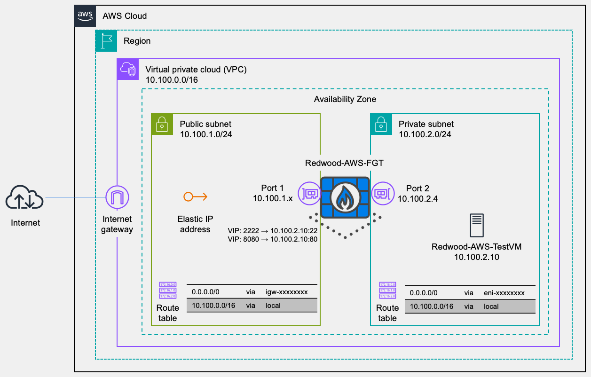

---

## PART 1: Deploy the Test Workload

## Step 1: Launch the Test EC2 Instance

1. Open **EC2 → Instances → Launch instances**.

2. **Name:** `redwood-aws101-lab-testvm`, with the standard tags.

   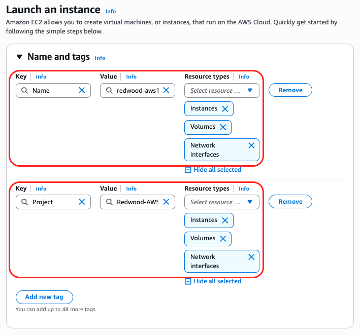

3. **AMI:** Quick Start → **Ubuntu Server 26.04 LTS**, 64-bit (x86).

   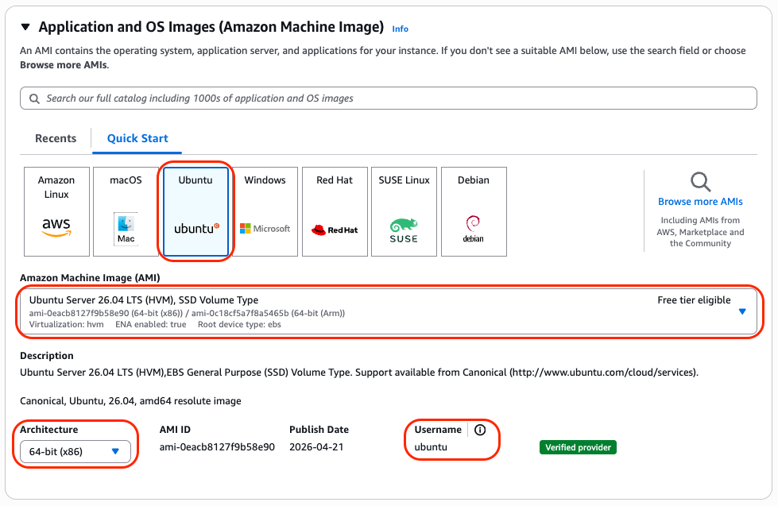

4. **Instance type:** `t3.micro`
   <!-- TODO: verify Free Tier eligibility of t3.micro in ca-central-1 for the account type in use -->

5. **Key pair:** `redwood-aws101-lab-kp`

6. **Network settings:** click **Edit**:

   | Parameter | Value |
   | --- | --- |
   | VPC | `redwood-aws101-lab-vpc` |
   | Subnet | `redwood-aws101-lab-subnet-private-1a` |
   | Auto-assign public IP | **Disable** |
   | Security group name | `redwood-aws101-lab-testvm-sg` |
   | Description | `Workload access - reachable only via FortiGate VIPs` |

   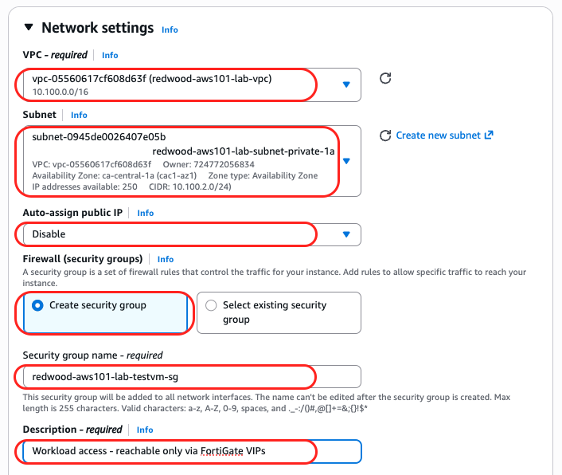

   Inbound rules:

   | Type | Port | Source |
   | --- | --- | --- |
   | SSH | 22 | `0.0.0.0/0` |
   | HTTP | 80 | `0.0.0.0/0` |

   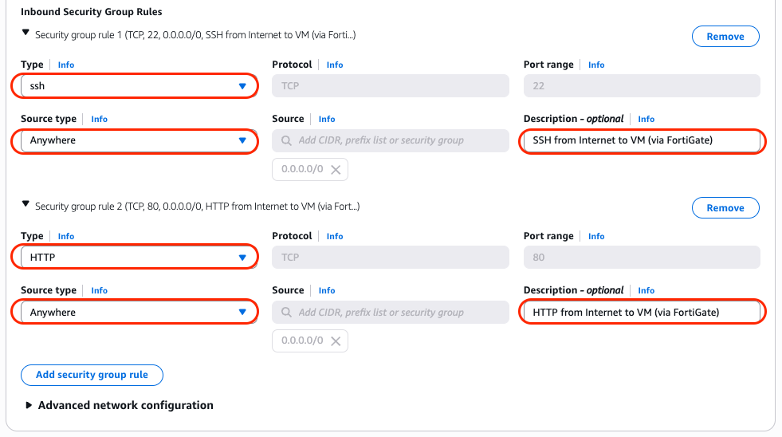

   The source is `0.0.0.0/0` because the inbound VIP keeps the real client IP. The VM is still not exposed: it has no public IP, and FortiGate is its only path to the Internet.

7. **Advanced network configuration:** set **Primary IP** to `10.100.2.10`.

   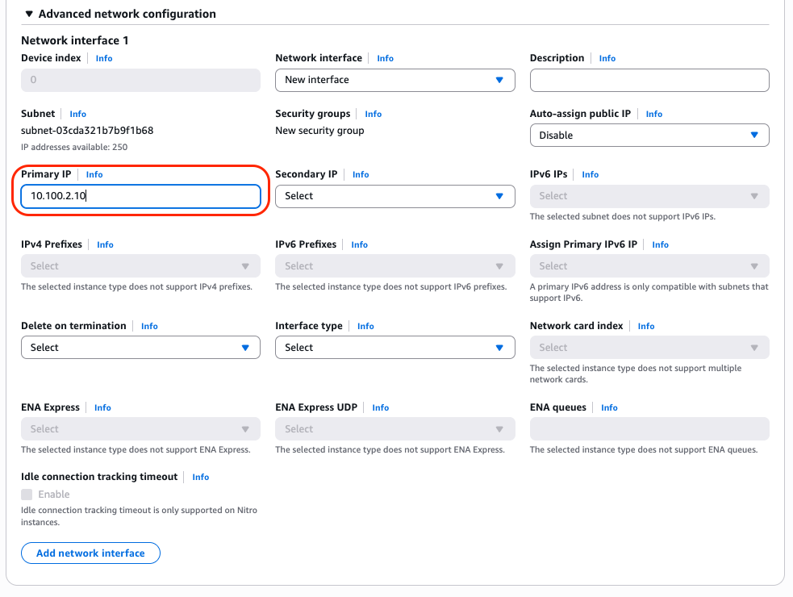

8. **Advanced details:** as with FortiGate, set **Metadata version** to **V2 only (token required)**.
   <!-- TODO: verify the current Ubuntu 26.04 AMI defaults to IMDSv2-only -->

9. Click **Launch instance**. Wait for **Running** with **2/2 checks passed**.

   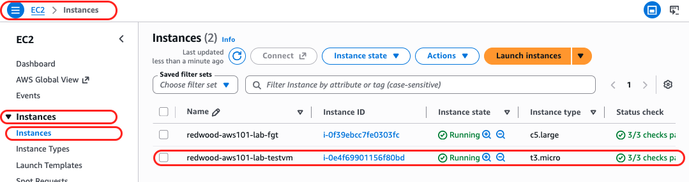

> [!IMPORTANT]
> The VM must have **no public IP**. If it has one, traffic bypasses FortiGate.

---

## PART 2: Inbound Access (VIPs)

## Step 2: Create the Address Object

An address object is a named, reusable reference for policies and VIPs. A policy that says `TESTVM-INTERNAL` is easier to read than one that says `10.100.2.10/32`.

1. Log in to FortiGate at `https://<FGT-EIP>`.
2. Open **Policy & Objects → Addresses → Create new**:

   | Parameter | Value |
   | --- | --- |
   | Name | `TESTVM-INTERNAL` |
   | Interface | `port2` |
   | Type | `Subnet` |
   | IP/Netmask | `10.100.2.10/32` |

   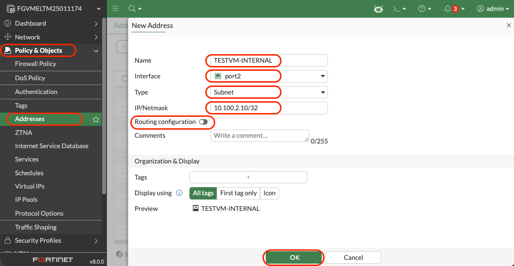

---

## Step 3: Create the Virtual IPs

A VIP is FortiGate's destination NAT: it maps a public IP and port to a private IP and port. Use `0.0.0.0` as the external IP. FortiGate then uses `port1`'s address, which AWS maps to the Elastic IP.

<details>
<summary><b>Why <code>0.0.0.0</code> and not the Elastic IP?</b></summary>

On AWS, `port1` holds a private VPC address (`10.100.1.x`). The Internet Gateway translates the Elastic IP to that address 1:1, and FortiOS never sees the Elastic IP. Inbound packets therefore arrive addressed to `port1`'s private IP. An external IP of `0.0.0.0` matches whatever address `port1` has.
</details>

1. Open **Policy & Objects → Virtual IPs → Create new → Virtual IP** and create two VIPs:

   | Parameter | SSH VIP | HTTP VIP |
   | --- | --- | --- |
   | Name | `TESTVM-INTERNAL-VIP-SSH` | `TESTVM-INTERNAL-VIP-HTTP` |
   | Interface | `port1` | `port1` |
   | Type | `Static NAT` | `Static NAT` |
   | External IP address/range | `0.0.0.0` | `0.0.0.0` |
   | Map to IPv4 address/range | `TESTVM-INTERNAL` | `TESTVM-INTERNAL` |
   | Port Forwarding | Enabled, TCP, One to one | Enabled, TCP, One to one |
   | External service port | `2222` | `8080` |
   | Map to IPv4 port | `22` | `80` |

   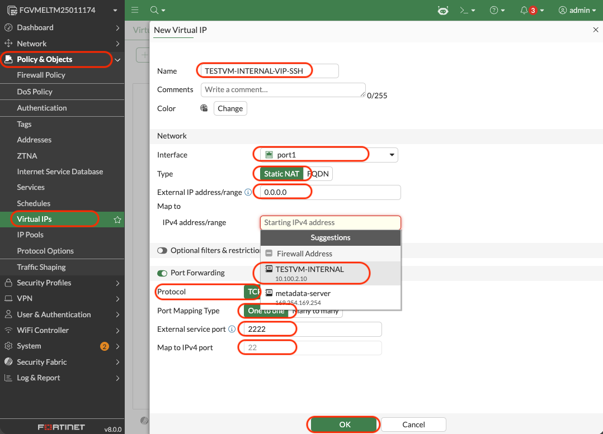
   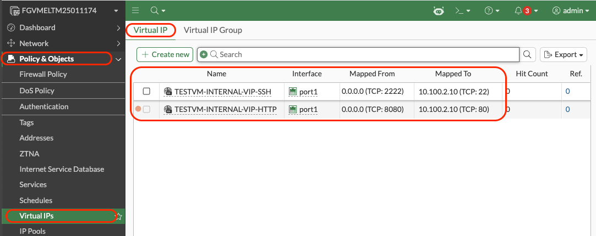

---

## Step 4: Create the Virtual IP Group

A group lets one policy cover both VIPs, so you don't need two parallel policies.

1. On the **Virtual IP Group** tab, click **Create new**:

   | Parameter | Value |
   | --- | --- |
   | Name | `TESTVM-INTERNAL-VIPGRP` |
   | Interface | `port1` |
   | Members | `TESTVM-INTERNAL-VIP-SSH`, `TESTVM-INTERNAL-VIP-HTTP` |

   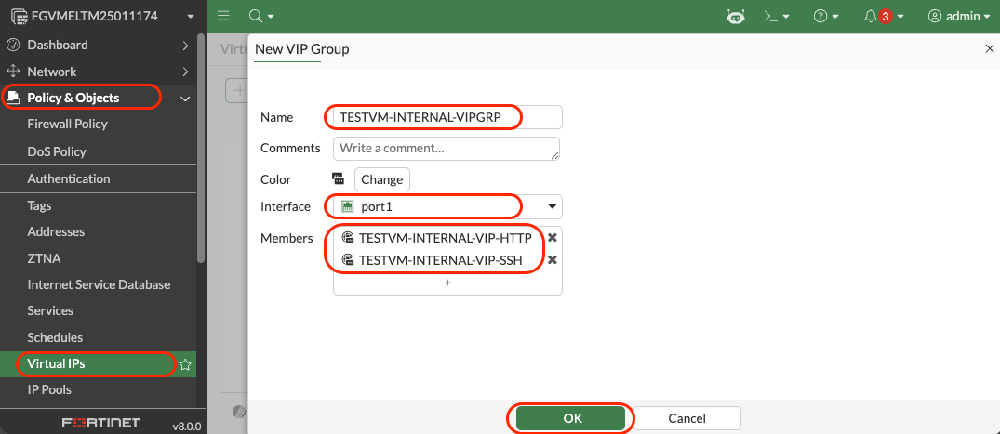

---

## Step 5: Create the Inbound Policy (port1 → port2)

1. Open **Policy & Objects → Firewall Policy → Create new**:

   | Parameter | Value |
   | --- | --- |
   | Name | `testvm_access_vip` |
   | Incoming / Outgoing interface | `port1` / `port2` |
   | Source | `all` |
   | Destination | `TESTVM-INTERNAL-VIPGRP` |
   | Service | `SSH`, `HTTP` |
   | Action | `ACCEPT` |
   | NAT | **Disabled** |
   | Log allowed traffic | `All sessions` |

   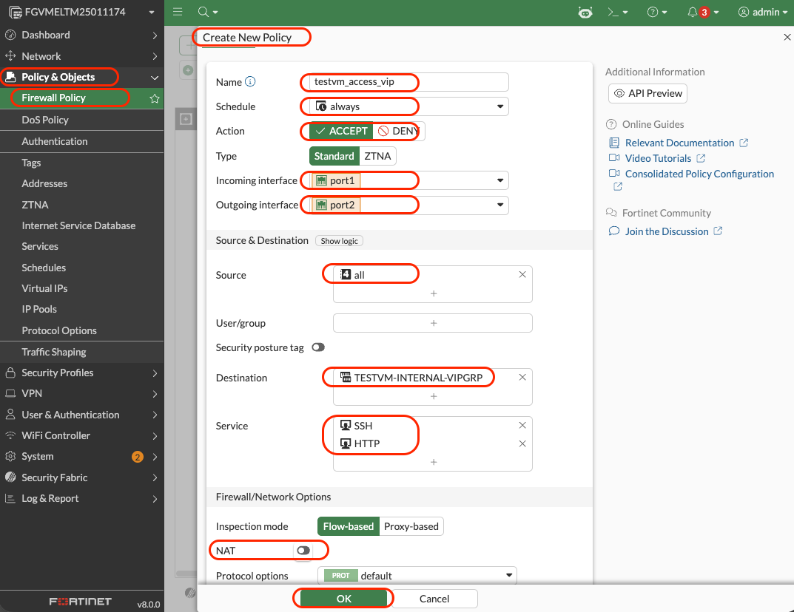

FortiGate denies everything by default. The VIP translates the address, but a policy must still allow the traffic.

<details>
<summary><b>Why NAT disabled and Source <code>all</code>?</b></summary>

- **NAT disabled:** the VIP already handles destination NAT. Without source NAT, the test VM sees the real client IP, which keeps logging accurate.
- **Source `all`:** lets attendees connect from any network. In production, narrow it to an office IP or a jump host.
</details>

---

## Step 6: Test SSH Through the VIP

1. From your workstation, run:

   ```bash
   ssh -i ~/.ssh/aws-101/redwood-aws101-lab-kp.pem -p 2222 ubuntu@<FGT-EIP>
   ```

   (PuTTY: host `<FGT-EIP>`, port `2222`, key `redwood-aws101-lab-kp.ppk`, user `ubuntu`.)

   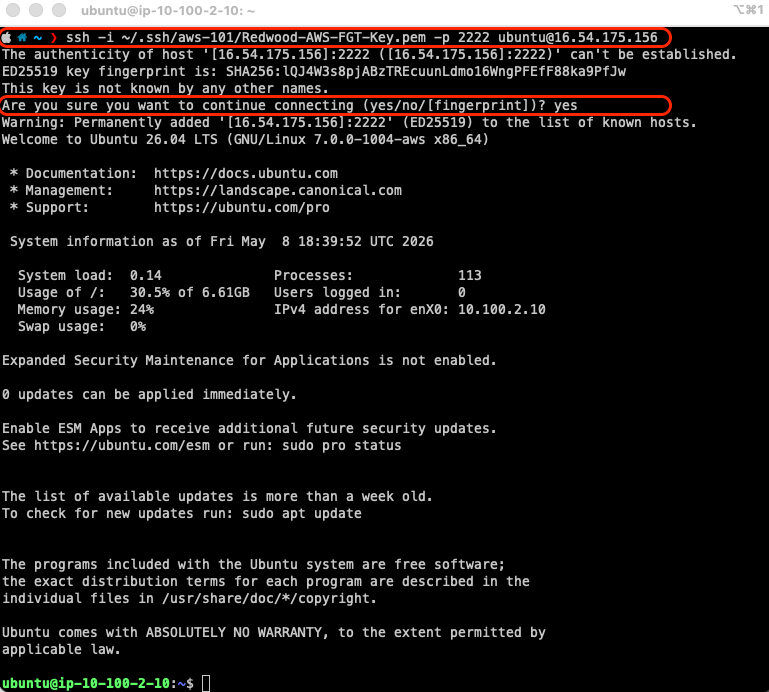

2. From the test VM, `ping -c 3 10.100.2.4` should **succeed** and `ping -c 3 8.8.8.8` should **fail**. The failure is expected because there is no outbound policy yet.

   If the ping to `10.100.2.4` fails, enable **PING** under **Administrative Access** on `port2` (**Network → Interfaces**).
   <!-- TODO: verify whether PING is enabled on port2 by default in the AWS FortiGate image -->

3. Try installing a web server:

   ```bash
   sudo apt update
   ```

   This also fails. The server can't download software until FortiGate allows outbound traffic.

---

## PART 3: Outbound Access

## Step 7: Create the Outbound Policy (port2 → port1)

1. Open **Policy & Objects → Firewall Policy → Create new**:

   | Parameter | Value |
   | --- | --- |
   | Name | `internet_access` |
   | Incoming / Outgoing interface | `port2` / `port1` |
   | Source / Destination | `all` / `all` |
   | Service | `ALL` |
   | Action | `ACCEPT` |
   | NAT | **Enabled**, `Use Outgoing Interface Address` |
   | Log allowed traffic | `All sessions` |

   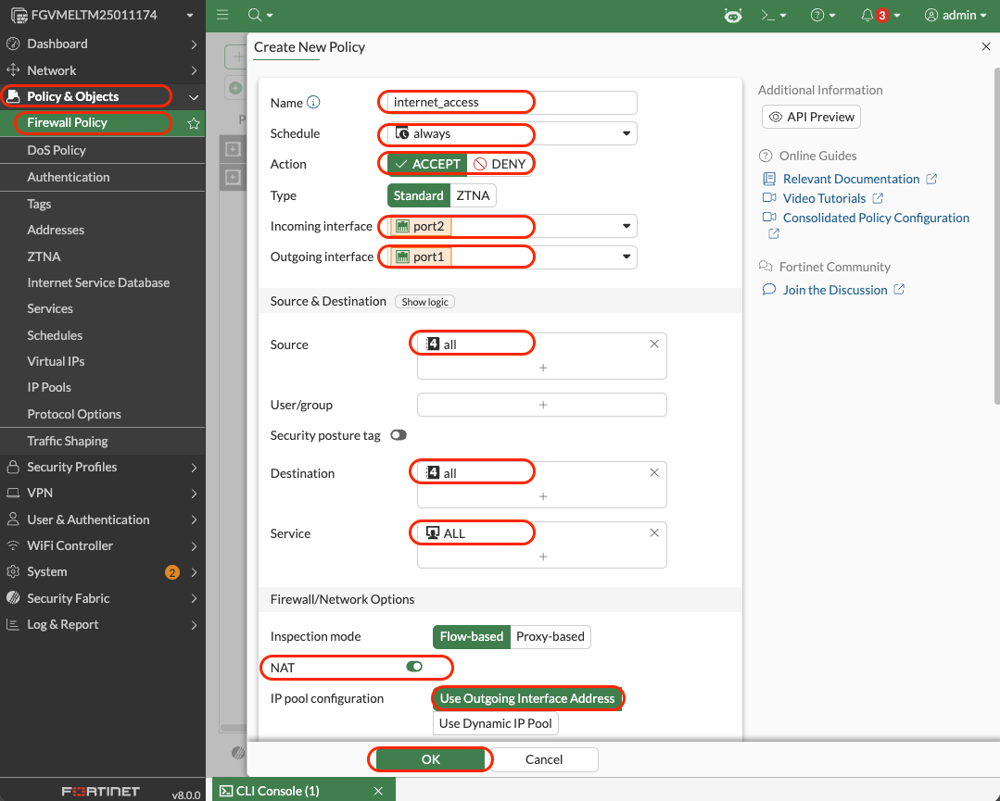

> [!IMPORTANT]
> **NAT must be enabled.** The Internet Gateway translates only the address that has the Elastic IP (`port1`). Without NAT, the VM's private address is dropped.

<details>
<summary><b>Outbound NAT path</b></summary>

```text
Test VM 10.100.2.10 → port2 → FortiGate SNAT to 10.100.1.x (port1)
  → IGW 1:1 NAT to Elastic IP → Internet
Replies: Elastic IP → IGW → port1 → FortiGate de-NAT → Test VM
```

The IGW translates only private IPs that have an associated public IP. `10.100.2.10` has none, so without FortiGate's SNAT the packet is dropped.
</details>

---

## Step 8: Test Outbound Access and Publish the Web Server

1. From the test VM, retest outbound access:

   ```bash
   ping -c 3 8.8.8.8
   ping -c 3 www.google.com
   curl -I https://www.fortinet.com
   curl -s https://ifconfig.me     # should return <FGT-EIP>
   ```

2. Now that outbound access works, install the web server:

   ```bash
   sudo apt update && sudo apt install -y nginx
   ```

3. From **your workstation**, test inbound HTTP through the HTTP VIP:

   ```bash
   curl -I http://<FGT-EIP>:8080
   ```

   Expected: `HTTP/1.1 200 OK` with `Server: nginx`. You can also open `http://<FGT-EIP>:8080` in a browser to see the nginx welcome page.

The application server is now published and protected in both directions, and FortiGate inspected every step.

---

## PART 4: Verify Inspection

## Step 9: Forward Traffic Logs

1. Open **Log & Report → Forward Traffic** and click an entry from `10.100.2.10`. It should show policy `internet_access`, `port2 → port1`, and NAT to `10.100.1.x`.

2. Find your inbound HTTP and SSH sessions: they show policy `testvm_access_vip` (`port1 → port2`), with your workstation's public IP as the source.

   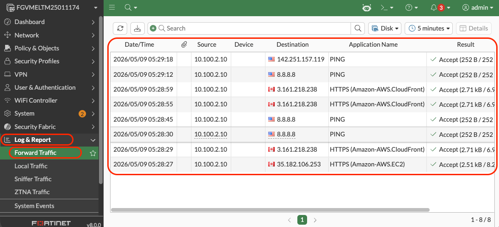
   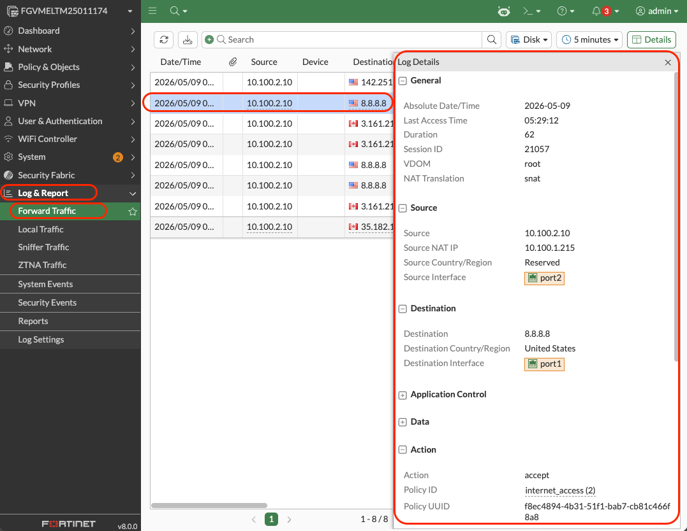

> [!NOTE]
> The logs show `port1`'s private IP as the NAT source, not the Elastic IP. AWS applies the Elastic IP at the IGW, after FortiGate. Use `curl -s https://ifconfig.me` to see the real public source.

Local logs are lost if the instance is replaced. In production, send logs to FortiAnalyzer or a SIEM.

---

## Step 10: FortiView

FortiView is FortiGate's real-time traffic dashboard. It needs no configuration because it reads the same logs.

1. Open **Dashboard → FortiView → Sources**, click `10.100.2.10`, and drill down to **Destination**. You should see the hosts you tested.

   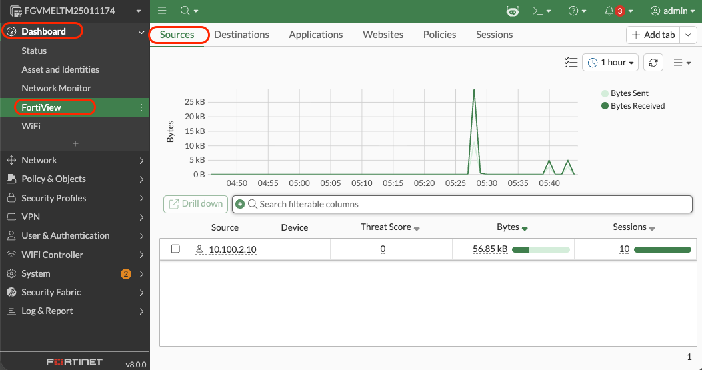
   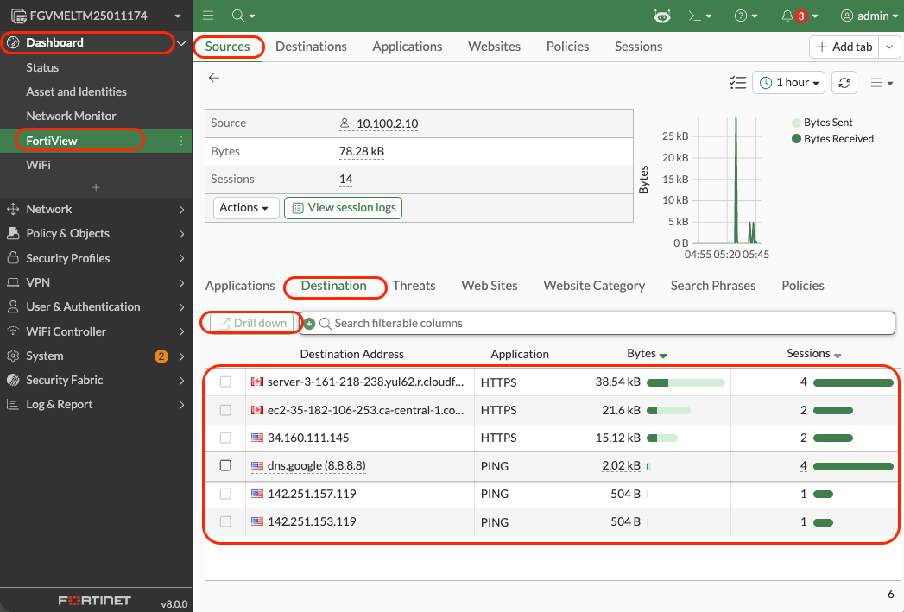

---

## Checklist

- [ ] Test VM is at `10.100.2.10` with **no public IP**
- [ ] SSH works through `<FGT-EIP>:2222`
- [ ] nginx answers on `http://<FGT-EIP>:8080`
- [ ] The test VM reaches the Internet, and `ifconfig.me` returns `<FGT-EIP>`
- [ ] Both policies appear in **Forward Traffic** logs

## Troubleshooting

| Issue | Solution |
| --- | --- |
| SSH times out on 2222 | `redwood-aws101-lab-fgt-sg` must allow TCP/2222 |
| SSH connection refused | Check the VIPs, the VIP group, and that `testvm_access_vip` is enabled |
| `Permission denied (publickey)` | Use user `ubuntu` and the correct key with `chmod 400` |
| No Internet from VM | Enable NAT on `internet_access` and make sure Service is `ALL` |
| HTTP on 8080 fails | Check that nginx is running (`systemctl status nginx`) and that `fgt-sg` allows TCP/8080 |
| `ifconfig.me` shows the wrong IP | The VM has a public IP. Relaunch it with auto-assign disabled. |

To find which policy matches a flow, use **Policy & Objects → Firewall Policy → Policy Match**:

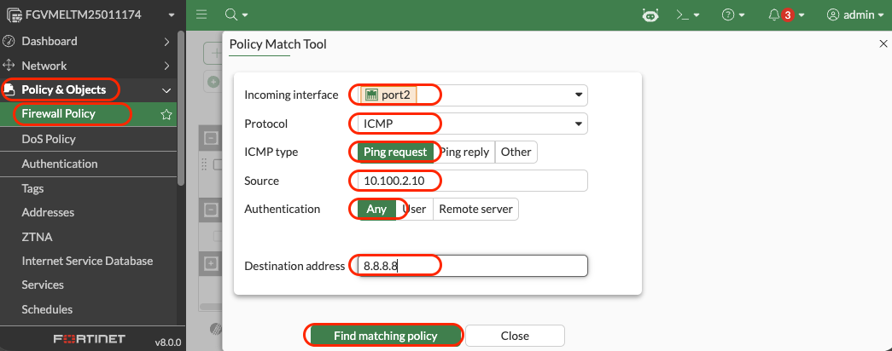
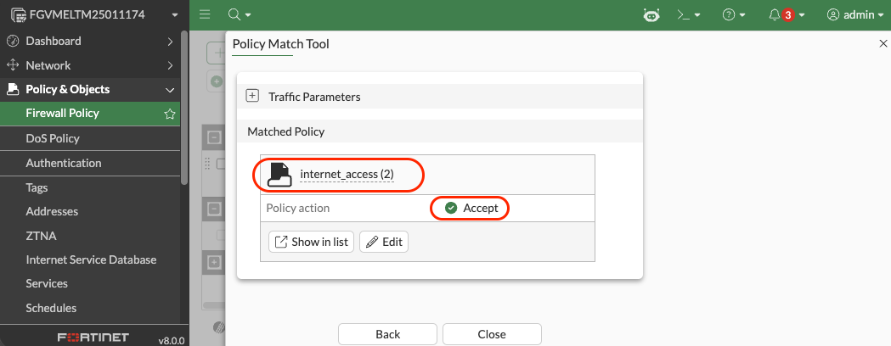

---

The security team signs off: the application is published and both directions are inspected and logged. But the application still needs databases and identity services that live at HQ. In Lab 4, you connect AWS to HQ.

*Next:* [**Lab 4: Site-to-Site VPN Configuration**](/aws-101-lab4/README.md)
