# AWS-101 Lab 4: Site-to-Site VPN Configuration

## Overview

> **Scenario:** The application server is live, but it depends on databases and identity services that are still at Redwood's HQ. Connect AWS to HQ privately, without adding a new security stack: FortiGate at both ends, with the same policies and logs.

In this lab you build an encrypted IPsec tunnel between your AWS FortiGate and your HQ (on-premises) FortiGate. When you finish, the AWS network (`10.100.0.0/16`) and the HQ network (`192.168.0.0/22`) can reach each other privately, and both FortiGates inspect and log every flow.

You'll configure the tunnel in this order:

1. Open the AWS security group so the HQ FortiGate can reach your AWS FortiGate.
2. Configure the HQ side of the tunnel.
3. Configure the AWS side of the tunnel. The tunnel comes up.
4. Verify the tunnel, then test traffic in both directions.

**Prerequisites:** Labs 1–3 completed, plus the HQ details from [What You Need](/README.md#what-you-need).

**Your HQ environment** (hosted by your instructor, one per student):

| Component | Address |
| --- | --- |
| HQ FortiGate public IP | `<on-prem-public-ip>` |
| HQ FortiGate `port2` (LAN) | `192.168.2.4` |
| HQ Windows VM | `192.168.2.10` (RDP via `<on-prem-public-ip>:9833`) |


**Why a FortiGate-to-FortiGate tunnel?** AWS offers a managed Site-to-Site VPN, but it has its own hourly charge, its own configuration model, and its own logs. Using FortiGate at both ends keeps one security platform: the same policies, the same logs, and the same troubleshooting tools as at HQ. You still pay for the FortiGate EC2 instance and for data transferred out of AWS.

> [!IMPORTANT]
> **NAT Traversal (NAT-T) must be enabled on both sides.** AWS translates the Elastic IP to `port1`'s private address, which counts as NAT in the path. IPsec can only cross that NAT when it's wrapped in UDP port 4500.

<details>
<summary><b>NAT Traversal (NAT-T) explained</b></summary>

**The problem:** IPsec encrypts traffic with ESP (IP protocol 50), which has no port numbers. NAT devices rely on ports to track flows, so plain ESP often breaks when it crosses NAT.

**How NAT is detected:** during IKE Phase 1, each peer sends a hash of its own IP and port. In this lab, the HQ FortiGate sends to the Elastic IP, but the AWS FortiGate sees its private `10.100.1.x` address. The hashes don't match, so both sides know NAT is in the path.

**The fix (RFC 3948):** both peers wrap ESP inside UDP port 4500, and IKE also moves from UDP/500 to UDP/4500. The UDP header gives NAT devices ports to track. The encrypted ESP payload inside is unchanged.

```text
Without NAT-T: [ IP | ESP | encrypted payload ]             ← no ports
With NAT-T:    [ IP | UDP 4500 | ESP | encrypted payload ]  ← NAT can track it
```

**Why it's mandatory here:** the Internet Gateway performs 1:1 NAT between the Elastic IP and `port1`. The security group you configure in Step 1 also allows only UDP/500 and UDP/4500, not raw ESP.

**Keepalives vs. DPD:** NAT-T keepalives (every 10 seconds in this lab) keep the UDP flow alive in NAT and firewall tables when no traffic is passing. Dead Peer Detection (DPD) is a separate IKE check that detects when the other peer is gone and clears the stale tunnel.

| Item | Detail |
| --- | --- |
| ESP | IP protocol 50, no ports |
| IKE | UDP/500, then UDP/4500 once NAT is detected |
| NAT-T | ESP wrapped in UDP/4500 |
| AWS Internet Gateway | 1:1 NAT between the Elastic IP and `port1`, which is why NAT-T is mandatory |
</details>

---

## VPN Parameters

The two sides of the tunnel mirror each other: each side's "local" network is the other side's "remote" network. Keep this table open while you configure both FortiGates.

| Parameter | HQ (on-prem) FortiGate | AWS FortiGate |
| --- | --- | --- |
| Tunnel name | `to_aws` | `to_on_prem` |
| Remote peer IP | `<FGT-EIP>` | `<on-prem-public-ip>` |
| Remote subnets | `10.100.0.0/16` | `192.168.0.0/22` |
| Local subnets | `192.168.0.0/22` | `10.100.0.0/16` |
| WAN (outgoing) interface | `port1` | `port1` |
| LAN (local) interface | `port2` | `port2` |
| Pre-shared key | `RedwoodIndustries2026!` | `RedwoodIndustries2026!` |
| IKE version | 2 | 2 |
| NAT Traversal | Enabled | Enabled |
| Keepalive frequency | 10 seconds | 10 seconds |

---

## Step 1: Allow IPsec to the AWS FortiGate

**Why:** The HQ FortiGate must reach your AWS FortiGate on two UDP ports: 500 (IKE, which negotiates the tunnel) and 4500 (NAT-T, which carries IKE and the encrypted traffic once NAT is detected). The security group from Lab 2 doesn't allow either port yet, so AWS would drop the HQ FortiGate's packets before they reach FortiGate. You allow them **only from the HQ FortiGate's public IP**, because VPN endpoints exposed to the whole Internet get probed within minutes.

1. **Open the security group:**
   - Open the EC2 console. In the left navigation pane, under **Network & Security**, choose **Security Groups**.
   - Select `redwood-aws101-lab-fgt-sg`.

   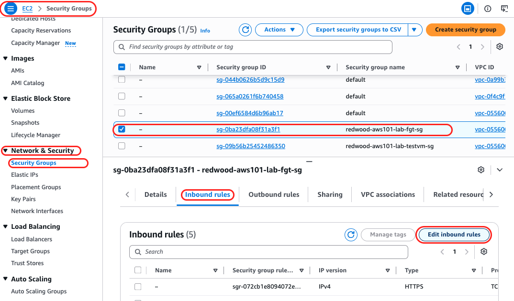

2. **Add the IPsec rules:**
   - Select the **Inbound rules** tab and choose **Edit inbound rules**.
   - Choose **Add rule** twice and fill in the two new rows:

     | Type | Protocol | Port range | Source type | Source | Description |
     | --- | --- | --- | --- | --- | --- |
     | Custom UDP | UDP | 500 | Custom | `<on-prem-public-ip>/32` | IKE from the HQ FortiGate |
     | Custom UDP | UDP | 4500 | Custom | `<on-prem-public-ip>/32` | IPsec NAT-T from the HQ FortiGate |

   - Choose **Save rules**.

   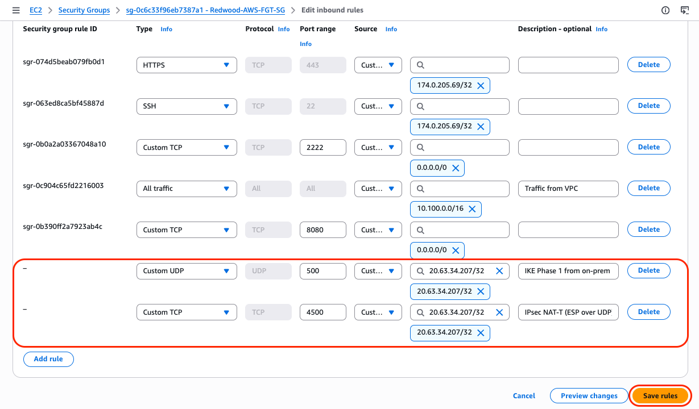

No other AWS change is needed. Security groups allow all outbound traffic by default, so the AWS FortiGate can already reach the HQ FortiGate.

**Check:** `redwood-aws101-lab-fgt-sg` has two new inbound rules, UDP 500 and UDP 4500, both with source `<on-prem-public-ip>/32`.

---

## Step 2: Configure the HQ FortiGate (`to_aws`)

**Why:** A tunnel needs a matching configuration at each end. You start at HQ. FortiGate's **VPN Wizard** builds everything the tunnel needs in one pass: the tunnel interface, the IKE Phase 1 and Phase 2 settings, a static route to the AWS network, address objects, and two firewall policies (HQ → AWS and AWS → HQ). The tunnel stays down after this step, because the AWS side doesn't exist yet.

1. **Log in to your HQ FortiGate:**
   - In your browser, go to `https://<on-prem-public-ip>`, accept the certificate warning, and log in with the credentials from your instructor.

2. **Start the VPN Wizard:**
   - Go to **VPN → VPN Wizard** and fill in:

     | Parameter | Value |
     | --- | --- |
     | Tunnel name | `to_aws` |
     | Select a template | **Site to Site** |

   - Choose **Begin**.

   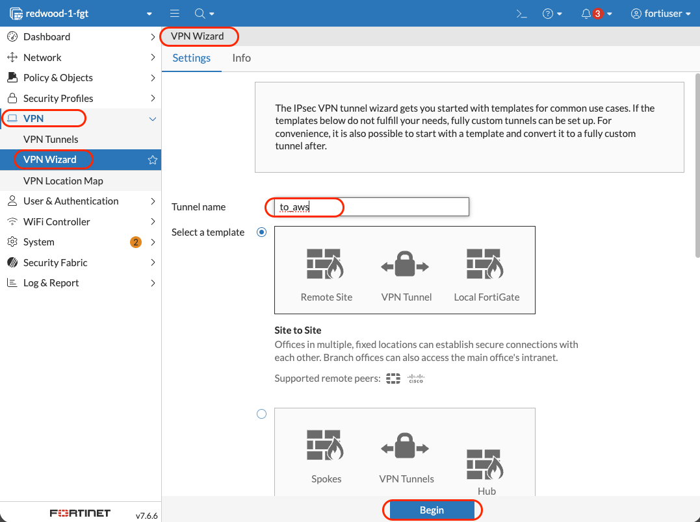

3. **VPN Tunnel page:** these settings define how the two FortiGates authenticate each other and build the tunnel.

   | Parameter | Value |
   | --- | --- |
   | Authentication method | **Pre-shared Key** |
   | Pre-shared Key | `RedwoodIndustries2026!` |
   | IKE | **Version 2** |
   | Transport | **UDP** |
   | NAT Traversal | **Enable** |
   | Keepalive frequency | `10` |

   - Choose **Next**.

   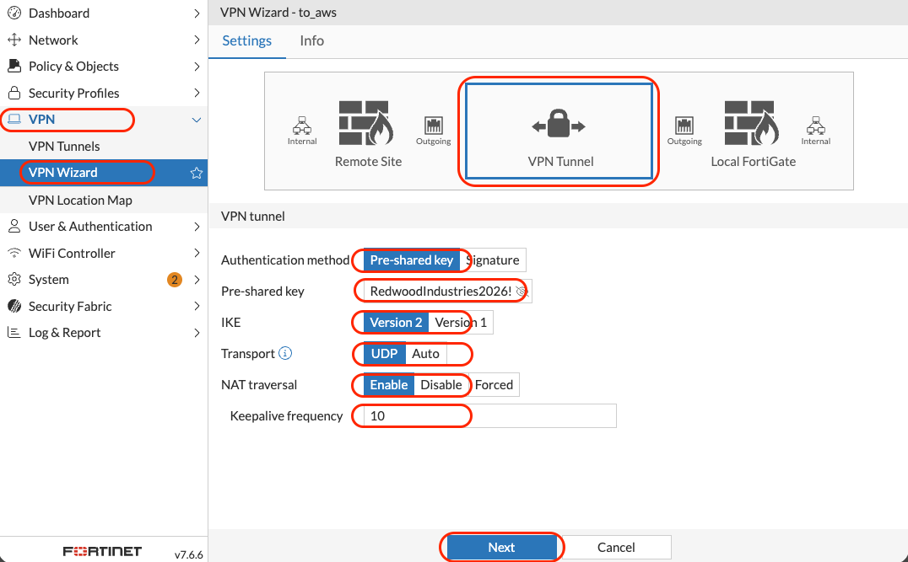

   > [!NOTE]
   > The pre-shared key is case-sensitive and must be identical on both sides. Copy and paste it to avoid typos. In production, use a random key of at least 20 characters, or certificate authentication.

4. **Remote Site page:** these settings describe the other end of the tunnel, your AWS FortiGate.

   | Parameter | Value |
   | --- | --- |
   | Remote site device type | **Fortinet** (select the Fortinet logo) |
   | Remote site device | **Accessible and static** |
   | IP/FQDN | `<FGT-EIP>` |
   | Route this device's internet traffic through the remote site | **Off** |
   | Remote site subnets that can access VPN | `10.100.0.0/16` |

   - Choose **Next**.

   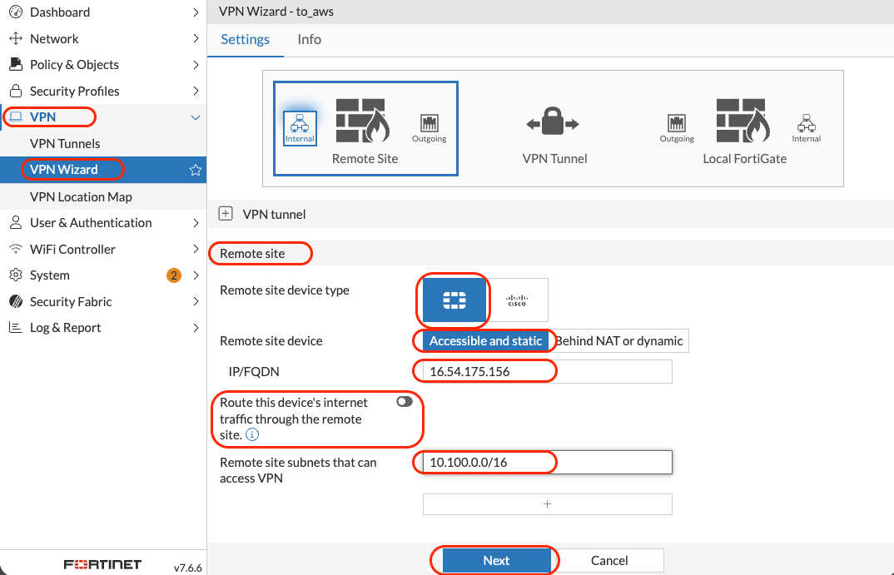

5. **Local Site page:** these settings describe this end, the HQ network.

   | Parameter | Value |
   | --- | --- |
   | Outgoing interface that binds to tunnel | `port1` |
   | Create and add interface to zone | **Off** |
   | Local site | `port2` |
   | Local subnets that can access VPN | `192.168.0.0/22` |
   | Allow remote site's internet traffic through this device | **Off** |

   - Choose **Next**.

   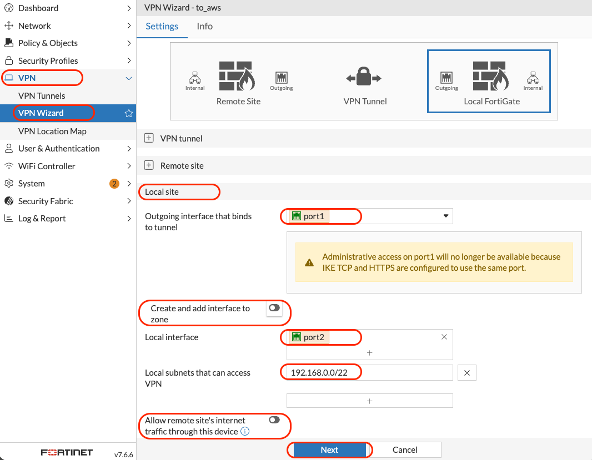

6. **Review and submit:**
   - Review the list of objects the wizard will create, then choose **Submit**.

   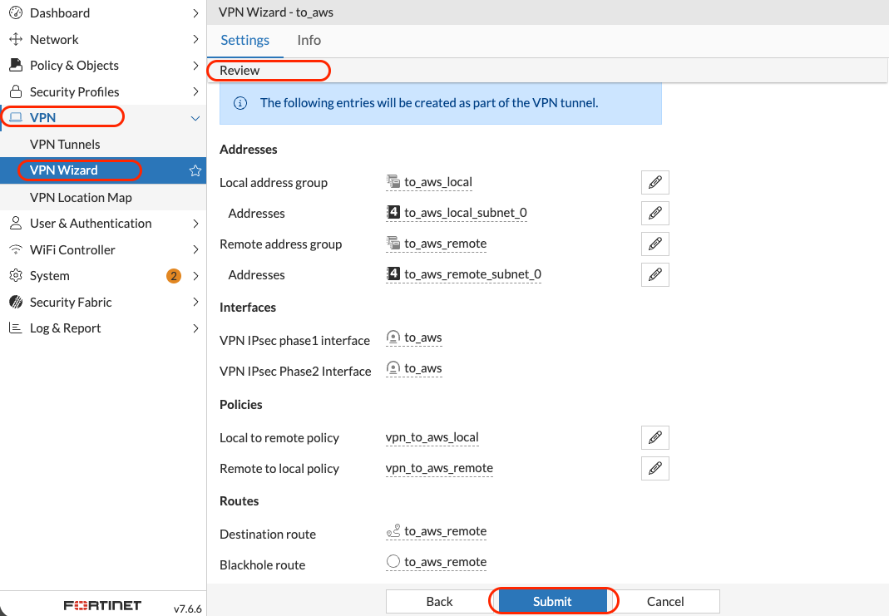

7. **Verify what the wizard created:**
   - **VPN → VPN Tunnels:** `to_aws` is listed, with status **Inactive** or **Down**. That's expected until the AWS side is configured.
   - **Network → Static Routes:** a route to `10.100.0.0/16` through the `to_aws` interface.
   - **Policy & Objects → Firewall Policy:** two new policies, `port2 → to_aws` and `to_aws → port2`.

<details>
<summary><b>What the wizard creates on each side</b></summary>

| Object | HQ FortiGate | AWS FortiGate |
| --- | --- | --- |
| Tunnel interface (Phase 1 + Phase 2) | `to_aws` | `to_on_prem` |
| Static route to the remote network | `10.100.0.0/16 → to_aws` | `192.168.0.0/22 → to_on_prem` |
| Outbound policy | `port2 → to_aws` | `port2 → to_on_prem` |
| Inbound policy | `to_aws → port2` | `to_on_prem → port2` |
| Address objects | Local and remote subnets | Local and remote subnets |

In production, review the auto-created policies and narrow their sources, destinations, and services. By default they allow any traffic between the two networks.
</details>

**Check:** `to_aws` exists on the HQ FortiGate (still down), with its route and two policies.

---

## Step 3: Configure the AWS FortiGate (`to_on_prem`)

**Why:** Now you build the mirror image on the AWS FortiGate. The local and remote values are swapped compared to Step 2. As soon as you submit, the two FortiGates find each other over UDP/500, detect the NAT at the Internet Gateway, switch to UDP/4500, and bring the tunnel up.

1. **Log in to your AWS FortiGate:**
   - In your browser, go to `https://<FGT-EIP>` and log in as `admin`.

2. **Start the VPN Wizard:**
   - Go to **VPN → VPN Wizard** and fill in:

     | Parameter | Value |
     | --- | --- |
     | Tunnel name | `to_on_prem` |
     | Select a template | **Site to Site** |

   - Choose **Begin**.

3. **VPN Tunnel page:** use the same values as on the HQ side.

   | Parameter | Value |
   | --- | --- |
   | Authentication method | **Pre-shared Key** |
   | Pre-shared Key | `RedwoodIndustries2026!` |
   | IKE | **Version 2** |
   | Transport | **UDP** |
   | NAT Traversal | **Enable** |
   | Keepalive frequency | `10` |

   - Choose **Next**.

4. **Remote Site page:** the other end is now your HQ FortiGate.

   | Parameter | Value |
   | --- | --- |
   | Remote site device type | **Fortinet** (select the Fortinet logo) |
   | Remote site device | **Accessible and static** |
   | IP/FQDN | `<on-prem-public-ip>` |
   | Route this device's internet traffic through the remote site | **Off** |
   | Remote site subnets that can access VPN | `192.168.0.0/22` |

   - Choose **Next**.

5. **Local Site page:** this end is the AWS network.

   | Parameter | Value |
   | --- | --- |
   | Outgoing interface that binds to tunnel | `port1` |
   | Create and add interface to zone | **Off** |
   | Local site | `port2` |
   | Local subnets that can access VPN | `10.100.0.0/16` |
   | Allow remote site's internet traffic through this device | **Off** |

   - Choose **Next**.

6. **Review and submit:**
   - Review the list of objects, then choose **Submit**.

   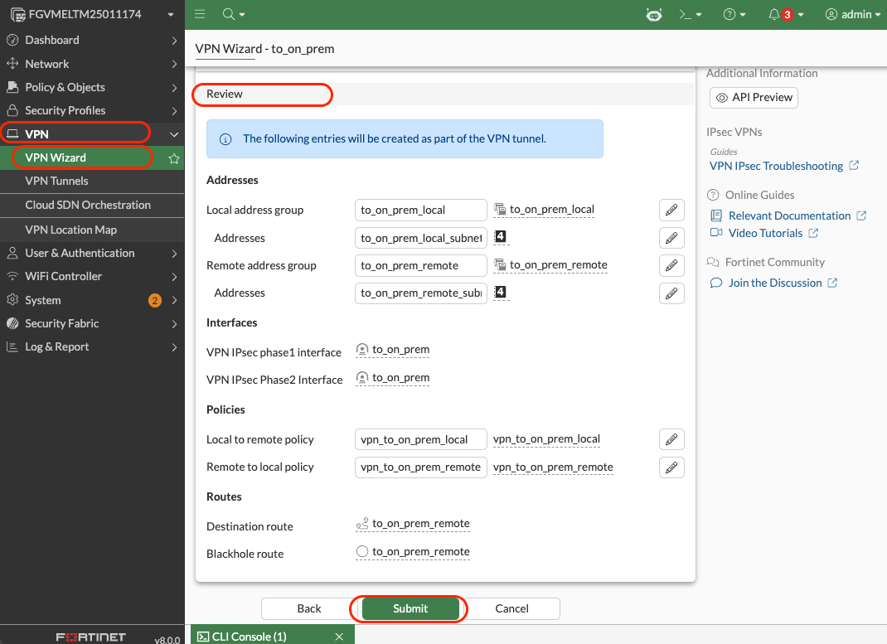

7. **Verify what the wizard created:**
   - **VPN → VPN Tunnels:** `to_on_prem` is listed. Within about 30 seconds its status should change to **Up**.
   - **Network → Static Routes:** a route to `192.168.0.0/22` through the `to_on_prem` interface.
   - **Policy & Objects → Firewall Policy:** two new policies, `port2 → to_on_prem` and `to_on_prem → port2`.

   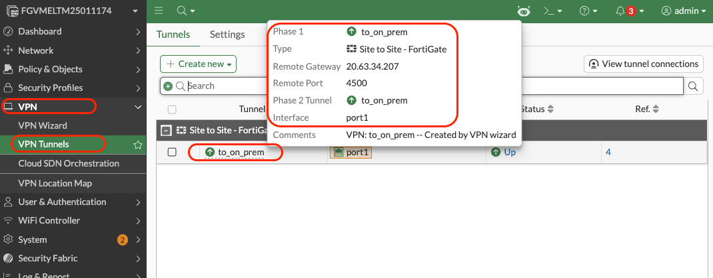

**Check:** `to_on_prem` exists on the AWS FortiGate, with its route and two policies, and its status is **Up**.

---

## Step 4: Verify the Tunnel

**Why:** "Up" in the tunnel list means Phase 1 (the IKE session between the FortiGates) succeeded. Traffic only flows if Phase 2 (the encrypted channel for your subnets) is also up. Checking both sides confirms the two configurations really match before you test with real traffic.

1. **On the AWS FortiGate:**
   - Go to **Dashboard → Network** and open the **IPsec** widget.
     <!-- TODO: verify the IPsec monitor GUI path for the FortiOS version in use -->
   - Confirm that `to_on_prem` shows status **Up**, with the remote gateway `<on-prem-public-ip>`.

   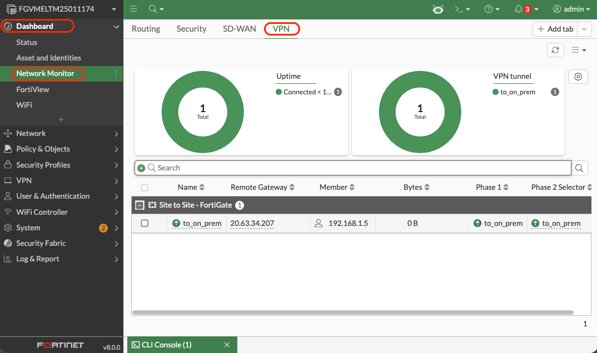

2. **On the HQ FortiGate:**
   - Open the same widget and confirm that `to_aws` is **Up**, with the remote gateway `<FGT-EIP>`.

   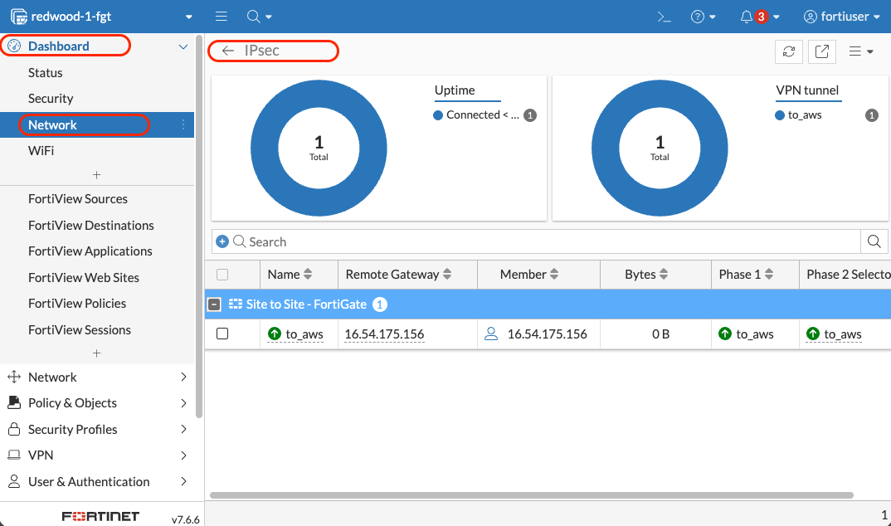

3. **Optional CLI check** on the AWS FortiGate (open the CLI console from the `>_` icon at the top right of the GUI):

   ```text
   diagnose vpn ike gateway list name to_on_prem
   diagnose vpn tunnel list name to_on_prem
   ```

   - The first command shows the IKE (Phase 1) session as **established**.
   - The second shows the Phase 2 tunnel with `10.100.0.0/16 ↔ 192.168.0.0/22`, and packet counters that will increase in Step 5.

**Check:** both tunnels are **Up** on both FortiGates.

> [!TIP]
> If a tunnel is still down after 60–90 seconds, the usual causes are a pre-shared key typo, a security group source that doesn't match the HQ public IP, or NAT-T disabled on one side. See [Troubleshooting](#troubleshooting).

---

## Step 5: Test Cross-Site Connectivity

**Why:** An "Up" tunnel proves the FortiGates agree, but Redwood cares about applications. You now test real TCP connections between real hosts, in both directions: the HQ Windows VM reaches the AWS server over SSH (port 22), and the AWS server reaches the HQ Windows VM over RDP (port 3389). Both use private addresses, with no NAT and no public IPs involved.

### 5.1 HQ → AWS

1. **Connect to the HQ Windows VM:**
   - Open your RDP client and connect to `<on-prem-public-ip>:9833`.
   - Log in with the credentials from your instructor.

2. **Open PowerShell:**
   - Open the **Start** menu, type `PowerShell`, and choose **Windows PowerShell**.

3. **Test TCP port 22 on the AWS test VM:**

   ```powershell
   Test-NetConnection -ComputerName 10.100.2.10 -Port 22
   ```

   Expected result:

   ```text
   ComputerName     : 10.100.2.10
   RemoteAddress    : 10.100.2.10
   RemotePort       : 22
   SourceAddress    : 192.168.2.10
   TcpTestSucceeded : True
   ```

   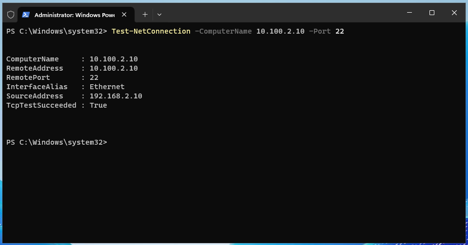

   `SourceAddress` is the Windows VM's own private IP. The traffic crossed the tunnel without NAT.

### 5.2 AWS → HQ

1. **SSH to the AWS test VM** from your workstation, as in Lab 3:

   ```bash
   ssh -i ~/.ssh/aws-101/redwood-aws101-lab-kp.pem -p 2222 ubuntu@<FGT-EIP>
   ```

2. **Test TCP port 3389 (RDP) on the HQ Windows VM:**

   ```bash
   nc -zv 192.168.2.10 3389
   ```

   Expected result:

   ```text
   Connection to 192.168.2.10 3389 port [tcp/ms-wbt-server] succeeded!
   ```

3. **Optional:** on either FortiGate, go to **Log & Report → Forward Traffic**. The cross-site sessions show the tunnel interface (`to_on_prem` or `to_aws`) and the VPN policies created by the wizard.

**Check:** `Test-NetConnection` returns `TcpTestSucceeded : True`, and `nc` reports `succeeded!`.

<details>
<summary><b>Why no AWS route change was needed</b></summary>

The private route table from Lab 2 still sends `0.0.0.0/0` to FortiGate's `port2`. Traffic to HQ and traffic to the Internet both reach FortiGate the same way. FortiGate's own routing table then decides where each packet goes. The wizard added `192.168.0.0/22 → to_on_prem`, which is more specific than the default route, so HQ-bound traffic enters the tunnel.

You didn't need to change any AWS route table, add a Transit Gateway, or create an AWS VPN Gateway. Traffic across the tunnel isn't NATed, so each side sees the other's real IP addresses, and both FortiGates log every flow.
</details>

---

## Troubleshooting

| Issue | Solution |
| --- | --- |
| The tunnel stays down | Check the pre-shared key on both sides (case-sensitive, no extra spaces). Check that the security group rules' source is exactly `<on-prem-public-ip>/32`. Check that NAT Traversal is enabled on both sides. |
| `no proposal chosen` in **Log & Report → System Events → VPN Events** | Both sides must use IKE version 2 and the wizard's default proposals. Rerun the wizard if either side was edited by hand. |
| Phase 1 is up, but Phase 2 fails (`INVALID_ID_INFORMATION`) | The local and remote subnets don't mirror each other. AWS: local `10.100.0.0/16`, remote `192.168.0.0/22`. HQ: the opposite. |
| The tunnel is up, but traffic fails | Check that both wizard policies (`port2 → tunnel` and `tunnel → port2`) exist and are enabled on both FortiGates, and that each side has the static route to the remote network. |
| `Test-NetConnection` to port 22 fails, but `nc` from AWS works | The test VM's security group must allow SSH. It allows `0.0.0.0/0` on port 22, which includes `192.168.0.0/22`. |
| The tunnel drops when idle | Check that NAT-T keepalive is `10` seconds on both sides. |

To watch cross-site packets live, run this on the AWS FortiGate CLI while you repeat a test:

```text
diagnose sniffer packet any "host 10.100.2.10 and host 192.168.2.10" 4 20
```

You should see packets on `port2` (to and from the test VM) and on `to_on_prem` (inside the tunnel).

---

## Clean-Up

**Why:** Several workshop resources bill by the hour even when idle, including the FortiGate instance, the test VM, their disks, and the Elastic IP. Stopping the instances isn't enough: disks and Elastic IPs keep billing while an instance is stopped. Delete everything, in the order below. Some resources can't be deleted while another resource still uses them.

1. **Terminate the instances:**
   - **EC2 → Instances:** select `redwood-aws101-lab-fgt` and `redwood-aws101-lab-testvm`, then choose **Instance state → Terminate instance**.
   - Wait until both show **Terminated**. Their root disks are deleted with them.

2. **Release the Elastic IP:**
   - **EC2 → Elastic IPs:** select `redwood-aws101-lab-fgt-eip` and choose **Actions → Release Elastic IP addresses**. If it's still associated, choose **Disassociate** first.

3. **Delete the `port2` interface:**
   - **EC2 → Network Interfaces:** if `redwood-aws101-lab-fgt-eni-port2` still exists, select it and choose **Actions → Delete**.

4. **Delete any remaining volumes:**
   - **EC2 → Volumes:** if a volume tagged `Project` = `Redwood-AWS-101` is still listed (for example, FortiGate's log disk) and shows **Available**, select it and choose **Actions → Delete volume**.

5. **Delete the security groups:**
   - **EC2 → Security Groups:** delete `redwood-aws101-lab-testvm-sg` and `redwood-aws101-lab-fgt-sg`.

6. **Delete the key pair:**
   - **EC2 → Key Pairs:** delete `redwood-aws101-lab-kp`. Also delete the private key file from your computer.

7. **Delete the VPC:**
   - **VPC → Your VPCs:** select `redwood-aws101-lab-vpc` and choose **Actions → Delete VPC**. This also deletes its subnets and route tables, and detaches and deletes the Internet Gateway.

8. **Confirm nothing is left:**
   - **Resource Groups & Tag Editor:** if you created `redwood-aws101-lab-rg` in Lab 1, delete it.
   - Open **Tag Editor**, set **Regions** to **All regions**, set **Resource types** to **All supported resource types**, search for tag `Project` = `Redwood-AWS-101`, and confirm that no resources are returned.

9. **Optional, HQ side:**
   - On your HQ FortiGate, delete the `to_aws` policies, route, and tunnel. The HQ environment is hosted by your instructor and doesn't bill your AWS account.

---

## Workshop Complete

Redwood now has a hybrid environment with FortiGate enforcing one security policy everywhere:

| Lab | What you built | Why it matters |
| --- | --- | --- |
| 1 | An AWS landing zone: VPC, public and private subnets, Internet Gateway | A network designed for inspection from the start |
| 2 | FortiGate as the only path in and out, using route tables and source/dest. check | No workload can bypass the firewall |
| 3 | A published application server, inspected and logged in both directions | Proof for the security team |
| 4 | An encrypted, inspected connection to HQ, with no AWS routing changes | One platform and one policy model across HQ and the cloud |

**Where to go next:**

- **AWS-102:** FortiGate HA across two Availability Zones, which removes the single point of failure
- **AWS-103:** Transit Gateway and Gateway Load Balancer designs for multi-VPC and east-west inspection

**Congratulations!**
